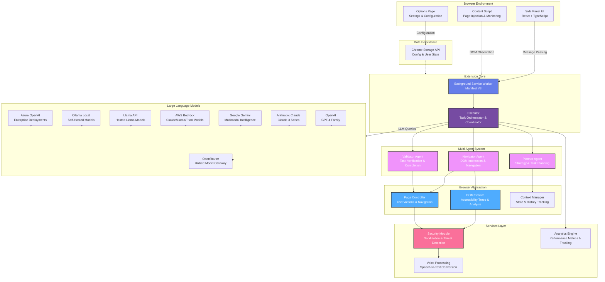

# WebGenie

<div align="center">
    
</div>

> **The Open-Source AI Web Automation Extension** — Run sophisticated multi-agent systems directly in your browser. Automate complex web tasks, do actions, and streamline workflows.

[](LICENSE)
[](https://chrome.google.com)
[](https://www.typescriptlang.org/)
[](https://react.dev)
---
https://github.com/user-attachments/assets/f2a8e7eb-eeee-4b39-abce-5368a4facd80

## Vision

WebGenie empowers developers and automation enthusiasts with a **free, open-source alternative to AI web automation tools** like OpenAI Operator. By leveraging local multi-agent AI systems, WebGenie enables intelligent web automation without vendor lock-in or cloud dependencies. Perfect for building custom workflows, testing automation logic, and experimenting with autonomous agents in a sandboxed browser environment.

---

## Key Features

### Multi-Agent Intelligence
- **Navigator Agent** — Intelligent DOM interaction and web navigation that understands page structure
- **Planner Agent** — High-level task planning and strategic reasoning to break down complex workflows
- **Validator Agent** — Autonomous verification of task completion and result accuracy
- Coordinated execution through Chrome Messaging APIs for seamless inter-agent communication

### LLM Provider Flexibility
- **OpenAI** — GPT-4, GPT-4 Turbo, GPT-3.5 Turbo for cutting-edge reasoning
- **Anthropic** — Claude 3 (Opus, Sonnet, Haiku) for diverse capability tiers
- **Google Gemini** — Gemini Pro and Gemini 1.5 for multimodal understanding
- **AWS Bedrock** — Managed Claude/Llama/Titan family models on AWS
- **Llama API** — Hosted Llama models via `api.llama.com`
- **Ollama** — Local LLM support for self-hosted and privacy-conscious deployments
- **Azure OpenAI** — Enterprise LLM deployments for organizational scale

### Security & Privacy
- **Local Processing** — All AI reasoning happens entirely in-browser, never leaves your machine
- **No API Fallback** — No automatic cloud uploads or hidden data transmission
- **Content Sanitization** — Built-in XSS and injection prevention for safe DOM manipulation
- **URL Validation** — Protected navigation and safe browsing to prevent malicious redirects

### Developer Experience
- **Hot Reload Development** — Vite-powered rapid iteration for faster development cycles
- **Comprehensive Logging** — Debug agent reasoning step-by-step to understand decision-making
- **Modular Architecture** — Clean, extensible codebase designed for easy customization
- **Type-Safe** — Strict TypeScript throughout for reliability and maintainability

### User-Friendly Interface
- **Chat-Based Controls** — Talk to the extension naturally, no complex syntax needed
- **Real-Time Feedback** — Watch live agent execution status and progress updates
- **Visual DOM Analysis** — Interactively inspect and explore page elements
- **Favorites & History** — Easily reuse, refine, and iterate on previous automation tasks

---

## Architecture Overview

WebGenie is built on a modular, layered architecture that separates concerns and enables clear communication between components. Here's how everything works together:



If you want a very detailed walkthrough of the DOM engine, read [docs/dom-deep-dive.md](docs/dom-deep-dive.md).

### How It Works Together

**User Interface Layer**: The side panel (_React + TypeScript_) allows users to interact with the system through a chat interface. The options page lets users configure LLM providers and preferences, which are stored locally via Chrome Storage API.

**Request Flow**: When a user submits a task:
1. The Side Panel sends a message to the Background Service Worker
2. The Executor coordinates the request across the multi-agent system
3. The Planner breaks down the task into actionable steps
4. The Navigator executes steps by interacting with the DOM
5. The Validator checks if the task was completed successfully
6. Results are sent back to the UI for display

**Agent Coordination**: Agents communicate through the Executor using a message-passing pattern. The Navigator never directly executes actions—it requests the Page Controller to perform user interactions safely.

**Browser Abstraction**: The browser layer isolates Chrome API interactions, making it easier to test agents and maintain code. DOM operations go through the Security module, which sanitizes content and prevents malicious injections.

**LLM Integration**: All agents use the configured LLM provider for reasoning. The system supports OpenAI, Anthropic, Gemini, AWS Bedrock, Llama API, Ollama, Azure OpenAI, OpenRouter, and compatible custom OpenAI endpoints.

### Provider Setup (Bedrock, Llama, Ollama)

#### AWS Bedrock

1. Open Options → Model Settings → add **AWS Bedrock**
2. Fill:
    - **Access Key** = AWS access key ID
    - **AWS Secret Key** = AWS secret access key
    - **AWS Region** (for example `us-east-1`)
3. Keep model IDs in the Bedrock format (for example `us.anthropic.claude-sonnet-4-20250514-v1:0`)
4. Save and assign Bedrock models to Planner/Navigator

Bedrock credentials are passed as SigV4 AWS credentials and used directly by the Bedrock runtime client.

#### Llama API (Hosted)

1. Add **Llama** provider
2. Set Base Endpoint to `https://api.llama.com/v1` (or your compatible endpoint)
3. Add your Llama API key
4. Save and select a Llama model for agents

#### Ollama (Local Server)

1. Start Ollama locally (default endpoint: `http://localhost:11434`)
2. Add **Ollama** provider
3. Set Base Endpoint to your Ollama server URL
4. Add installed model names exactly as seen in Ollama (examples: `qwen3:14b`, `mistral-small:24b`)
5. Save and select models for Planner/Navigator

If Ollama runs on another machine, expose it on your network and use that full `http(s)://host:port` URL.

---

## Capabilities at a Glance

| Feature | Description |
|---------|-------------|
| Task Automation | Execute complex multi-step workflows with natural language commands |
| Data Extraction | Scrape and structure web data intelligently using AI reasoning |
| Form Filling | Automated form submission with intelligent field understanding |
| Navigation | Smart web browsing with context awareness and state tracking |
| Natural Language | Interact with agents using plain English—no special syntax required |
| Voice Input | Optional speech-to-text for hands-free automation control |
| Local Processing | Everything runs in-browser, no backend infrastructure needed |
| Privacy-First | All processing stays local; no data transmitted to servers |

---

## Quick Start (Build from Source)

### Prerequisites

You'll need the following tools installed:

- **Node.js** — Check your `.nvmrc` file for the specific required version
- **pnpm** — Fast, disk-efficient package manager (required for this project)

### Installation & Setup

Get up and running in just a few commands:

```bash
# Clone the repository
git clone https://github.com/derpx06/webgenie.git
cd webgenie

# Install dependencies
pnpm install

# Start development with hot reload
pnpm -F chrome-extension dev

# In another terminal, build for production
pnpm build
```

### Loading in Chrome

Ready to test your extension?

1. Open `chrome://extensions/` in your browser
2. Enable **Developer mode** using the toggle in the top-right corner
3. Click **Load unpacked**
4. Select the `dist/` directory

Your extension is now loaded and ready to use!

---

## Usage Examples

### Simple Task Automation

```
"Go to example.com and search for 'AI automation tools', then tell me the top 3 results"
```

### Form Filling

```
"Navigate to the contact form at example.com and fill it with:
- Name: John Doe
- Email: john@example.com
- Message: Hello, I'm interested in your services"
```

### Data Extraction

```
"Visit the pricing page at example.com and extract the pricing table into a structured format"
```

---

## Project Structure

WebGenie is organized as a monorepo with clear separation of concerns:

```
WebGenie/
├── chrome-extension/              # Core extension & background worker
│   ├── src/background/
│   │   ├── agent/                 # Multi-agent system (Navigator, Planner, Validator)
│   │   ├── browser/               # Chrome API abstraction layer
│   │   ├── services/              # Security, analytics, voice processing
│   │   └── task/                  # Task management & execution
│   └── public/                    # Static assets & permissions
│
├── pages/                          # User interface components
│   ├── side-panel/                # Main chat interface for user interaction
│   ├── options/                   # Settings & configuration page
│   └── content/                   # Content script for page injection
│
├── packages/                       # Shared utilities & libraries
│   ├── shared/                    # Common types and utility functions
│   ├── storage/                   # Chrome storage abstraction layer
│   ├── ui/                        # Reusable React components
│   ├── i18n/                      # Internationalization support
│   └── schema-utils/              # Zod validation schemas
│
└── docs/                          # Documentation & guides
    ├── MODULARITY_GUIDE.md        # Architecture & module organization
    ├── BEST_PRACTICES.md          # Development standards & guidelines
    └── README.md files            # Per-module documentation
```

For a deep dive into architecture and module organization, see [MODULARITY_GUIDE.md](MODULARITY_GUIDE.md).

---

## Development

### Available Commands

Here are the most common commands you'll use during development:

```bash
# Type checking - Catch TypeScript errors early
pnpm type-check

# Linting & formatting - Maintain code quality
pnpm lint
pnpm prettier

# Testing - Run automated tests
pnpm -F chrome-extension test              # Run all tests
pnpm -F chrome-extension test -- -t "Sanitizer"  # Run specific test

# Building
pnpm build                                 # Production build
pnpm zip                                   # Create distribution zip
pnpm dev                                   # Development with hot reload

# Cleaning
pnpm clean                                 # Clean all build artifacts
pnpm clean:bundle                          # Clean build outputs only
pnpm update-version                        # Update version across packages
```

### Code Quality Standards

We maintain high code quality standards across the project:

- **TypeScript** — Strict mode enabled throughout for type safety
- **ESLint + Prettier** — Automated code formatting and linting
- **Vitest** — Fast unit testing framework
- **Comprehensive Type Definitions** — Full TypeScript coverage

For detailed development guidelines and best practices, see [BEST_PRACTICES.md](BEST_PRACTICES.md).

---

## Security & Privacy

WebGenie puts **privacy and security at the core** of its design:

- All AI reasoning happens entirely in-browser with zero cloud dependencies
- No automatic telemetry or data collection (unless explicitly enabled by users)
- Built-in content sanitization prevents XSS, injection attacks, and malicious content
- URL validation prevents navigation to suspicious or blocked sites
- User configuration stored locally in Chrome storage, never transmitted
- Minimal required permissions for core functionality only
- Full transparency in what data is processed and where

For detailed security information and threat modeling, see [SECURITY.md](SECURITY.md).

---

## Documentation

Comprehensive documentation is available:

- **[MODULARITY_GUIDE.md](MODULARITY_GUIDE.md)** — Complete architecture and module organization guide
- **[BEST_PRACTICES.md](BEST_PRACTICES.md)** — Code quality standards and development best practices
- **[CONTRIBUTING.md](CONTRIBUTING.md)** — Contribution guidelines for developers and maintainers
- **[CHANGELOG.md](CHANGELOG.md)** — Version history and release notes

---

## Contributing

We welcome contributions from the community! Here's how you can help:

1. **Fork** the repository on GitHub
2. **Create a feature branch** for your work (`git checkout -b feature/amazing-feature`)
3. **Commit your changes** with clear, descriptive messages (`git commit -m 'Add amazing feature'`)
4. **Push to your branch** (`git push origin feature/amazing-feature`)
5. **Open a Pull Request** with a detailed description of your changes

Please read [CONTRIBUTING.md](CONTRIBUTING.md) for our code standards, testing requirements, and development workflow.

---

## License

This project is licensed under the **Apache License 2.0** — see the [LICENSE](LICENSE) file for full details.

---

## Disclaimer

This repository does **not** endorse or support blockchain, cryptocurrency, NFT projects, or similar derivative works. Any such projects are **unaffiliated** with the maintainers of this codebase.

---

## Acknowledgments

WebGenie stands on the shoulders of exceptional open-source projects:

- [Chrome Extension Manifest V3](https://developer.chrome.com/docs/extensions/mv3/) — Modern extension development
- [React 18](https://react.dev) — Powerful UI framework
- [TypeScript](https://www.typescriptlang.org/) — Type-safe JavaScript
- [Vite](https://vitejs.dev) — Lightning-fast build tool
- [LangChain.js](https://js.langchain.com) — LLM integration framework
- [Turbo](https://turbo.build) — Monorepo build orchestration
- [Tailwind CSS](https://tailwindcss.com) — Utility-first styling

---

## Support & Community

Have questions or want to help?

- **Report Bugs or Request Features** — Open an issue on [GitHub Issues](https://github.com/yourusername/WebGenie/issues)
- **Join Community Discussions** — Participate in our GitHub discussions
- **Read the Documentation** — Check out the [comprehensive guides](./docs/)

---

**Made with care by the WebGenie community**
