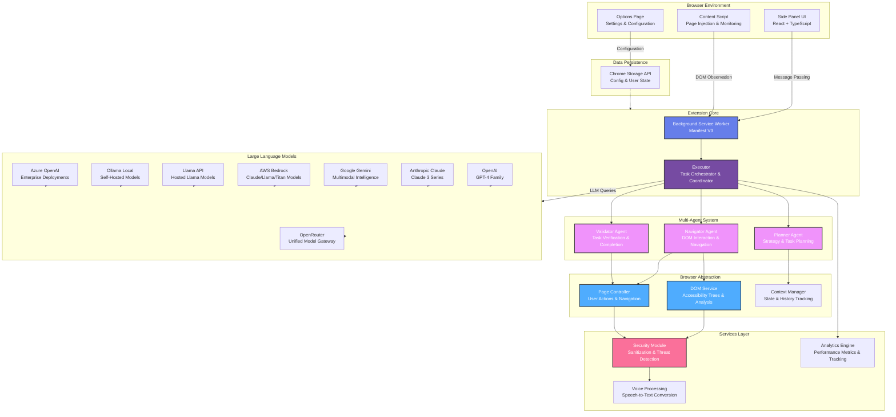

# WebGenie

<div align="center">
    
</div>

> **The Open-Source AI Web Automation Extension** — Run multi-agent systems directly in your browser. Automate web tasks, execute actions, and manage workflows.

<div align="center">

[](LICENSE)
[](https://chrome.google.com)
[](https://www.typescriptlang.org/)
[](https://react.dev)
[](https://deepwiki.com/derpx06/webgenie)

</div>

---

https://github.com/user-attachments/assets/f2a8e7eb-eeee-4b39-abce-5368a4facd80

---

## Vision

WebGenie is an open-source, local alternative to cloud-based web automation agents. By running multi-agent AI loops inside a standard Chrome Extension, WebGenie lets you automate web browsing tasks without vendor lock-in or sending browsing sessions to a remote server. You can build custom workflows, test automation scripts, and run autonomous agents entirely within your local browser.

> [!NOTE]
> WebGenie is fully local and built on Chrome Manifest V3. The extension communicates directly with your configured AI endpoints with no intermediate backend databases.

---

## Key Features

### 1. Multi-Agent System
WebGenie uses a multi-agent loop where separate components coordinate to complete tasks:
* **Navigator Agent** — Translates the page DOM into a clean interactive tree and performs actions like clicks, text input, and scrolling.
* **Planner Agent** — Breaks down high-level user tasks into sequential steps for the navigator to execute.
* **Validator Agent** — Checks the page state at each step to ensure that the navigator's action succeeded.
* **Chrome Messaging Coordination** — Coordinates communication between the side panel UI and background service worker using Chrome runtime message passing.

### 2. Browser Subsystem Integration
Unlike remote browser automation setups, WebGenie runs directly inside your local Chrome instance. The agent can use the following native Chrome capabilities:
* **Bookmarks** — Search, query, and create bookmarks.
* **Reading List** — Fetch unread items, add new links, or update read status.
* **Browsing History** — Inspect recent visits and analyze domain frequency to navigate efficiently.
* **Downloads** — Trigger, monitor, and query downloads.

### 3. Agent Memory & Caching
* **Session Cache** — The agent caches temporary text findings, variables, or keys across execution steps.
* **DOM Compression** — Serializes the interactive accessibility tree into structured, indexable nodes while filtering out non-interactive layout nodes to save tokens.

### 4. Security & Privacy
* **Local Sandboxing** — All prompt assembly and decision execution occur locally inside the extension.
* **Local Storage** — Configuration values, histories, and firewall rules are stored in `chrome.storage.local`.
* **Domain Firewall** — A configurable allow/deny list to prevent agents from navigating to unauthorized domains.
* **Content Sanitization** — Inputs are sanitized before writing to DOM elements to mitigate script injection.

### 5. UI Customization
* **Settings Dashboard** — A dark-first layout with clean typography and custom configuration inputs.
* **History Switcher** — Side-panel filters separating **All**, **Chats**, and **Tasks** for precise history management.
* **Collapsible Action Steps** — Groups lower-level agent actions (such as scrolling and typing) into collapsible blocks, keeping the main chat thread clean.
* **Bulk History Management** — Instantly batch-delete old sessions or task history with a sticky operations bar.

---

## System Architecture

WebGenie is built on a modular, layered architecture that separates UI components, service abstractions, storage protocols, and core AI agents.



### Modular Directory Breakdown
```
WebGenie/
├── chrome-extension/              # background service workers & manifest definition
│   ├── src/background/
│   │   ├── agent/                 # Navigator, Planner, and Validator orchestrations
│   │   ├── browser/               # Chrome subsystems integrations (Bookmarks, History)
│   │   ├── services/              # security, analytics, and voice utilities
│   │   └── task/                  # execution loop coordinators
│   └── public/                    # manifest.json and static icons
│
├── pages/                         # React UI layers
│   ├── side-panel/                # main user chat interface with collapsible details
│   ├── options/                   # settings management dashboard
│   └── content/                   # page analyzers & DOM accessibility tree generators
│
└── packages/                      # shared monorepo modules
    ├── shared/                    # cross-boundary types
    ├── storage/                   # type-safe Chrome local storage schemas
    ├── ui/                        # custom UI buttons, inputs, and cards
    ├── i18n/                      # translation bindings
    └── schema-utils/              # Zod validation schemas
```

---

## Settings Configuration Reference

| Tab | Feature Name | Description |
| :--- | :--- | :--- |
| **General** | Interaction Highlights | Toggles visual outlines over elements the Navigator agent focuses on. |
| | Task Tab Grouping | Groups tabs spawned by the automation cycle into a dedicated Chrome Tab Group. |
| **Advanced** | Viewport Dimensions | Configures the fixed viewport width and height used during DOM element calculation. |
| | Action Latency Buffer | Sets the delay (in milliseconds) before evaluating DOM updates after actions like clicking. |
| | Planner Vision Mode | Allows the planner to process screenshot buffers when supported by multimodal models. |
| **Developer**| Log DOM Snapshot | Prints the serialized DOM tree that the LLM processes to the service worker console. |
| | Developer Options | Master toggle that activates testing controls. |
| **Firewall** | Domain Filter Rules | Enforces navigation safety using segmented Allow or Deny lists of domain patterns (e.g. `*.github.com`). |

---

## Installation & Developer Quickstart

### 1. Build from Source
```bash
# Clone the repository
git clone https://github.com/derpx06/webgenie.git
cd webgenie

# Install dependencies (requires Node.js and pnpm)
pnpm install

# Run type checks to verify project integrity
pnpm type-check

# Compile for production
pnpm build
```

### 2. Load into Chrome
1. Open Google Chrome and go to `chrome://extensions/`.
2. Toggle **Developer mode** in the top-right corner.
3. Click **Load unpacked** in the top-left corner.
4. Select the `dist/` directory generated in your workspace folder.

---

## License & Disclaimer

- Licensed under the **Apache License 2.0** — see the [LICENSE](LICENSE) file for details.
- This repository does **not** endorse or support blockchain, cryptocurrency, NFT projects, or similar derivative works. Any such projects are **unaffiliated** with the maintainers of this codebase.
