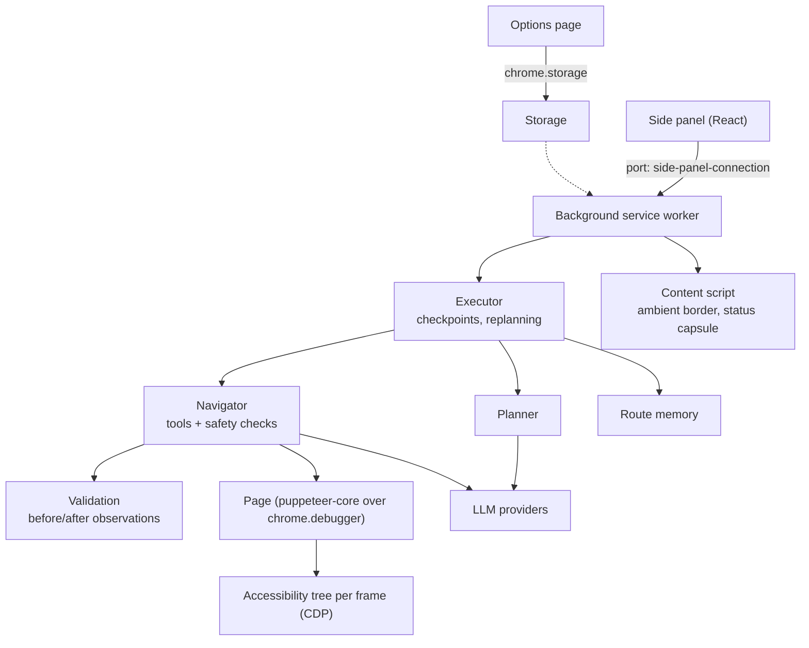

# WebGenie

<div align="center">
    
</div>

> **The Open-Source AI Web Automation Extension** — an LLM browser agent that runs entirely inside your browser.

<div align="center">

[](LICENSE)
[](https://chrome.google.com)
[](https://www.typescriptlang.org/)
[](https://react.dev)
[](https://deepwiki.com/derpx06/webgenie)

</div>

---

https://github.com/user-attachments/assets/f2a8e7eb-eeee-4b39-abce-5368a4facd80

---

## Vision

WebGenie is an open-source, local alternative to cloud-based web automation agents. The agent loop runs inside a standard Chrome extension, so your browsing session never goes through a remote server — only the prompts you send to the model provider you configure.

> [!NOTE]
> WebGenie is built on Chrome Manifest V3 and has no backend. It talks directly to your configured AI endpoints.

---

## How it works

### Planner and navigator
* **Planner** — decides the plan, replans when the navigator reports completion, hits an error, stalls or stops making validated progress, and makes the final call on whether the task is done.
* **Navigator** — reads the page and acts through tools: click, type (optionally pressing Enter), keys, scroll, hover, drag, dropdowns, dialogs, tabs, back/forward, waiting for text, reading the full page text, saving findings, and asking you.
* **Verification** — every page-changing action is checked by comparing the page before and after it; a `done` is checked against what was actually read on the page. There is no separate validator model.

### Perception
The agent reads the page's accessibility tree over the Chrome DevTools Protocol (`chrome.debugger`), across frames, and acts with real input events. No script is injected to read the page.

### Asking you, not guessing
* **Confirmations for commits** — before an order, payment, subscription or account change, WebGenie itself asks you to confirm (showing the amount on the page); a "no" is respected for the rest of the task.
* **Passwords** you type into its questions are never shown to the model; they are filled in only into a password field on the site where you gave them.
* **Personal data and addresses** — before sending an email address or number from your task to a site, or opening a link that came from page text rather than from you, a separate check that sees only your messages confirms you asked for it.
* **Prompt injection** — page text is wrapped as untrusted content, with look-alike delimiters defanged.
* **Domain firewall** — an allow/deny list checked on every navigation.

### Interruptions
Tasks are checkpointed every step. Closing the side panel or the tab, an unanswered question, or a provider rate limit pauses the task instead of failing it; reopen the panel to resume or discard it, or answer a pending question late.

### Memory
After a successful task WebGenie remembers the *route* it took (pages and the kinds of elements used — never what you typed), keyed by the start page, and offers it as a hint the next time a task starts there.

### Browser data tools (opt-in)
With **Options → Advanced → browser data tools** on, the agent can also manage bookmarks, the reading list, history, downloads, tab groups, windows, sessions, extensions and browsing data. Clearing data and toggling extensions require your confirmation.

### Model providers
OpenAI, Anthropic, Gemini, Vertex AI, Azure OpenAI, AWS Bedrock, DeepSeek, Grok, Groq, Cerebras, Llama API, OpenRouter, Ollama and any OpenAI-compatible endpoint. Calls have per-model timeouts, hedged duplicate requests for slow replies, and rate-limit backoff.

---

## Architecture



```
chrome-extension/
├── manifest.js                 # manifest source of truth
├── src/background/
│   ├── index.ts                # port commands, task lifecycle wiring
│   ├── agent/                  # executor, planner/navigator, actions, validation, contracts, memory, prompts
│   ├── browser/                # BrowserContext, Page, accessibility-tree perception
│   ├── core/                   # tab orchestration (tab groups, workflow stage for the ambient UI)
│   ├── services/               # guardrails, analytics, speech-to-text, keep-alive
│   ├── adapters/               # Chrome API adapters for testability
│   └── trace.ts                # IndexedDB trace capture
└── e2e/                        # live e2e harness and Online-Mind2Web tooling
pages/
├── side-panel/                 # chat UI
├── options/                    # settings
└── content/                    # ambient border and status capsule
packages/                       # storage, i18n, ui, shared, schema-utils, build tooling
docs/
├── agent.md                    # how the agent works, in detail
├── e2e.md                      # the live test harness
└── adr/                        # architecture decisions
```

---

## Settings reference

| Tab | Setting | Description |
| :--- | :--- | :--- |
| **General** | Maximum Mission Steps, Actions Per Step, Retry Limit | Task bounds. |
| | Planning Interval, Action Settle Timeout, Action Delay, Page Load Buffer | Execution tuning. |
| **Advanced** | Vision for Planner Agent | Lets the planner see screenshots on multimodal models. |
| | Interaction Highlights, Show Ambient Border, Show Status Capsule | On-page feedback. |
| | Task Tab Grouping, Auto-Close Ephemeral Tabs | Tab management. |
| | Browser data tools | Enables the bookmark/history/downloads/tabs/windows/sessions/extensions/privacy tools. |
| **Models** | Providers, per-agent models, speech-to-text model | Planner and navigator can use different models. |
| **Firewall** | Domain filtering | Allow or deny lists of domain patterns (e.g. `*.github.com`). |
| **Developer** | Enable Developer Options, Log DOM Snapshot, Capture Traces | Diagnostics; traces can be downloaded as JSONL. |
| | Langsmith Tracing | Sends runs to a LangSmith endpoint. |

---

## Installation & developer quickstart

```bash
git clone https://github.com/derpx06/webgenie.git
cd webgenie
pnpm install            # Node >= 22.12, pnpm 9
pnpm type-check
pnpm -F chrome-extension test
pnpm build              # -> dist/
```

Load into Chrome: open `chrome://extensions/`, enable **Developer mode**, click **Load unpacked** and select `dist/`.

`pnpm e2e` builds and runs the live suite against real sites with Vertex AI (gcloud login required); see [docs/e2e.md](docs/e2e.md).

---

## License & Disclaimer

- Licensed under the **Apache License 2.0** — see the [LICENSE](LICENSE) file for details.
- This repository does **not** endorse or support blockchain, cryptocurrency, NFT projects, or similar derivative works. Any such projects are **unaffiliated** with the maintainers of this codebase.
