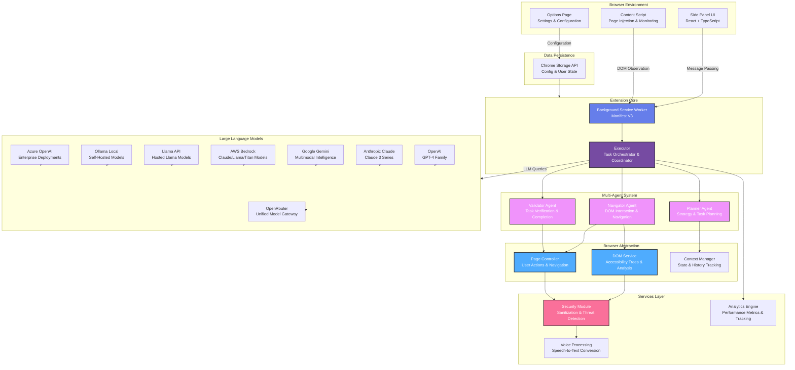

# WebGenie

<div align="center">
    
</div>

> **The Open-Source AI Web Automation Extension** — Run sophisticated multi-agent systems directly in your browser. Automate complex web tasks, execute actions, and streamline workflows.

[](LICENSE)
[](https://chrome.google.com)
[](https://www.typescriptlang.org/)
[](https://react.dev)
[](https://deepwiki.com/derpx06/webgenie)
---
https://github.com/user-attachments/assets/f2a8e7eb-eeee-4b39-abce-5368a4facd80

## Vision

WebGenie empowers developers and automation enthusiasts with a **free, open-source alternative to AI web automation tools** like OpenAI Operator. By leveraging local multi-agent AI systems, WebGenie enables intelligent web automation without vendor lock-in or cloud dependencies. Perfect for building custom workflows, testing automation logic, and experimenting with autonomous agents in a sandboxed browser environment.

---

## Key Features

### Multi-Agent Intelligence
- **Navigator Agent** — Intelligent DOM interaction and web navigation that understands page structure.
- **Planner Agent** — High-level task planning and strategic reasoning to break down complex workflows.
- **Validator Agent** — Autonomous verification of task completion and result accuracy.
- Coordinated execution through Chrome Messaging APIs for seamless inter-agent communication.

### LLM Provider Flexibility
- **OpenAI** — GPT-4o, GPT-4, and GPT-3.5 Turbo for cutting-edge reasoning.
- **Anthropic** — Claude 3.5 (Sonnet), Claude 3 (Opus, Sonnet, Haiku).
- **Google Gemini** — Gemini 1.5 Pro and Gemini 1.5 Flash.
- **AWS Bedrock** — Managed Claude, Llama, and Titan family models on AWS (supports Access Key, Secret Key, custom Region, and STS session tokens).
- **Llama API** — Hosted Llama models via `api.llama.com`.
- **Ollama** — Local LLM support for self-hosted and privacy-conscious deployments.
- **Azure OpenAI** & **OpenRouter** — Enterprise deployments and unified gateways.

### Security & Privacy
- **Local Processing** — All AI reasoning happens entirely in-browser; it never leaves your machine.
- **No Telemetry Leakage** — Fully controlled storage with zero automatic cloud uploads or hidden data transmission.
- **Domain Firewall** — Built-in domain filtering (segmented Allow/Deny controls) to strictly enforce navigation boundaries.
- **Content Sanitization** — Built-in XSS and injection prevention for safe DOM manipulation.

### Premium User Interface
- **Chat-Based Controls** — Talk to the extension naturally, featuring a modern glassmorphism design and a dynamic visual orb.
- **Collapsible Execution Steps** — Keeps the interface clean by nesting verbose agent actions inside interactive, collapsible step details.
- **History Switcher & Bulk Management** — Filter history by **All**, **Chats**, or **Tasks**, with bulk selection support for easy session-level cleanup.
- **Polished Settings Dashboard** — A dark-first premium settings panel using human-friendly typography (DM Sans / system-sans) and clean monospace values.

---

## Architecture Overview

WebGenie is built on a modular, layered architecture that separates concerns and enables clear communication between components.



For a detailed walkthrough of the DOM engine, see [docs/dom-deep-dive.md](docs/dom-deep-dive.md).

### How It Works Together

When a user submits a task through the Side Panel:
1. The **Executor** coordinates the request across the multi-agent system.
2. The **Planner** breaks down the task into actionable steps.
3. The **Navigator** executes steps by interacting with the DOM.
4. The **Validator** checks if the task was completed successfully.
5. Results and status updates are sent back to the Side Panel UI.

---

## Provider Setup

### AWS Bedrock
1. Open Options → Model Settings → add **AWS Bedrock**.
2. Fill:
    - **Access Key ID** = AWS access key ID.
    - **Secret Access Key** = AWS secret access key.
    - **Session Token (Optional)** = AWS STS session token if using temporary credentials.
    - **AWS Region** (e.g. `us-east-1`).
3. Set model IDs in the Bedrock format (e.g. `us.anthropic.claude-3-5-sonnet-20241022-v2:0` or custom model ARNs).

### Ollama (Local Server)
1. Start Ollama locally (default endpoint: `http://localhost:11434`).
2. Add **Ollama** provider.
3. Set Base Endpoint to your Ollama server URL.
4. Set model name exactly as configured in Ollama (e.g. `qwen2.5:14b`).

---

## Quick Start (Build from Source)

### Prerequisites
- **Node.js** (check `.nvmrc` for version)
- **pnpm** (Fast, disk-efficient package manager)

### Installation & Setup

```bash
# Clone the repository
git clone https://github.com/derpx06/webgenie.git
cd webgenie

# Install dependencies
pnpm install

# Start development with hot reload
pnpm -F chrome-extension dev

# Build for production
pnpm build
```

### Loading in Chrome
1. Open `chrome://extensions/` in your browser.
2. Enable **Developer mode** (top-right corner).
3. Click **Load unpacked** and select the built `dist/` directory.

---

## Documentation & Contributing

- **[MODULARITY_GUIDE.md](MODULARITY_GUIDE.md)** — Architecture & module organization guide.
- **[BEST_PRACTICES.md](BEST_PRACTICES.md)** — Code quality standards and development guidelines.
- **[SECURITY.md](SECURITY.md)** — Security architecture & threat modeling.
- **[CONTRIBUTING.md](CONTRIBUTING.md)** — Standard contributing guidelines.

---

## License & Disclaimer

- Licensed under the **Apache License 2.0** — see the [LICENSE](LICENSE) file for details.
- This repository does **not** endorse or support blockchain, cryptocurrency, NFT projects, or similar derivative works. Any such projects are **unaffiliated** with the maintainers of this codebase.
