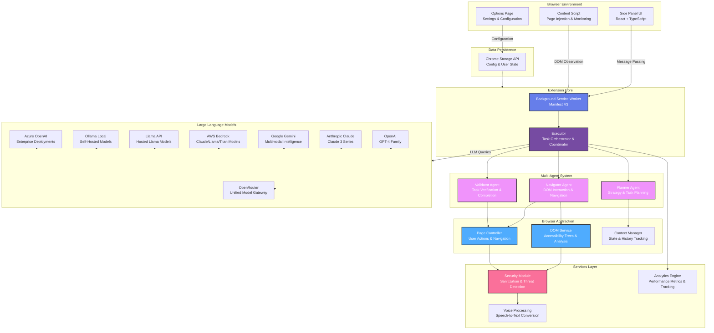

# 🧞‍♂️ WebGenie

<div align="center">
    
</div>

> **The Open-Source AI Web Automation Extension** — Run sophisticated multi-agent systems directly in your browser. Automate complex web tasks, execute actions, and streamline workflows.

<div align="center">

[](LICENSE)
[](https://chrome.google.com)
[](https://www.typescriptlang.org/)
[](https://react.dev)
[](https://deepwiki.com/derpx06/webgenie)

</div>

---

https://github.com/user-attachments/assets/f2a8e7eb-eeee-4b39-abce-5368a4facd80

---

## 🌟 Vision

WebGenie empowers developers and automation enthusiasts with a **free, open-source alternative to AI web automation tools** like OpenAI Operator. By leveraging local multi-agent AI systems, WebGenie enables intelligent web automation without vendor lock-in or cloud dependencies. Perfect for building custom workflows, testing automation logic, and experimenting with autonomous agents in a sandboxed browser environment.

> [!NOTE]
> WebGenie is fully local and runs on Chrome Manifest V3, communicating directly with your configured AI endpoints with no intermediate cloud databases.

---

## ⚡ Key Features

### 🤖 1. Multi-Agent Intelligence
WebGenie relies on a collaborative multi-agent architecture where agents share responsibilities to optimize success rates and ensure safety:
* 🧭 **Navigator Agent** — Focuses on page analysis, translating raw interactive elements into a clean interactive tree, and executing actions like clicking, typing, and scrolling.
* 📋 **Planner Agent** — Handles high-level reasoning and orchestrates step-by-step strategies. It breaks down complex user goals into small, manageable objectives.
* ⚖️ **Validator Agent** — Periodically evaluates page states to verify if actions successfully reached the goal, preventing false positives.
* 💬 **Chrome Messaging Coordination** — Fast, asynchronous messaging routes agent commands and feedback cycles smoothly through the extension worker.

### 🔌 2. Native Browser Integration & Subsystems Control
Unlike cloud-hosted solutions that operate inside remote VNC containers, WebGenie runs directly inside your local Chrome instance, accessing native APIs via the **`chrome_control`** tool:
* 🔖 **Bookmarks Manager** — Allows agents to query the bookmarks tree, search folders, and create new bookmarks dynamically.
* 📖 **Reading List** — Allows agents to append articles, check unread tabs, and mark pages as read.
* history 🕒 **Browsing History** — Inspects visit frequency and queries domain telemetry to guide autonomous tasks.
* 📥 **Downloads Controller** — Automatically downloads files, handles conflict strategies (overwrite/uniquify), and monitors progress.

### 🧠 3. Agent Memory & Caching
* 💾 **Session-Level Memory Cache** — Agents use the `cache_content` tool to store extracted text, credentials, keys, or state data, making them accessible across subsequent execution steps.
* 🗜️ **DOM Context Isolation** — Serializes the interactive accessibility tree into structured, indexable nodes while filtering out noisy visual elements to optimize LLM token usage.

### 🔒 4. Advanced Security & Privacy
* 🛡️ **Local Control Sandbox** — All prompt assembly, execution logic, and decision framing occur locally on your machine.
* 🔏 **Zero Telemetry Leakage** — Settings, history, and workspace configurations are kept entirely inside native `chrome.storage.local`.
* 🧱 **Domain Firewall** — Segmented Allow/Deny list filters enforce navigation guardrails to block malicious redirects or off-domain links.
* 🧼 **Content Sanitization** — Sanitizes input strings before writing to inputs or executing clicks.

### 🎨 5. Premium UI/UX Customization
* 🎛️ **Modern Options Dashboard** — A clean, dark-first dashboard designed with unified typography (DM Sans for settings, JetBrains Mono for system values).
* 🗂️ **Interactive Switcher Tabs** — Side-panel filters separating **All**, **Chats**, and **Tasks** for precise history management.
* 🪆 **Collapsible Detail Steps** — Groups low-level agent actions (such as scrolling and typing) into collapsible blocks, keeping the main chat thread clean.
* 🗑️ **Bulk Selection** — Instantly batch-delete old sessions or task history with a sticky operations bar.

---

## 🏗️ System Architecture

WebGenie is built on a modular, layered architecture that separates UI components, service abstractions, storage protocols, and core AI agents.



### 📂 Modular Directory Breakdown
```
WebGenie/
├── chrome-extension/              # background service workers & manifest definition
│   ├── src/background/
│   │   ├── agent/                 # Navigator, Planner, and Validator orchestrations
│   │   ├── browser/               # Chrome subsystems integrations (Bookmarks, History)
│   │   ├── services/              # security, analytics, and voice utilities
│   │   └── task/                  # execution loop coordinators
│   └── public/                    # manifest.json and static icons
│
├── pages/                         # React UI layers
│   ├── side-panel/                # main user chat interface with collapsible details
│   ├── options/                   # unified settings management dashboard
│   └── content/                   # page analyzers & DOM accessibility tree generators
│
└── packages/                      # shared monorepo modules
    ├── shared/                    # cross-boundary types
    ├── storage/                   # type-safe Chrome local storage schemas
    ├── ui/                        # custom UI buttons, inputs, and cards
    ├── i18n/                      # translation bindings
    └── schema-utils/              # Zod validation schemas
```


---


## 🛠️ Settings Configuration Reference

| Tab | Feature Name | Description |
| :--- | :--- | :--- |
| **General** | Interaction Highlights | Toggles visual outlines over elements the Navigator agent focuses on. |
| | Task Tab Grouping | Groups tabs spawned by the automation cycle into a dedicated Chrome Tab Group. |
| | Replay Historical Tasks | Saves historic execution records locally for step-by-step debugging. |
| **Advanced** | Viewport Dimensions | Configures the fixed viewport width and height used during DOM element calculation. |
| | Action Latency Buffer | Sets the delay (in milliseconds) before evaluating DOM updates after actions like clicking. |
| | Planner Vision Mode | Allows the planner to process screenshot buffers when supported by multimodal models. |
| **Developer**| Log DOM Snapshot | Prints the serialized DOM tree that the LLM processes to the service worker console. |
| | Developer Options | Master toggle that activates testing controls. |
| **Firewall** | Domain Filter Rules | Enforces navigation safety using segmented Allow or Deny lists of domain patterns (e.g. `*.github.com`). |

---

## 🚀 Installation & Developer Quickstart

### 1. Build from Source
```bash
# Clone the repository
git clone https://github.com/derpx06/webgenie.git
cd webgenie

# Install dependencies (requires Node.js and pnpm)
pnpm install

# Run type checks to verify project integrity
pnpm type-check

# Compile for production
pnpm build
```

### 2. Load into Chrome
1. Open Google Chrome and go to `chrome://extensions/`.
2. Toggle **Developer mode** in the top-right corner.
3. Click **Load unpacked** in the top-left corner.
4. Select the `dist/` directory generated in your workspace folder.

---

## 📄 License & Disclaimer

- Licensed under the **Apache License 2.0** — see the [LICENSE](LICENSE) file for details.
- This repository does **not** endorse or support blockchain, cryptocurrency, NFT projects, or similar derivative works. Any such projects are **unaffiliated** with the maintainers of this codebase.
