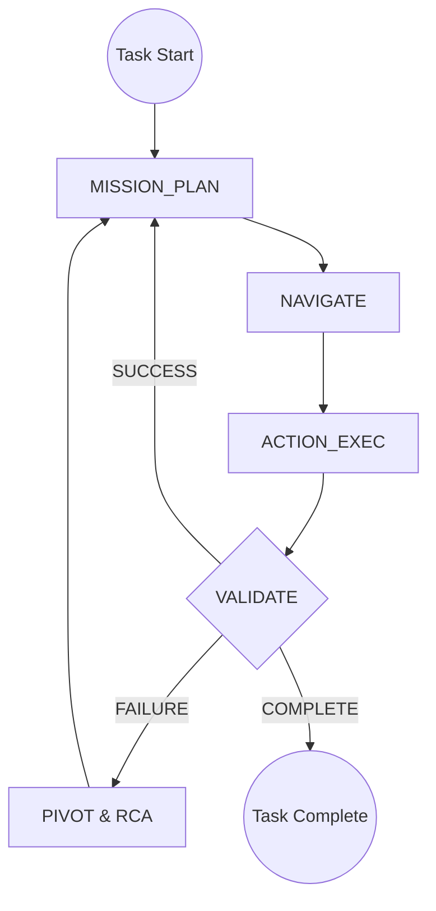

# 💎 Supreme Architect: Agentic Evolution Blueprint

This specification defines the elite-tier architectural overhaul for the Nanobrowser system. The goal is to achieve **Supreme Autonomous Resilience** through deterministic state management, independent verification, and semantic perception.

---

## 🏗️ 1. Core Orchestration: The Finite State Machine (FSM)
We are transitioning from a linear execution loop to a **Non-Linear State Machine**. This allows the agent to backtrack, pivot, and verify with absolute certainty.

### 📊 System Flowchart


---

## 🛡️ 2. Verification Sovereignty: The Validator Agent
The **Validator** is a dedicated reasoning layer that acts as the agent's conscience. It is strictly separated from the Navigator to prevent confirmation bias.

### Key Capabilities:
- **Blind Verification**: Evaluates the page without knowing the Navigator's "intent," only the "goal."
- **Side-Effect Detection**: Identifies error toasts, blocking modals, or failed URL redirects that the Navigator might miss.
- **Confidence Scoring**: Reports a 0-100% confidence level for every step.

---

## 👁️ 3. Perception Layer: Semantic Signature Logic
We are ending the era of fragile index-based interaction. 

### Semantic Signatures:
Every element in the DOM tree now carries a **Persistent Fingerprint**:
```json
{
  "fingerprint": "hash(tagName + role + ariaLabel + truncatedText + parentStructure)",
  "recovery": "fuzzy_match_search"
}
```
### The "Ghost-Target" Recovery:
If the Navigator attempts to click an index that has shifted, the system automatically triggers a **Semantic Search**. It finds the "Ghost" of the target element elsewhere on the page and re-syncs the execution deterministically.

---

## ⚡ 4. Efficiency: Deterministic DOM Slimming
To achieve **Blazing Speed**, we minimize the token load on the LLM while maximizing signal.

| Technique | Logic | Result |
| :--- | :--- | :--- |

---

## 🔄 5. Resilience: The Pivot & RCA Loop
When a failure occurs, the agent does not simply "try again." It performs **Root Cause Analysis (RCA)**.

1.  **Blocker Detection**: Validator identifies the specific blocker (e.g., "Cookie Consent Overlay").
2.  **Pivot Context**: The Planner is fed the exact failure signature.
3.  **Strategic Pivot**: The Planner generates a workaround (e.g., "Close overlay" or "Navigate to mobile version of site").

---

## 🎨 6. Premium UX Integration (Telemetry)
The user should **feel** the agent's intelligence through the UI.

- **State Glows**: The Agent Orb will change colors based on state:
  - 🟣 **Planning** (Deep Purple Pulse)
  - 🔵 **Navigating** (Cyan Velocity)
  - 🟢 **Validating** (Steady Emerald)
  - 🟡 **Pivoting** (Amber Alert)
- **Live Reasoner Trace**: A sleek, high-density telemetry feed in the Side Panel showing:
  - `[STATE] VALIDATING...`
  - `[SIGHT] Elements Verified: 14`
  - `[HEALTH] Semantic Sync: 100%`

---

## 📅 Implementation Roadmap

### Phase I: The Core FSM
- [ ] Refactor `executor.ts` main loop into `AgentState` FSM.
- [ ] Implement state-based event emitting for UI telemetry.

### Phase II: The Validator
- [ ] Create `ValidatorAgent` and `ValidatorPrompt`.
- [ ] Integrate post-action verification checkpoints.

### Phase III: Semantic Robustness
- [ ] Update `traversal.js` with signature generation.
- [ ] Implement the `SemanticFallback` interaction middleware.

### Phase IV: Optimization
- [ ] Finalize `pruneTree` and `foldRepetitive` DOM utilities.
- [ ] Implement token-budgeting limits per step.
