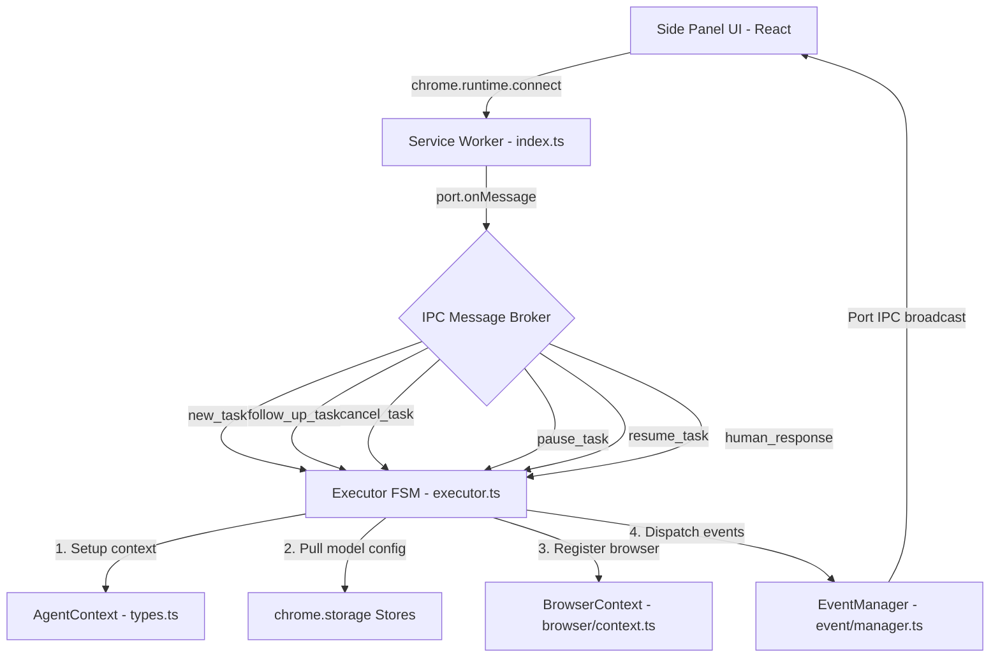
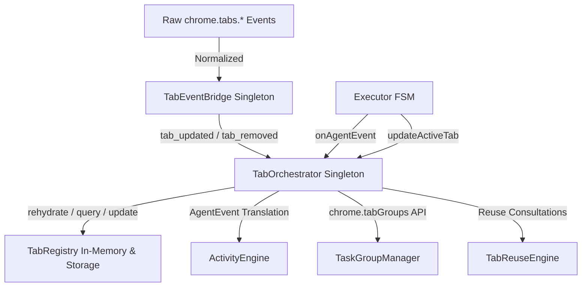

# WebGenie Codebase Walkthrough & System Architecture Manual
## Part 1: Service Worker Lifecycle & Agent Orchestration Loop

This document provides a highly granular, production-grade technical analysis of the WebGenie background service worker lifecycle, long-lived IPC messaging broker, the Executor Finite State Machine (FSM), the cognitive agent orchestration layer (Planner and Navigator agents), and the telemetry/event distribution bus.

---

## 1. Background Service Worker & Event Messaging Infrastructure

The entry point of the entire chrome extension runtime is the service worker located at `chrome-extension/src/background/index.ts`. It runs in a separate, event-driven background thread spawned by the Chromium browser process.



### 1.1 Service Worker Boot & Global State Hooks

Upon startup, the background script runs initialization logic and registers global event listeners:

1. **Tab Orchestration (`tabOrchestrator`):** Instantiates a singleton of the `TabOrchestrator` class (`chrome-extension/src/background/core/tab-orchestrator/index.ts`). It handles tab group isolation and prevents background workflows from getting cross-contaminated.
2. **Window Focus Monitoring:** Registers a listener on `chrome.windows.onFocusChanged` to track `lastFocusedWindowId`. This caches the active window ID synchronously, avoiding asynchronous API queries that might fail or delay when a user gesture is captured.
3. **SPA History Monitoring:** Subscribes to `chrome.webNavigation.onHistoryStateUpdated`. When a SPA (Single Page Application) changes its path client-side (e.g. via `history.pushState`), this hook triggers `page.updateUrl(url)` and invalidates the element highlight caches to prevent coordinate drift. It also wipes the `failureRegistry` for that tab.
4. **Debugger Detach Hook:** Monitors `chrome.debugger.onDetach`. If Chrome cancels the debugger session (for example, if the user manually closes the DevTools panel or clicks the "Stop debugging" banner), the background worker intercepts the event, calls `currentExecutor.cancel()`, and runs `browserContext.cleanup()` to release resources.
5. **Omnibox Command Hook:** Registers a handler on `chrome.omnibox.onInputEntered`. When the user types `genie [prompt]` into the browser address bar, the extension saves the string into `chrome.storage.session` under the key `pendingOmniboxPrompt`, opens the side panel, and initiates the execution flow automatically.

### 1.2 Side-Panel Connection Port Broker

Communication between the React side panel and the service worker is maintained through a persistent `chrome.runtime.Port` channel.

```typescript
// IPC Message Schemas (Port-level payload definitions)
export type SidePanelRequest =
  | { type: 'heartbeat' }
  | { type: 'new_task'; taskId: string; task: string; tabId: number }
  | { type: 'follow_up_task'; taskId?: string; task: string; tabId: number }
  | { type: 'cancel_task' }
  | { type: 'resume_task' }
  | { type: 'pause_task' }
  | { type: 'human_response'; response: string }
  | { type: 'screenshot'; tabId: number }
  | { type: 'state' }
  | { type: 'nohighlight' }
  | { type: 'speech_to_text'; audio: string }
  | { type: 'replay'; tabId: number; taskId: string; historySessionId: string; task?: string };
```

#### Message Handling Workflows:
* **`new_task`:** Resets current execution state. It calls `setupExecutor(taskId, task, browserContext)` to resolve model settings (providers, API keys, temperature settings) and instantiate the `Executor`. It then calls `tabOrchestrator.beginTask()` to group the tab, and triggers `currentExecutor.execute()`.
* **`follow_up_task`:** Appends the prompt to the task list using `currentExecutor.addFollowUpTask()` and restarts the execution loop (`currentExecutor.execute()`). If the executor was cleaned up, it throws an error.
* **`cancel_task` / `pause_task` / `resume_task`:** Controls the FSM state flags in the active `AgentContext` instance.
* **`human_response`:** Resumes the executor loop by writing the user's response to the message history and resetting `context.waitingForHuman` to `false`.
* **`screenshot`:** Switches tab focus and takes an ad-hoc page screenshot.
* **`state`:** Evaluates the DOM tree and logs the interactive element representation.
* **`nohighlight`:** Removes coordinate overlays from the active page.
* **`speech_to_text`:** Receives base64-encoded audio data, initializes the `SpeechToTextService` using keys retrieved from `llmProviderStore`, and returns the transcribed text.
* **`replay`:** Reruns a recorded session by reading step-by-step history from `chatHistoryStore`, matching saved element attributes to live DOM coordinates.

### 1.3 Service Worker Lifetime Hacks & Cleanup

Chrome Extension V3 service workers are ephemeral and terminate after 5 minutes of inactivity. To prevent the execution loop from dying mid-task:
1. **Heartbeat Pinging:** The side-panel client pings the service worker every 15-30 seconds (`type: 'heartbeat'`). The service worker acknowledges this with `heartbeat_ack`, resetting the browser's termination timer.
2. **Context Persistence:** Every step's conversation history is serialized and saved to `chrome.storage.session` via `messageManager.saveToSession()`. If the service worker is recycled, it reads the saved state on start using `loadFromSession()`, restoring the active model context.
3. **Port Disconnection Cleanup:** When the side panel is closed, `port.onDisconnect` triggers `currentExecutor.cancel()`. This immediately halts active LLM calls, shuts down CDP debugger sessions, and removes interactive highlights.

---

## 2. The Executor Finite State Machine (FSM)

The execution loop is managed by the `Executor` class in `chrome-extension/src/background/agent/executor.ts`. It runs as a synchronous loop driven by an asynchronous model.

```
       TASK_START ──► STEP_START ─┬─► [Planning Interval?] ──► runPlanner() ──► done? ──► TASK_OK (Exit)
                                  │                                              │ (no)
                                  └──────────────────────────────────────────────▼
                                                      navigate() (Run actions via Navigator)
                                                           │
                                                           ▼
                                                      STEP_OK / ACT_FAIL ──► shouldStop()? ──► Loop / Fail
```

### 2.1 State Transition Table

The execution state is tracked via the `ExecutionState` enum:

| Source State | Event Trigger | Guard Condition | Target State | Description |
| :--- | :--- | :--- | :--- | :--- |
| **`Idle`** | Port message `new_task` | Valid configurations and API keys | `TASK_START` | Initializing execution workspace, loading history, emitting task start event. |
| **`TASK_START`** | FSM loop entry | Step count $S < \text{maxSteps}$ | `STEP_START` | Initializing a step. |
| **`STEP_START`** | Planning interval or stagnation | `shouldRunPlanning` is `true` | `Planner execution` | Invoking the Planner agent. |
| **`Planner execution`** | Planner confirms goal completion | `plannerOutput.done == true` | `TASK_OK` | Task finished successfully. Extends final answer to side panel. |
| **`Planner execution`** | Planner sets next goal | `plannerOutput.done == false` | `Navigator execution` | Invoking the Navigator to perform DOM actions. |
| **`Navigator execution`** | Navigator actions succeed | `navigatorDone == false` | `STEP_OK` | Step completed. History recorded. |
| **`Navigator execution`** | Navigator reports done | `navigatorDone == true` | `Planner execution` | Handoff to Planner for final validation. |
| **`STEP_OK` / `ACT_FAIL`** | Max steps exceeded | $S \ge \text{maxSteps}$ | `TASK_FAIL` | Terminating because the maximum step limit was reached. |
| **`STEP_OK` / `ACT_FAIL`** | Max failures exceeded | $F \ge \text{maxFailures}$ | `TASK_FAIL` | Terminating because consecutive execution failures exceeded the limit. |
| **`STEP_OK` / `ACT_FAIL`** | User cancel / Disconnect | `context.stopped == true` | `TASK_CANCEL` | Halting the loop and releasing CDP sessions. |
| **`STEP_OK` / `ACT_FAIL`** | Human input requested | `result.isWaitingForHuman == true` | `TASK_PAUSE` | Pausing the FSM to wait for a user response. |

### 2.2 Core Execution Loop (`execute()`)

The execution loop is structured to handle errors at each step and support cancellation requests:

```typescript
async execute(): Promise<void> {
  await this.context.messageManager.loadFromSession();
  this.context.nSteps = 0;
  const allowedMaxSteps = this.context.options.maxSteps;

  try {
    this.context.emitEvent(Actors.SYSTEM, ExecutionState.TASK_START, this.context.taskId);
    void analytics.trackTaskStart(this.context.taskId);

    let latestPlanOutput: AgentOutput<PlannerOutput> | null = null;
    let navigatorDone = false;

    for (let step = 0; step < allowedMaxSteps; step++) {
      this.context.stepInfo = { stepNumber: this.context.nSteps, maxSteps: allowedMaxSteps };

      if (await this.shouldStop()) break;

      // 1. Planning Layer (macro-cognition)
      if (this.planner && this.shouldRunPlanning(step, navigatorDone)) {
        navigatorDone = false;
        latestPlanOutput = await this.runPlanner();
        if (this.checkTaskCompletion(latestPlanOutput)) break;
      }

      // 2. Action Selection Layer (micro-cognition)
      navigatorDone = await this.navigate();
      
      // If navigatorDone is true, the next loop iteration will run the planner to verify completion.
    }

    // Determine final status
    const isCompleted = latestPlanOutput?.result?.done === true;
    if (this.context.stopped) {
      this.context.emitEvent(Actors.SYSTEM, ExecutionState.TASK_CANCEL, t('exec_task_cancel'));
      void analytics.trackTaskCancelled(this.context.taskId);
    } else if (isCompleted) {
      this.context.emitEvent(Actors.SYSTEM, ExecutionState.TASK_OK, this.context.finalAnswer || this.context.taskId);
      void analytics.trackTaskComplete(this.context.taskId);
    } else if (step >= allowedMaxSteps) {
      this.context.emitEvent(Actors.SYSTEM, ExecutionState.TASK_FAIL, t('exec_errors_maxStepsReached'));
      void analytics.trackTaskFailed(this.context.taskId, 'max_steps_reached');
    }
  } catch (error) {
    this.handleExecutionCrash(error);
  } finally {
    await this.cleanup();
  }
}
```

### 2.3 Planning & Stagnation Checking (`shouldRunPlanning`)

Running the Planner on every step consumes significant tokens. Instead, `shouldRunPlanning` triggers it based on specific conditions:
1. **First step ($S = 0$):** To analyze the initial page layout and define the task milestones.
2. **Navigator signals completion (`navigatorDone == true`):** When the Navigator runs the `done` tool, the FSM invokes the Planner to confirm task completion.
3. **Planning cadence:** Runs every $N$ steps (default is 3, configured via `planningInterval`).
4. **Stagnation detection (`hasRecentProgressStall()`):** If the Navigator generates the exact same reasoning output three times in a row, a loop is detected. The FSM triggers the Planner early to re-route.

```typescript
private hasRecentProgressStall(): boolean {
  const records = this.context.history.history;
  if (records.length < 3) return false;

  // Retrieve clean strings of the last 3 navigator responses
  const lastThree = records.slice(-3).map(r => (r.modelOutput || '').trim());
  if (lastThree.some(v => v.length === 0)) return false;

  // Verify if the output has stalled
  return lastThree[0] === lastThree[1] && lastThree[1] === lastThree[2];
}
```

---

## 3. Cognitive Agent Definitions: Planner vs. Navigator

WebGenie splits its reasoning into two layers: a Planner for high-level validation and a Navigator for DOM interaction.

### 3.1 Planner Agent (`PlannerAgent`)

* **Role:** Acts as a strategic supervisor. It evaluates screenshots and action histories to update milestones and confirm completion.
* **System Prompt (`prompts/planner.ts`):** Defines a role focused on objective verification. It is instructed to output a JSON schema with the following fields:
  ```json
  {
    "observation": "Strategic review of the page state...",
    "challenges": "Identified blockers (e.g. captchas, popups)...",
    "reasoning": "Reasoning for the next sub-goal...",
    "web_task": "The updated sub-goal for the Navigator...",
    "next_steps": "Plan for subsequent steps...",
    "done": false,
    "final_answer": "The final result (populated only when done is true)"
  }
  ```
* **Done evaluation:** When `done` is set to `true`, the FSM stops the execution loop and returns the `final_answer` to the UI.

### 3.2 Navigator Agent (`NavigatorAgent`)

* **Role:** Selects and executes specific DOM actions (clicks, keypresses, text inputs) to achieve the current sub-goal.
* **System Prompt (`prompts/templates/navigator.ts`):** Directs the agent to select tools based on the current page layout. The prompt restricts the agent to a maximum of `maxActionsPerStep` actions.
* **Structured Output Schema:** Resolves the schema dynamically by merging the core state schema with the registered action schemas:
  ```typescript
  setupModelOutputSchema(): z.ZodType {
    const actionSchema = buildDynamicActionSchema(this.getAllActions());
    return z.object({
      current_state: z.object({
        evaluation_previous_goal: z.string(),
        memory: z.string(),
        next_goal: z.string()
      }),
      action: z.array(actionSchema)
    });
  }
  ```

---

## 4. Message History & Event Routing Services

The system manages execution context and broadcasts telemetry using a shared messaging and event bus.

### 4.1 Message Manager (`MessageManager`)

* **Context Slicing (`cutMessages`):** If the total tokens in the history exceed the model's context limit (`maxInputTokens`), the Message Manager shrinks the context:
  1. It removes screenshots from older messages to free up token space.
  2. If tokens are still over the limit, it calculates the percentage of overflow:
     $$\text{proportionToRemove} = \frac{\text{totalTokens} - \text{maxInputTokens}}{\text{lastMessageTokens}}$$
  3. It truncates characters from the end of the last message to bring the context within limits:
     $$\text{charsToRemove} = \text{content.length} \times \text{proportionToRemove}$$
* **Batch Token Writing:** Writing token usage to storage on every step can block Chrome storage I/O. The Message Manager batches token updates and flushes them to `chrome.storage.local` every 2000ms:
  ```typescript
  public recordTokenUsage(input: number, output: number): void {
    this.history.updateCumulativeTokens(input, output);
    this.pendingInputTokens += input;
    this.pendingOutputTokens += output;

    if (!this.flushTimeout) {
      this.flushTimeout = setTimeout(() => this.flushTokenUsage(), this.flushIntervalMs);
    }
  }
  ```

### 4.2 Event Manager (`EventManager`)

The Event Manager uses a pub-sub model to broadcast execution telemetry to the React side-panel.

```typescript
export class AgentEvent {
  constructor(
    public actor: Actors,                  // 'system' | 'planner' | 'navigator'
    public state: ExecutionState,          // e.g. STEP_START, ACT_FAIL, TASK_OK
    public data: {
      taskId: string;
      step: number;
      maxSteps: number;
      details: string;                     // Log detail or structured string
      usage?: { inputTokens: number; outputTokens: number };
    },
    public timestamp: number,
    public duration?: number,
    public screenshot?: string             // Base64 screenshot (vision mode)
  ) {}
}
```

When an event fires, the background worker updates the active tab ID:
```typescript
const agentTabId = executor.getCurrentTabId();
if (agentTabId !== null) {
  await tabOrchestrator.updateActiveTab(agentTabId);
}
```
The event is then forwarded to the side-panel port:
```typescript
currentPort.postMessage(event);
```

---

## 5. Tab Orchestration Subsystem (`chrome-extension/src/background/core/`)

To prevent tab explosions and maintain clean user workspaces, WebGenie utilizes a multi-layered Tab Orchestration subsystem. This subsystem coordinates raw browser events, persistent tab metadata, automatic tab grouping, and duplicate tab reuse.



### 5.1 TabEventBridge Singleton (`core/event-bridge/bridge.ts`)

The `TabEventBridge` operates as the single source of truth for all Chrome tab lifecycle event listeners. It acts as an isolation wrapper around raw Chrome extension APIs to prevent event listener leaks and control event storms.

#### Key Mechanics:
1. **Singleton Listener Registry:** The constructor binds Chrome listeners exactly once:
   ```typescript
   chrome.tabs.onCreated.addListener(this._onCreated);
   chrome.tabs.onUpdated.addListener(this._onUpdated);
   chrome.tabs.onRemoved.addListener(this._onRemoved);
   chrome.tabs.onActivated.addListener(this._onActivated);
   chrome.tabs.onMoved.addListener(this._onMoved);
   chrome.windows.onFocusChanged.addListener(this._onWindowFocusChanged);
   ```
2. **Debouncing noisy `onUpdated` updates:** During page load, status updates (`loading` to `complete`) can fire dozens of times. `TabEventBridge` uses a custom `debounce` function to throttle updates within a 50ms window.
3. **Immediate Complete Transitions:** To guarantee prompt execution gating on page transitions, `changeInfo.status === 'complete'` bypasses debouncing and dispatches immediately:
   ```typescript
   this._onUpdated = (tabId, changeInfo, tab) => {
     if (changeInfo.status === 'complete') {
       this._dispatch<TabUpdatedEvent>('tab_updated', { type: 'tab_updated', tabId, changeInfo, tab });
     } else {
       debouncedUpdate(tabId, changeInfo, tab);
     }
   };
   ```
4. **Clean Disposal:** When the background script or worker is unloaded, `dispose()` removes all Chrome listeners and clears internal callback sets to prevent memory leaks:
   ```typescript
   chrome.tabs.onUpdated.removeListener(this._onUpdated);
   this._subscribers[eventType].clear();
   ```

### 5.2 TabRegistry Database (`core/tab-registry/registry.ts`)

The `TabRegistry` stores active metadata mapping for AI-managed browser tabs. It uses an in-memory `Map<number, TabRecord>` for high-performance reads during action execution, coupled with a batched persistence manager.

#### Metadata Schema (`TabRecord`):
```typescript
export interface TabRecord {
  tabId: number;
  taskId: string;
  purpose: string;
  workflowStage: WorkflowStage; // e.g. PLANNING, RESEARCHING, INTERACTING
  state: TabState;             // e.g. PRIMARY_ACTIVE, BACKGROUND_ACTIVE, IDLE
  temporary: boolean;          // Ephemeral tab to be closed on success
  createdAt: number;
  updatedAt: number;
  confidence: number;
  lastAction: string;
  aiOwned: boolean;
  groupId: string | null;      // chrome.tabGroups ID
  pageTitle: string;
  url: string;
}
```

#### Persistence & Rehydration:
* **Storage Flushes:** To avoid hitting `chrome.storage.local` write quota limits during rapid interaction sequences, writes are debounced with a 500ms window (`FLUSH_DEBOUNCE_MS = 500`).
* **Service Worker Rehydration:** When the MV3 service worker wakes up from hibernation, it calls `restore()` to read records from storage. It verifies each tab ID still exists in the browser using `chrome.tabs.get(tabId)` before inserting it back into the in-memory map:
  ```typescript
  async restore(): Promise<void> {
    const state = await tabOrchestrationStore.getState();
    for (const [rawTabId, record] of Object.entries(state.tabs)) {
      const tabId = Number(rawTabId);
      try {
        await chrome.tabs.get(tabId); // verify active window status
        this._tabs.set(tabId, record);
      } catch {
        // Tab was closed while SW was dead — skip rehydration
      }
    }
  }
  ```

### 5.3 TaskGroupManager (`core/task-groups/manager.ts`)

To keep user workspaces organized, the `TaskGroupManager` places all tabs belonging to an active task into a native Chromium `chrome.tabGroups` container.

#### Key Mechanics:
1. **Dynamic Tab Group Creation:** If tab grouping is enabled, starting a task calls `chrome.tabs.group` to bundle active tab IDs.
2. **Context-Aware Group Titles:** The orchestrator invokes the planner model with a brief description prompt to summarize the task into a concise Title Case name (e.g. "GitHub Issue PR", "Flight Search Chicago") rather than a generic task ID.
3. **Workspace Focus Swapping:** When switching tasks, `TaskGroupManager` collapses all inactive task groups via the Chromium API to keep the user's tab bar clutter-free:
   ```typescript
   async collapseInactiveGroups(activeGroupId: string): Promise<void> {
     const groups = await chrome.tabGroups.query({});
     for (const group of groups) {
       if (group.id !== activeGroupId) {
         await chrome.tabGroups.update(group.id, { collapsed: true });
       }
     }
   }
   ```

### 5.4 TabReuseEngine (`core/tab-reuse/engine.ts`)

To prevent tab explosions during multi-step research tasks, the `TabReuseEngine` checks if an existing tab can be reused before opening a new one.

#### Matching Priority & Selection Score:
Before opening a URL, the engine matches the target URL against active `TabRecord` elements in the registry, assigning scores based on priority:

| Priority | Match Type | Condition | Score | Description |
| :--- | :--- | :--- | :--- | :--- |
| **1 (Highest)** | `exact_url` | URL match within the same task ID | **1.0** | Focus shifts back to the existing tab immediately. |
| **2** | `exact_url` | URL match in any task, tab is `IDLE` or `COMPLETE` | **0.9** | Recycles the tab into the active task. |
| **3** | `same_domain_same_task` | Hostname matches target domain within same task ID | **0.7** | Navigates the existing tab instead of opening a new one. |
| **4 (Lowest)** | `same_domain_recyclable` | Hostname matches target domain, state is recyclable | **0.5** | Reuses the tab and updates its URL. |

#### Exclusions:
Tabs with active states (`PRIMARY_ACTIVE`, `BACKGROUND_ACTIVE`, `ERROR`) are excluded to avoid interrupting ongoing executions.
```typescript
const NON_REUSABLE_STATES = new Set([
  TabState.PRIMARY_ACTIVE,
  TabState.BACKGROUND_ACTIVE,
  TabState.ERROR
]);
```
If multiple candidates match, the engine sorts them descending by score, and then by `updatedAt` to select the most recently updated tab first.

