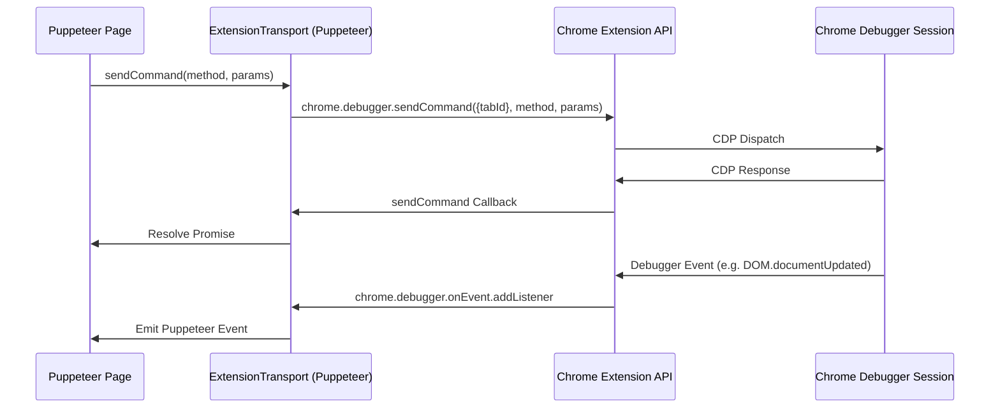

# WebGenie Codebase Walkthrough & System Architecture Manual
## Part 2: Browser & Tab Control Infrastructure

This document provides a detailed breakdown of WebGenie's browser controller, tab lifecycle orchestrator, and Chromium attachment primitives. It outlines how the system uses chrome APIs alongside Puppeteer-Core to drive real browser interactions.

---

## 1. BrowserContext: Global Tab & Config Coordinator

The `BrowserContext` class (located in `chrome-extension/src/background/browser/context.ts`) coordinates tab management, settings, page object instantiation, and allowed/denied URL constraints (firewall rules).

```
               ┌──────────────────────────────────────────┐
               │              BrowserContext              │
               │   - Tracks active tab ID                 │
               │   - Manages Map<tabId, Page>             │
               │   - Resolves concurrency locking         │
               └────────────┬─────────────────────────────┘
                             │
             ┌───────────────┼───────────────┐
             ▼               ▼               ▼
      ┌─────────────┐ ┌─────────────┐ ┌─────────────┐
      │   Page #1   │ │   Page #2   │ │   Page #3   │
      │  (CDP Sess) │ │  (CDP Sess) │ │  (CDP Sess) │
      └─────────────┘ └─────────────┘ └─────────────┘
```

### 1.1 Concurrency Protection Gating

Multiple asynchronous calls requesting the same page (for instance, a DOM poll and an action execution hitting the same tab) could cause multiple debugger attachments, causing Chrome to disconnect the existing session (with a "detached by another client" error).

To prevent this, `BrowserContext` registers a creation gate map:
```typescript
private _creatingPages: Map<number, Promise<Page>> = new Map();
```

Before instantiating a new `Page` wrapper, the context checks `_creatingPages` for an in-flight promise associated with that tab ID. If present, it waits for the existing page instantiation to complete rather than creating a duplicate:

```typescript
public async getOrCreatePage(tabId: number, forceUpdate = false): Promise<Page> {
  const existingPromise = this._creatingPages.get(tabId);
  if (existingPromise && !forceUpdate) {
    return existingPromise;
  }

  const createPromise = (async () => {
    try {
      let pageInstance = this._pages.get(tabId);
      if (!pageInstance || forceUpdate) {
        pageInstance = new Page(tabId, this);
        await pageInstance.initialize();
        this._pages.set(tabId, pageInstance);
      }
      return pageInstance;
    } finally {
      this._creatingPages.delete(tabId);
    }
  })();

  this._creatingPages.set(tabId, createPromise);
  return createPromise;
}
```

### 1.2 Firewall Security Implementation

The `BrowserContext` filters page navigation requests through a firewall hook configured by `firewallStore`. Before any navigation action (`navigateToUrl` or `openNewTab`) executes, the system validates the URL target:

```typescript
export function isUrlAllowed(url: string, allowedPatterns: string[], deniedPatterns: string[]): boolean {
  try {
    const parsed = new URL(url);
    const domain = parsed.hostname;

    // Deny list matches first (fail-safe check)
    for (const pattern of deniedPatterns) {
      if (matchPattern(domain, pattern)) return false;
    }

    // Allow list checks
    if (allowedPatterns.length === 0) return true; // Empty allow list means permit all
    for (const pattern of allowedPatterns) {
      if (matchPattern(domain, pattern)) return true;
    }

    return false;
  } catch {
    return false; // Blocks invalid URLs
  }
}
```
If a domain fails this check, the context throws a `URLNotAllowedError`, aborting the navigation before the browser processes the network request.

### 1.3 Tab State Validation Polling (`waitForTabEvents`)

When opening a tab or navigating to a new URL, the service worker must wait for the page to load before reading the DOM. `waitForTabEvents` listens for:
1. **`chrome.tabs.onUpdated`:** Triggers when the tab's status reaches `'complete'`.
2. **`chrome.tabs.onActivated`:** Triggers when the tab gains focus.

To prevent infinite loops when an SPA (Single Page Application) loads slowly, the system races these event listeners against a timeout promise (default 3000ms).

---

## 2. Puppeteer CDP Transport Bridge

WebGenie maps standard Puppeteer automation commands to Chromium extension API calls using `ExtensionTransport`.



### 2.1 The Connection Interface

The connection lifecycle is managed in `Page.attachPuppeteer()`. It uses `ExtensionTransport.connectTab` to attach to Chrome's debugger API:

```typescript
const browser = await connect({
  transport: await ExtensionTransport.connectTab(this._tabId),
  defaultViewport: null,
  protocol: 'cdp' as ProtocolType,
});
this._browser = browser;
const [page] = await browser.pages();
this._puppeteerPage = page;
```

#### Under the Hood of `ExtensionTransport`:
1. **CDP Frame Tunneling:** The transport translates Puppeteer JSON-RPC requests (e.g., `{ id: 1, method: "Runtime.evaluate", params: { ... } }`) into `chrome.debugger.sendCommand` calls targeting the specific tab.
2. **Event Broadcast Routing:** It registers a listener on `chrome.debugger.onEvent`. When the browser emits debugger events (such as console logs, network payloads, or frame changes), the transport routes them back to Puppeteer's internal event loop.

### 2.2 Revalidation & Promotion (`_revalidateFromTab`)

When a tab is first opened or constructed from `chrome://newtab/`, it is not a valid target for Puppeteer debugger attachment. The Page constructor sets `_validWebPage = false` for system pages.

During the next DOM extraction request:
1. `_revalidateFromTab()` queries the live tab metadata via `chrome.tabs.get()`.
2. If the tab has transitioned to an allowed web address (e.g. `http://` or `https://`), `_validWebPage` is promoted to `true`.
3. The method attempts `attachPuppeteer()` so the agent can begin executing actions on the target site.

---

## 3. Web Automation Primitives

Interaction with the target page is handled through CDP-level events or JS evaluations.

### 3.1 JavaScript Dialog Watchdog

Unexpected JavaScript dialogs (`alert()`, `confirm()`, `prompt()`, `beforeunload`) can freeze the Puppeteer CDP protocol thread. If a dialog appears while an action is running, the protocol blocks until the execution timeout triggers, causing the step to fail.

To resolve this, `Page` registers an auto-dismiss listener upon Puppeteer connection:
```typescript
this._puppeteerPage.on('dialog', async dialog => {
  logger.warning(`[DialogWatchdog] Auto-dismissing ${dialog.type()} dialog`);
  await dialog.dismiss();
});
```

### 3.2 Liveness Recovery Checks

Service worker environments can lose connections to their CDP endpoints due to resource allocation or background page suspensions. To ensure the page is still interactive, `_updateState` executes a liveness check:

```typescript
try {
  await this._puppeteerPage.evaluate('1');
} catch (error) {
  // Try to recover by querying pages again
  const pages = await this._browser.pages();
  if (pages.length > 0) {
    this._puppeteerPage = pages[0];
  } else {
    this._puppeteerPage = null;
    this._browser = null;
  }
}
```
If the evaluation fails and page recovery fails, the system clears Puppeteer references and falls back to injected script execution (`chrome.scripting.executeScript`) to query the DOM.

### 3.3 SPA Navigation & State Cache Invalidation

Client-side routing (via `pushState` or `replaceState` in React, Vue, Angular, etc.) changes the browser URL without triggering a traditional page reload. This means the extension background service worker does not reload the page or reconstruct the `Page` instance.

If the page state cache is not cleared during these transitions, the agent will receive outdated coordinates.

To handle this, `Page.updateUrl` tracks changes to the tab's URL. If a URL shift is identified (even without a page reload), it invalidates the state caches:
```typescript
if (previousUrl && previousUrl !== url) {
  this._cachedState = null;
  this._cachedStateClickableElementsHashes = null;
}
```
This forces a fresh DOM snapshot on the next step, aligning the agent's target coordinates with the visible layout.

---

## 4. Multi-Tab & Multi-Window Isolation System

The active browser environment is managed by the `TabOrchestrator` (`chrome-extension/src/background/core/tab-orchestrator/index.ts`). It handles window focus and tab isolation.

```typescript
export interface TaskSession {
  taskId: string;
  tabGroupMap: Map<number, number>; // Maps dynamic tabIds to parent windows
  currentActiveTabId: number;
}
```

When a task starts:
1. **Workspace Hook:** `tabOrchestrator.beginTask(taskId, baseTabId)` registers the task session and hooks the initial window ID.
2. **Dynamic Isolation:** Any tab opened during the task (`chrome.tabs.create`) is registered in `tabGroupMap`.
3. **Tab Focus Management:** When switching tabs (`switchTab(tabId)`), the system checks the active session rules. If the target tab is not registered to the current `taskId`, the switch is blocked, preventing the agent from modifying pages outside its workspace.
4. **Session Cleanup:** When the task completes, `tabOrchestrator.endTask(taskId)` detaches the tab hooks, removes interactive highlights, and returns focus to the base page.
