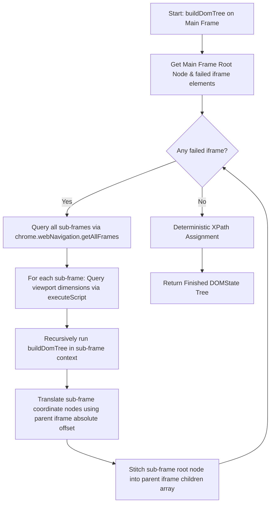

# WebGenie Codebase Walkthrough & System Architecture Manual
## Part 3: DOM Intelligence & State Extraction

This document explains WebGenie's DOM parsing, serialization, and coordinate calculation engine. It contrasts script injection (legacy) with native Chrome DevTools Protocol (CDP) snapshotting, detailing how the model receives structural representation of active web pages.

---

## 1. Dual DOM-Extraction Architecture

WebGenie contains two parallel extraction pipelines to build representations of the interactive document:
1. **Script Injection (Legacy content script execution):** Utilizes `chrome.scripting` to run code inside the page window context.
2. **CDP Snapshotting (Native debugger capture):** Uses native DevTools APIs without injecting Javascript into the webpage.

```
                      ┌──────────────────────┐
                      │    Browser Page      │
                      └──────────┬───────────┘
                                 │
         ┌───────────────────────┴───────────────────────┐
         ▼                                               ▼
┌──────────────────┐                            ┌──────────────────┐
│ Script Injection │                            │   CDP Snapshot   │
│ (buildDomTree.js)│                            │ (DOMSnapshot API)│
├──────────────────┤                            ├──────────────────┤
│ Injects code via │                            │ Queries AXTree & │
│ chrome.scripting │                            │ computed styles  │
│ - CSP vulnerable │                            │ - Bypasses CSP   │
│ - CPU intensive  │                            │ - Lightweight    │
└──────────────────┘                            └──────────────────┘
```

---

## 2. Injected DOM Parsing & Iframe Stitching

The primary active crawler resides in `chrome-extension/src/background/browser/dom/service.ts`, calling an injected library script `buildDomTree.js`.

### 2.1 The Cross-Origin Iframe Stitching Algorithm

Chrome extensions cannot traverse frames belonging to different origins from the main document frame. If `buildDomTree` runs only on the top frame, nested cross-origin iframes (like Stripe payment fields or Google Login boxes) appear empty.

To construct a complete page tree, `service.ts` runs a recursive stitching pipeline:



1. **Top-Level Scan:** Runs `buildDomTree` on the main frame, generating a flat node map and identifying iframe placeholder nodes.
2. **Retrieve Frame IDs:** Queries the browser for all active frames in the target tab:
   ```typescript
   const tabFrames = await chrome.webNavigation.getAllFrames({ tabId });
   ```
3. **Execute in Sub-frames:** Iterates through the discovered frame list. For each sub-frame that failed to parse in the main pass, it injects `buildDomTree.js` and runs the extraction logic:
   ```typescript
   const result = await chrome.scripting.executeScript({
     target: { tabId, frameIds: [subFrame.frameId] },
     func: args => window.buildDomTree(args),
     args: [options]
   });
   ```
4. **Coordinate Mapping:** Translates the layout positions returned by the sub-frame (which are relative to the sub-frame's viewport) to match the root document's coordinate space. This is done by adding the parent iframe's absolute offset:
   $$\text{node.pageX} = \text{parentIframe.pageX} + \text{node.clientX}$$
   $$\text{node.pageY} = \text{parentIframe.pageY} + \text{node.clientY}$$
5. **Node Tree Stitching:** Appends the translated sub-frame tree root to the parent iframe node's children list.

---

## 3. CDP-Based Snapshotting: `DOMSnapshotExtractor`

The native parser (located in `chrome-extension/src/background/browser/chromium-apis/dom-snapshot-extractor.ts`) uses Chrome's native CDP API `DOMSnapshot.captureSnapshot` to read page state. This approach bypasses Content Security Policy (CSP) headers that block content script execution.

### 3.1 Bounding Box Calculation

CDP returns layout coordinate bounds relative to the iframe document frame. If an element is nested inside three nested iframes, its raw bounds reflect its offset inside the inner frame, not on the user's viewport.

To compute correct interaction coordinates, the snapshot extractor calculates absolute page locations recursively:
* It tracks parent document offsets (`parentOffsetPageX`, `parentOffsetPageY`) during iframe traversal.
* The absolute page coordinate is calculated as:
  $$\text{pageX} = \text{parentOffsetPageX} + \text{rx} + \frac{\text{width}}{2}$$
  $$\text{pageY} = \text{parentOffsetPageY} + \text{ry} + \frac{\text{height}}{2}$$
* Viewport coordinates (which determine click targeting) are adjusted using the root document scroll position:
  $$\text{viewportX} = \text{pageX} - \text{rootScrollX}$$
  $$\text{viewportY} = \text{pageY} - \text{rootScrollY}$$

### 3.2 Accessibility and Visibility Filtering

The extractor filters out elements that are not visible or interactive to reduce token usage:
1. **Computed Styles Check:** It requests computed properties (`display`, `visibility`, `opacity`, `width`, `height`). Elements with `display: none`, `visibility: hidden`, or zero dimensions are discarded.
2. **Interactive Node Filtering:** Elements are checked against interactive criteria (HTML tags like `button`, `a`, `input`, `select`, or ARIA roles like `link`, `checkbox`, `tab`).
3. **Numbering Assignment:** Interactive elements are assigned a sequential `highlightIndex` for identification.

---

## 4. CDPBridge Interface

`CDPBridge` (`chrome-extension/src/background/browser/chromium-apis/cdp-bridge.ts`) wraps `chrome.debugger` to send CDP commands directly to a tab.

### 4.1 Accessibility Tree Serialization (`getFullAXTree`)

Rather than serializing raw HTML nodes, the debugger can return the browser's accessibility tree (`AXTree`). 
* **ARIA Mapping:** The browser automatically resolves element roles, labels, and state properties.
* **Token Reduction:** The AXTree contains structural content, reducing DOM size to about 1/10th of a raw HTML string.
* **Interactions:** The debugger maps AXTree nodes to backend DOM IDs (`backendDOMNodeId`), allowing the agent to target elements using their accessibility definitions.

### 4.2 Raw Input Emulation

To simulate user actions, the bridge sends low-level inputs directly to Chrome's rendering engine:

* **`cdpClick(tabId, x, y)`:** Dispatches mouse move, press, and release events to the target coordinates:
  ```typescript
  export async function cdpClick(tabId: number, x: number, y: number): Promise<void> {
    await cdpBridge.send(tabId, 'Input.dispatchMouseEvent', {
      type: 'mouseMoved', x, y, button: 'none', clickCount: 0
    });
    await cdpBridge.send(tabId, 'Input.dispatchMouseEvent', {
      type: 'mousePressed', x, y, button: 'left', clickCount: 1
    });
    await cdpBridge.send(tabId, 'Input.dispatchMouseEvent', {
      type: 'mouseReleased', x, y, button: 'left', clickCount: 1
    });
  }
  ```
* **`cdpInsertText(tabId, text)`:** Inserts characters into the focused element, bypassing keypress listeners that can interfere with traditional string typing simulations.
* **`cdpKeyPress(tabId, key)`:** Simulates keycodes (like `Enter`, `Tab`, `Escape`) to trigger page event listeners.

---

## 5. XPath Assignment & Interactive Filtering

### 5.1 Deterministic XPath Builder (`assignXPaths`)

After stitching the DOM tree together, WebGenie walks the tree recursively to assign unique XPaths:

```typescript
function assignXPaths(node: DOMBaseNode, parentXPath: string) {
  if (node instanceof DOMElementNode) {
    const tag = node.tagName || 'div';
    const siblings = node.parent ? node.parent.children : [];
    let sameTagCount = 0;
    let myIndex = 1;

    for (const sibling of siblings) {
      if (sibling instanceof DOMElementNode && sibling.tagName === tag) {
        sameTagCount++;
        if (sibling === node) {
          myIndex = sameTagCount;
        }
      }
    }

    const currentXPath = parentXPath ? `${parentXPath}/${tag}[${myIndex}]` : `/${tag}[${myIndex}]`;
    node.xpath = currentXPath;

    for (const child of node.children) {
      assignXPaths(child, currentXPath);
    }
  }
}
```

### 5.2 Interactive Node Identification

`isElementInteractive` identifies clickable nodes using tag types, ARIA roles, and inline cursor attributes:

```typescript
function isElementInteractive(tagName: string, attributes: Record<string, string>): boolean {
  const interactiveTags = new Set(['button', 'a', 'input', 'select', 'textarea', 'option']);
  if (interactiveTags.has(tagName)) return true;

  // ARIA role checks
  const role = attributes.role ?? '';
  const interactiveRoles = new Set(['button', 'link', 'checkbox', 'radio', 'tab', 'menuitem', 'combobox']);
  if (interactiveRoles.has(role)) return true;

  // Custom interaction handlers & pointer styling
  if (attributes.onclick || attributes.cursor === 'pointer' || attributes['data-clickable'] === 'true') {
    return true;
  }

  return false;
}
```
