# WebGenie Comprehensive Architecture Review & SOTA Research Report

**Document Reference**: WG-ARCH-REV-2026  
**Author**: Principal Architect / Staff Engineer  
**Date**: May 31, 2026  
**Scope**: Entire WebGenie Workspace (Chrome Extension & Shared Packages)

---

## 1. Executive Summary

This architectural review evaluates WebGenie, a modular agentic browser automation platform. As an established codebase, WebGenie successfully bridges high-level semantic intentions (via LLM planning) and low-level web interactions. Our review assesses the product workflow, browser control layers, memory systems, and runtime execution loops, contrasting them with state-of-the-art (SOTA) research and open-source frameworks (including **Stagehand v3**, **browser-use**, **Skyvern**, **Letta**, and **Mem0**).

### Core Findings
1. **CDP Transition**: The migration of DOM retrieval from script injection to native DevTools Protocol (`DOMSnapshot.captureSnapshot`) resolved Content Security Policy (CSP) blockages. However, legacy script injection still functions as a fallback, representing a maintenance duplication.
2. **Context & Token Bloat**: The agent suffers from linear context bloat. Short-term memory slices elements based on raw character cuts instead of semantic tokens, increasing the risk of broken JSON buffers and high token costs.
3. **Bot-Detection Vulnerability**: Action handlers trigger actions using synthetic events rather than native, human-like Bezier coordinates, making the agent vulnerable to detection by modern anti-bot frameworks (e.g., Cloudflare, Akamai).
4. **Validation Deficit**: The system lacks an automated, post-action "Critic Validator" step. If an action fails silently (e.g., clicking a button does not trigger navigation), the agent does not immediately detect it, leading to redundant retry loops.

### Summary of Recommendations
We propose an **evolutionary roadmap** prioritizing high-ROI stability improvements over deep system rewrites:
* **Immediate**: Fully decommission legacy DOM script injection; implement a CDP-native visual overlay; introduce Bezier curve mouse movements.
* **Short-Term**: Implement a Letta-style memory pyramid to compress step traces and prevent token bloat.
* **Medium-Term**: Integrate a Planner-Actor-Validator FSM with recursive checkpoint rollbacks to recover from path failures.

---

## 2. Workspace File Landscape & Repository Mapping

```
webSurfer/
├── chrome-extension/
│   ├── src/
│   │   ├── background/
│   │   │   ├── agent/
│   │   │   │   ├── actions/          # Tool builders & handlers (click, input, done)
│   │   │   │   ├── agents/           # Specialized agent brains (base, planner, navigator)
│   │   │   │   ├── event/            # Telemetry publishers, execution states, events
│   │   │   │   ├── messages/         # Token tracking, message history, session storage
│   │   │   │   ├── prompts/          # System templates & user state builders
│   │   │   │   ├── executor.ts       # Finite State Machine execution coordinator
│   │   │   │   └── types.ts          # Core context schemas, ActionResult definitions
│   │   │   ├── browser/
│   │   │   │   ├── chromium-apis/    # CDPBridge, Native DOMSnapshot capture
│   │   │   │   ├── dom/              # Injected crawlers (buildDomTree, xpath calculators)
│   │   │   │   ├── context.ts        # Tab lifecycle & concurrency gateway locking
│   │   │   │   └── page.ts           # Puppeteer-Core controller attachment
│   │   │   ├── core/                 # Tab Orchestration Suite
│   │   │   │   ├── activity-engine/  # Translates AgentEvents to WorkflowStages
│   │   │   │   ├── event-bridge/     # Normalizes & debounces Chrome tab events
│   │   │   │   ├── tab-orchestrator/ # Singleton controller for tab context
│   │   │   │   ├── tab-registry/     # In-memory and persistent AI-managed tab records
│   │   │   │   ├── tab-reuse/        # Duplicate tab search & recycling logic
│   │   │   │   └── task-groups/      # Bundles active task tabs into native tab groups
│   │   │   └── index.ts              # Service worker registration & IPC broker
│   │   └── sidepanel/                # React application dashboard
│   │       ├── components/           # Chat interface, settings, history logs
│   │       └── index.tsx             # Panel view coordinator
│   └── manifest.json                 # Extension capability declaration
└── packages/                         # Shared libraries
    ├── storage/                      # Settings, analytics, & history database schemas
    └── ui/                           # Shared UI styling and design components
```

---

## 3. End-to-End Control Flow & Message Sequence

The diagram below details the sequence of messages and state updates that occur when a user submits a task from the side panel:

```mermaid
sequenceDiagram
    participant UI as React Side Panel (UI)
    participant SW as Service Worker (index.ts)
    participant Exec as Executor FSM (executor.ts)
    participant Planner as Planner Agent (planner.ts)
    participant CDP as CDP Debugger Bridge
    participant Page as Puppeteer Page
    participant Navigator as Navigator Agent (navigator.ts)
    participant Registry as Failure Registry
    
    UI->>SW: connectPort("side-panel-connection")
    UI->>SW: postMessage({ type: "new_task", task: "..." })
    SW->>Exec: setupExecutor(taskId, task, browserContext)
    Exec->>Exec: execute() Loop Start
    
    rect rgb(30, 40, 50)
        Note over Exec, Planner: 1. Planning Layer (Interval-based)
        Exec->>Planner: execute()
        Planner->>Planner: Invoke LLM (Evaluate milestones)
        Planner-->>Exec: Return sub-goal (PlannerOutput)
    end
    
    rect rgb(40, 30, 40)
        Note over Exec, CDP: 2. State Observation Layer
        Exec->>CDP: getDOMStateViaSnapshot()
        CDP->>Page: DOMSnapshot.captureSnapshot
        Page-->>CDP: Layout bounds, computed styles, DOM elements
        CDP-->>Exec: Parsed DOMState & SelectorMap
        Exec->>Registry: Filter DOMState against blocked elements
    end
    
    rect rgb(30, 50, 40)
        Note over Exec, Navigator: 3. Navigator Action Selection
        Exec->>Navigator: execute()
        Navigator->>Navigator: Invoke LLM (Select tools)
        Navigator-->>Exec: Return actions JSON
    end
    
    rect rgb(50, 40, 30)
        Note over Exec, Page: 4. Execution & Verification Layer
        loop For each Action in Sequence
            Exec->>Exec: Check if new elements appeared (isSubsetOf)
            Exec->>Page: Dispatch Action (cdpClick / cdpInsertText)
            Page-->>Exec: Action Completed
            Exec->>CDP: Check post-action DOM state
            Exec->>Registry: Register failure if page state unchanged
        end
    end
    
    Exec->>UI: emitEvent(ExecutionState.STEP_OK, Telemetry)
    Exec->>Exec: Continue loop (up to maxSteps)
```



---

## 4. Subsystem Component Design Deep Dive

### 4.1 Execution & Orchestration Layer (`executor.ts`)

The execution layer is managed by the `Executor` class. It runs as a synchronous loop driven by an asynchronous model.

```typescript
export class Executor {
  private context: AgentContext;
  private planner: PlannerAgent | null;
  private navigator: NavigatorAgent;
  private lastPlanningStep = 0;
  private tasks: string[] = [];

  constructor(taskId: string, options: Partial<AgentOptions>) {
    this.context = new AgentContext(taskId, ...);
    this.navigator = new NavigatorAgent(this.actionRegistry, ...);
    if (this.context.options.planningInterval > 0) {
      this.planner = new PlannerAgent(...);
    }
  }

  public async execute(): Promise<void> {
    // Manages the FSM state loops, races Planner / Navigator agents,
    // triggers recoveries on consecutive failures, and logs step histories.
  }
}
```

#### Key Orchestration Logic:
* **Stagnation Prevention:** Uses `hasRecentProgressStall()` to compare the last 3 reasoning outputs. If they match exactly, the Navigator is flagged as stuck, and the system triggers the Planner early to update the sub-goal.
* **Failure Count Check:** Tracks consecutive errors in `context.consecutiveFailures`. If they exceed `maxFailures` (default 3), it halts the loop and emits `TASK_FAIL` to protect the model from generating repeating requests.

### 4.2 Browser & Tab Context Coordinator (`BrowserContext`)

`BrowserContext` coordinates tab management and implements concurrency gates to prevent race conditions during tab operations.

```typescript
export default class BrowserContext {
  private _pages: Map<number, Page> = new Map();
  private _creatingPages: Map<number, Promise<Page>> = new Map();
  private _activeTabId: number | null = null;
  private _tabOrchestrator: TabOrchestrator;

  public async getOrCreatePage(tabId: number, forceUpdate = false): Promise<Page> {
    // Implements a promise gateway to prevent duplicate debugger attachments
    // targeting the same tab ID simultaneously.
  }
}
```

* **CDP Attachment Rules:** `Page.attachPuppeteer()` establishes a CDP session via `ExtensionTransport.connectTab(tabId)`. If another debugger client attaches, the previous session is disconnected, so the context coordinates Page instances to prevent session drops.
* **Navigation Tracking:** `waitForTabEvents` races a Chrome tab status listener (`status === 'complete'`) against a 3-second timeout, allowing the system to handle slow-loading sites.

### 4.3 Native DOM Snapshot Engine (`DOMSnapshotExtractor`)

Bypasses the page's Content Security Policies (CSP) by extracting layout states directly from Chrome's debugger channel using `DOMSnapshot.captureSnapshot`.

```typescript
export async function getDOMStateViaSnapshot(
  tabId: number,
  viewportWidth = 1280,
  viewportHeight = 800
): Promise<DOMState> {
  const rawData = await cdpBridge.send<CDPSnapshotResponse>(tabId, 'DOMSnapshot.captureSnapshot', {
    computedStyles: ['display', 'visibility', 'opacity', 'transform', 'width', 'height'],
    includeDOMRects: true
  });
  return parseSnapshot(rawData, viewportWidth, viewportHeight);
}
```

* **String Table Parsing:** CDP returns a de-duplicated string array (`strings`) and maps node attributes to integer indices in this table, reducing payload size.
* **Recursive Coordinate Translation:** Resolves iframe coordinate offsets by adding parent offsets recursively during traversal:
  $$\text{node.pageX} = \text{parentOffsetPageX} + \text{rx} + \frac{\text{width}}{2}$$
  $$\text{node.viewportX} = \text{node.pageX} - \text{rootScrollX}$$
* **Interactive Filtering:** Restricts elements sent to the LLM to visible, interactive nodes (e.g., buttons, inputs, links, and elements with ARIA roles or pointer cursors) to reduce token count.

### 4.4 Injected DOM Fallback (`buildDomTree.js`)

If the CDP session is unavailable, the system fallback runs a script injection to parse the DOM:

1. **Content Script Injection:** Uses `chrome.scripting.executeScript` to load `buildDomTree.js` in the target tab.
2. **Recursive Iframe Stitching:** If cross-origin frames are encountered, the service worker discovers frame IDs via `chrome.webNavigation.getAllFrames` and runs `buildDomTree` inside each frame context.
3. **Tree Merger:** Translates sub-frame viewport coordinates and stitches the child tree into the parent iframe node representation.

### 4.5 Workspace Tab Orchestration Subsystem (`core/`)

Coordinates multi-tenant tab environments, isolates task-related tabs, debounces noisy browser lifecycle events, and implements a duplicate-tab reuse policy.

*   **`TabEventBridge` Singleton:** Normalizes and debounces `chrome.tabs.onUpdated` changes into structured `TabEvent` packages. Employs a 50ms sliding window to prevent message storms while prioritizing page status updates.
*   **`TabRegistry` Database:** Maintains an in-memory `Map<number, TabRecord>` synchronized with `chrome.storage.local`. To survive background worker recycles, it rehydrates tab records on boot, verifying their existence in the window manager:
    $$\text{Registry Size} = |\{t \in \text{chrome.tabs} \mid \text{TabRegistry.has}(t)\}|$$
    Writes are throttled at a 500ms debounce interval to minimize disk overhead.
*   **`TaskGroupManager` API:** Integrates the browser's native `chrome.tabGroups` system. Groups tabs logically by task ID and uses the planner model to auto-summarize titles. When swapping tasks, it collapses all background task groups.
*   **`TabReuseEngine` Matcher:** Prevents tab explosions by checking existing tabs before executing `openTab`. It uses a four-level scoring matching model:
    1.  *Exact URL and Active Task Match* (Score: 1.0)
    2.  *Exact URL Match in Recycle State* (Score: 0.9)
    3.  *Same Domain and Active Task Match* (Score: 0.7)
    4.  *Same Domain Match in Recyclable State* (Score: 0.5)

---

## 5. Token Optimization & Memory Pyramid Blueprint

Linear message logs grow rapidly on multi-step tasks, consuming tokens and increasing the risk of JSON parsing errors. We propose a three-tiered **Memory Pyramid** to manage context efficiency:

```
                  ▲
                 ╱█╲         L1: Working Viewport Memory
                ╱███╲        (Active DOM state AXTree - cleared each step)
               ╱█████╲
              ╱███████╲      L2: Action Trace Logs
             ╱█████████╲     (Last 3 action steps, arguments, and outcomes)
            ╱███████████╲
           ╱█████████████╲   L3: Milestone Summary
          ╱███████████████╲  (Summarized task history & completed milestones)
          ─────────────────
```

### Memory Tier Specifications:
1. **L1 (Working Viewport Memory):** Holds the active page's DOM state (represented as an AXTree string). This is updated on every step and cleared from history immediately after invocation.
2. **L2 (Action Trace Logs):** Maintains a rolling history of the last 3 navigator actions, reasoning outputs, and results. Older traces are removed to limit context growth.
3. **L3 (Milestone Summary):** Contains a text summary of the task state (e.g. "Step 1 complete, Step 2 in progress"). It is updated by the Planner during planning intervals to preserve historical context without duplicating DOM structures.

---

## 6. SOTA Comparison & Research Grounding

We compared WebGenie's design choices with current research and open-source frameworks:

| Metric | WebGenie (Current) | Stagehand v3 | browser-use | Skyvern | Letta (MemGPT) |
| :--- | :--- | :--- | :--- | :--- | :--- |
| **Observation Method** | CDP Snapshot / Legacy Fallback | Pure CDP AXTree | Compacted HTML Snapshot | Visual Screenshots + DOM Tree | Dynamic Paged Context |
| **Bypassing CSP** | Yes (via CDP fallback) | Yes (Pure CDP) | No (uses standard Playwright) | No | N/A |
| **Token Efficiency** | Low (linear history growth) | High (AXTree serialization) | Medium (DOM compression) | Low (multimodal payload) | High (sliding context window) |
| **Verification Loop**| None (retry-based FSM) | Action Validation | ReAct Loop | Planner-Actor-Validator | OS Milestone Paging |
| **Stealth Mode** | Basic User-Agent spoofing | High (via CDP native) | Basic | High (Stealth proxies & patterns) | N/A |

### Research Notes:
1. **Stagehand (v3) Protocol:** Migrated fully to DevTools protocol WebSocket messaging. It extracts semantic nodes using `Accessibility.getFullAXTree` to prune layout elements, reducing DOM size by up to 90% while maintaining accuracy.
2. **browser-use Engine:** Employs a State Awareness Engine with differential DOM tracking to identify layout shifts. It hashes elements to detect changes rather than reloading the entire DOM.
3. **Skyvern (Visual Verification):** Runs a Critic loop that compares pre- and post-action screenshots. If the visual diff is below a set threshold, the action is marked as a no-op, triggering self-correction.
4. **Letta Paging:** Uses a sliding context window. When the token count approaches the limit, older message blocks are summarized and archived, keeping the prompt length stable.

---

## 7. Evolutionary Roadmap

To improve reliability and token efficiency, we outline a structured, phased roadmap:

```
Immediate (1–2 Weeks)
  ├── Clean up legacy script injections
  └── Implement Bezier curve mouse movements
  
Short-Term (1–3 Months)
  ├── Implement the Letta-style memory pyramid
  └── Add persistent session rehydration
  
Medium-Term (3–6 Months)
  ├── Integrate the post-action Critic Validator
  └── Implement FSM checkpoint rollbacks
```

### Phase 1: Immediate Enhancements (1–2 Weeks)
* **DOM Cleanup:** Decommission `buildDomTree.js` and fallback code. Standardize on the CDP native snapshots (`DOMSnapshot.captureSnapshot`) to simplify DOM parsing and guarantee CSP bypass.
* **Human-like Mouse Inputs:** Implement Bezier curve interpolation to generate realistic cursor movement paths:
  $$\begin{cases} x(t) = (1-t)^3 x_0 + 3(1-t)^2 t x_1 + 3(1-t) t^2 x_2 + t^3 x_3 \\ y(t) = (1-t)^3 y_0 + 3(1-t)^2 t y_1 + 3(1-t) t^2 y_2 + t^3 y_3 \end{cases}$$
  Add randomized jitter delays (10ms to 50ms) between typed characters to simulate human typing.

### Phase 2: Short-Term Enhancements (1–3 Months)
* **Memory Pyramid:** Implement the three-tiered memory architecture (L1, L2, L3) in `MessageManager` to compress the agent's context and prevent JSON formatting issues.
* **Session Recovery:** Save active task state profiles (including `lastMemory`, `lastEvaluation`, and execution step lists) to `chrome.storage.local` to enable recovery if the background service worker restarts.

### Phase 3: Medium-Term Enhancements (3–6 Months)
* **Critic Validator Step:** Add a validation step after every Navigator action. The Validator checks if the page changed (via URL match or visual diff) and confirms the action's success.
* **FSM Checkpoint Rollbacks:** Implement page state checkpointing. If the Validator flags a failure or the agent enters a loop, the executor rolls back the tab state to the last successful checkpoint and recalculates its path.

---

## 8. Conclusion

WebGenie's architecture provides a clean separation between high-level planning and low-level DOM control. Standardizing on native CDP snapshotting and implementing the proposed memory pyramid and verification loops will improve token efficiency and execution success rates. The phased roadmap outlines a path to enhance the agent's stability, stealth capabilities, and resource management.
