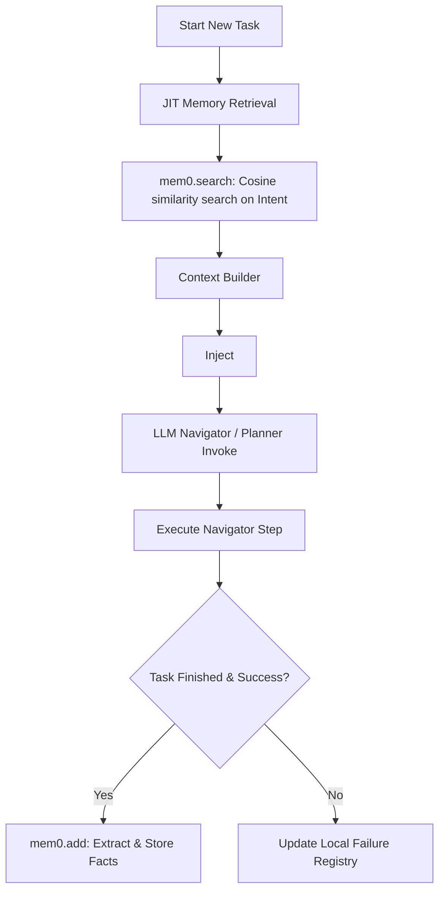

# Implementation Plan: Mem0 Cloud SDK Persistent Memory Integration

This plan details the step-by-step design and architecture to integrate the official **Mem0 SDK (`mem0ai`)** into the browser agent workspace. 

This enables persistent, cross-session memory management, user preference adaptation, and semantic search via Mem0's managed memory cloud layer, utilizing external vector databases and graph entities managed by Mem0.

---

## 1. Core Architectural Overview

By integrating the `mem0ai` SDK, we decouple the memory database (embeddings, vector indexing, graph associations) from the local extension storage. The extension background worker handles task execution, and calls the Mem0 client via standard API endpoints to store and retrieve contextual memories.



---

## 2. Dependency & Configuration Configuration

To support the Mem0 SDK, we will add the package to the extension workspace and expose configuration variables in settings.

### A. Dependency Setup
Add the official SDK to the dependency manifest:
```json
// chrome-extension/package.json
"dependencies": {
  "mem0ai": "^1.0.3"
}
```

### B. Settings schema modification
Expose settings parameters so the user can configure their Mem0 API Key and User ID in the extension popup:
```typescript
// packages/storage/lib/settings.ts
export interface UserSettings {
  mem0ApiKey: string;
  mem0UserId: string;
  // Existing settings...
}
```

---

## 3. Class Design & Mem0 Wrapper

We implement a wrapper around `mem0ai` to handle client instantiation, search queries, and memory additions safely in the service worker environment.

```typescript
// chrome-extension/src/background/agent/memory/cross-session/mem0-service.ts
import { MemoryClient } from 'mem0ai';

export class Mem0Service {
  private client: MemoryClient | null = null;
  private userId: string;

  constructor(apiKey: string, userId: string) {
    this.userId = userId || 'default_user';
    if (apiKey) {
      this.client = new MemoryClient({ apiKey });
    }
  }

  public isEnabled(): boolean {
    return this.client !== null;
  }

  /**
   * Search for relevant semantic memories matching the current task.
   */
  public async searchMemories(query: string): Promise<string[]> {
    if (!this.client) return [];
    try {
      const results = await this.client.search(query, {
        userId: this.userId,
        agentId: 'webgenie_browser_agent'
      });
      
      // Mem0 returns an array of memory objects with a "memory" string property
      return results.map((r: any) => r.memory);
    } catch (error) {
      console.error('Failed to search Mem0 memory:', error);
      return [];
    }
  }

  /**
   * Store new interaction context to extract facts on the Mem0 cloud.
   */
  public async addMemory(task: string, outcome: string): Promise<void> {
    if (!this.client) return;
    try {
      const messages = [
        { role: 'user', content: `Task: ${task}` },
        { role: 'assistant', content: `Outcome & Steps Taken: ${outcome}` }
      ];
      await this.client.add(messages, {
        userId: this.userId,
        agentId: 'webgenie_browser_agent'
      });
    } catch (error) {
      console.error('Failed to add memory to Mem0:', error);
    }
  }
}
```

---

## 4. JIT Context Injection Hook

Before invoking the Planner or Navigator agents, the system queries the Mem0 client for relevant memories:

1. **Trigger**: When a task is initialized, `ContextBuilder` instantiates the `Mem0Service`.
2. **Retrieve**:
   ```typescript
   // chrome-extension/src/background/agent/memory/in-chat/context-builder.ts
   const mem0Service = new Mem0Service(settings.mem0ApiKey, settings.mem0UserId);
   const relevantMemories = await mem0Service.searchMemories(taskIntent);
   ```
3. **Format**: Inject memories into the system prompt's memory block:
   ```xml
   <cross_session_memory>
   [RETRIEVED FROM MEM0 PERSISTENT STORE]
   ${relevantMemories.map(m => `- ${m}`).join('\n')}
   </cross_session_memory>
   ```

---

## 5. Fact-Extraction Pipeline Commit

Upon successful task completion, the executor commits the outcome to Mem0:

```typescript
// chrome-extension/src/background/agent/executor.ts
if (status === 'COMPLETED' && mem0Service.isEnabled()) {
  const summary = memory.progressTracker.getProgressString();
  await mem0Service.addMemory(primaryGoal, summary);
}
```
*Note: The Mem0 API automatically runs its internal extraction models in the cloud to parse the input, reconcile previous facts, and perform `ADD`/`UPDATE`/`DELETE` operations.*

---

## 6. Implementation Blueprint

| File Path | Action | Description |
|---|---|---|
| **`chrome-extension/package.json`** | `[MODIFY]` | Add `mem0ai` as a dependency. |
| **`chrome-extension/src/background/agent/memory/cross-session/mem0-service.ts`** | `[NEW]` | Wrapper around `mem0ai` to handle instantiation, search, and storage. |
| **`chrome-extension/src/background/agent/memory/in-chat/context-builder.ts`** | `[MODIFY]` | Add a hook to search Mem0 and inject returned memories into the `SystemMessage` payload. |
| **`chrome-extension/src/background/agent/executor.ts`** | `[MODIFY]` | Invoke `addMemory()` on Mem0 upon successful task completion. |
| **`packages/storage/lib/settings.ts`** | `[MODIFY]` | Add settings configuration parameters for `mem0ApiKey` and `mem0UserId`. |
