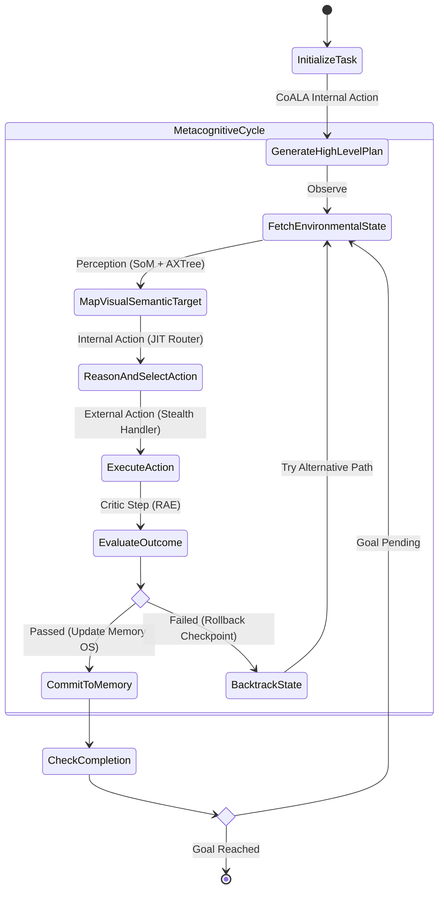

# SOTA Agent Cognitive Thinking Upgradation Blueprint

This document details the transition of WebGenie's execution loop from a sequential planning model to a **Hierarchical Metacognitive Architecture**. This blueprint combines **CoALA (Cognitive Architectures for Language Agents)** memory management, a **Memory OS** paging model, and a **Reason-Act-Evaluate (RAE)** execution loop with page state checkpoint rollbacks.

---

## 1. Core Cognitive Loop: The Hierarchical Metacognitive Model

The upgraded cognitive model separates high-level strategy from low-level execution and validation:



---

## 2. Deep Dive: Memory OS Hierarchical Architecture

To prevent context bloat and JSON parser errors, the agent's memory is structured as a hierarchical **Memory OS** with segment-paging rules:

```
┌────────────────────────────────────────────────────────────────────────┐
│                        MEMORY OS ARCHITECTURE                          │
├────────────────────────────────────────────────────────────────────────┤
│  L1: Active Working Memory (Viewport AXTree & SoM Overlays)            │
│  ├── Current Viewport Bounds                                           │
│  └── Live Element Annotations                                          │
├────────────────────────────────────────────────────────────────────────┤
│  L2: Short-Term Action Trace Buffer (Rolling Context)                  │
│  ├── Last 3 Action Trajectories                                        │
│  └── Page Mutation Signatures (JSON Diff String)                       │
├────────────────────────────────────────────────────────────────────────┤
│  L3: Episodic Memory (Paged Storage - Read/Write API)                  │
│  ├── Long-Term Selector DB (Mem0 Selector Cache)                       │
│  └── Domain Success/Failure Metrics                                    │
└────────────────────────────────────────────────────────────────────────┘
```

### Memory OS Segment-Paging Mechanics
1. **L1 (Active Viewport)**: Parsed and serialized dynamically at each step. Old L1 states are discarded.
2. **L2 (Short-Term Action Trace)**: Maintained as a rolling buffer of the last three steps. Older traces are compiled into milestone summaries and archived to L3 to prevent token bloat.
3. **L3 (Episodic Memory)**: Loaded into context only when matching target domains are visited, reducing prompt sizes.

---

## 3. Algorithm: Reason-Act-Evaluate (RAE) with Rollback

The core cognitive execution flow uses the following algorithm:

```typescript
export interface Point { x: number; y: number; }

export interface BrowserState {
  url: string;
  axTreeHash: string;
  screenshotBase64: string;
}

export interface ActionDescriptor {
  type: string;
  targetSelector?: string;
  targetCoords?: Point;
  payload?: string;
}

export interface ValidationResult {
  passed: boolean;
  score: number; // 0.0 to 1.0 confidence score
  feedback?: string;
}

export class CognitiveExecutionEngine {
  private memoryOS: MemoryOS;
  private cdpBridge: CDPBridge;
  private critic: CriticAgent;
  private checkpointRegistry: CheckpointRegistry;

  async executeCognitiveStep(
    taskId: string,
    currentSubGoal: string
  ): Promise<{ status: 'SUCCESS' | 'REPLAN' | 'FAILED' }> {
    // 1. Save state checkpoint
    const checkpointId = await this.checkpointRegistry.saveCheckpoint(this.cdpBridge.getActiveTabId());
    
    // 2. Observe & Perceive (AXTree + Set-of-Marks)
    const axTree = await this.cdpBridge.captureAXTree();
    const annotatedScreenshot = await this.cdpBridge.captureAnnotatedScreenshot(axTree.interactiveElements);
    
    // Update L1 Working Memory
    this.memoryOS.updateL1({ axTree, annotatedScreenshot });
    
    // 3. Reason & Select Action (JIT Router)
    const context = this.memoryOS.compileContext(currentSubGoal);
    const action: ActionDescriptor = await this.planner.decideAction(context);
    
    // 4. Act (Stealth Execution Handler)
    const preState = await this.getCurrentBrowserState();
    await this.actionHandlers.dispatchStealthAction(action);
    
    // 5. Evaluate (RAE Critic Validation)
    const postState = await this.getCurrentBrowserState();
    const evaluation: ValidationResult = await this.critic.evaluate(
      currentSubGoal,
      action,
      preState,
      postState
    );
    
    // 6. State Transition Decision
    if (evaluation.passed && evaluation.score >= 0.8) {
      // Commit step results to L2 Trace Buffer
      this.memoryOS.commitToL2({
        action,
        preState,
        postState,
        validation: 'PASSED'
      });
      return { status: 'SUCCESS' };
    } else {
      // Revert page context to last checkpoint
      logger.warn(`Critic validation failed: ${evaluation.feedback}. Rolling back context...`);
      await this.checkpointRegistry.restoreCheckpoint(checkpointId);
      
      // Update L3 Episodic Memory with failure records
      this.memoryOS.registerFailureToL3({
        selector: action.targetSelector ?? 'unknown',
        url: preState.url,
        actionType: action.type,
        feedback: evaluation.feedback
      });
      
      return { status: 'REPLAN' };
    }
  }

  private async getCurrentBrowserState(): Promise<BrowserState> {
    const tabId = this.cdpBridge.getActiveTabId();
    return {
      url: await this.cdpBridge.getTabUrl(tabId),
      axTreeHash: await this.cdpBridge.getAXTreeHash(tabId),
      screenshotBase64: await this.cdpBridge.getScreenshot(tabId)
    };
  }
}
```

---

## 4. Implementation Specifications for the Cognitive Engine

### Metacognitive Self-Reflection
After every three actions, the agent performs a self-reflection step. It evaluates its progress against the initial task objective and refines the sub-goals:

$$\text{Progress Index } (P) = \frac{\text{Milestones Completed}}{\text{Total Milestones Estimated}}$$

If $P$ is static for 3 steps, the Executor halts execution and prompts the Planner to rewrite the strategy.

### Selector Caching (Mem0-Style Memory)
When the Critic validates a step as successful, the selector path and domain are cached in a local database:

$$\text{Cache Key} = \text{MD5}(\text{Domain} + \text{Semantic Goal})$$

If the agent returns to a matching domain with a similar goal in future sessions, it loads the cached selector directly, bypassing LLM queries and reducing step latency to sub-100ms.
