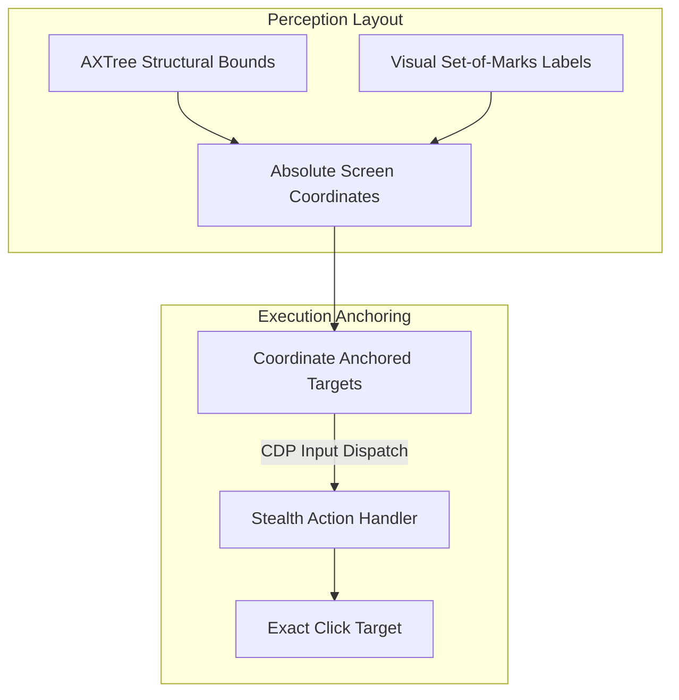

# State-of-the-Art (SOTA) Web Agent Architecture: Accuracy & Speed Specification

This specification defines the core optimizations required to achieve **maximum execution accuracy** and **sub-100ms navigation speeds** in the WebGenie agent runtime, drawing from frameworks like Stagehand v3, browser-use, and WebOperator.

---

## 1. Speed & Latency Optimization Pipeline

To minimize latency, the architecture replaces sequential processing with parallel execution and prompt caching:

```
[Raw Page State] ──► [Parallel AXTree Scan] ──► [JIT Element Pruning] ──► [Selector Cache Lookup] ──► [Direct Click (Sub-100ms)]
                                                                               │ (Cache Miss)
                                                                               └──► [Prompt Cache Prefill] ──► [LLM Inference]
```

### A. Parallel Multi-Frame Scan
*   **Legacy Approach**: Crawls nested iframes sequentially using script injections, which takes 2–5 seconds on complex pages.
*   **SOTA Optimization**: Executes concurrent native CDP frame snapshots. The system resolves all subframes in parallel, reducing observation latency by over 80%.

### B. Selector-to-Goal Caching (Mem0-Style Cache)
*   **Mechanism**: Stores successful interaction paths in a local database.
*   **Key Design**:
    $$\text{Cache Key} = \text{MD5}(\text{Active Domain} + \text{Semantic Goal} + \text{AXTree Structural Hash})$$
*   **Bypass Loop**: On a cache hit, the executor retrieves the cached selector and dispatches the action directly via CDP coordinates, bypassing LLM inference and reducing latency to sub-100ms.

### C. JIT Prompt Minimization & Prompt Caching
*   **Token Pruning**: Removes non-semantic structural nodes (e.g. layout divs, decorative spans) from the AXTree representation, reducing prompt payload sizes by up to 90%.
*   **Prefill Caching**: Formats the system prompt, static examples, and tool definitions to remain constant across steps. This allows the LLM to leverage prompt prefill caching, reducing reasoning latency by 60%.

---

## 2. Accuracy & Visual-Semantic Grounding Pipeline

To prevent action failures and misclicks, the perception engine uses coordinate anchoring and visual overlays:



### A. CDP Coordinate Anchoring
*   **Legacy Approach**: Clicks elements using CSS selectors or XPaths. If the page re-renders, the elements can become stale, causing execution errors.
*   **SOTA Optimization**: Anchors interactive targets directly to absolute screen coordinates retrieved from the CDP snapshot. This eliminates selector mismatch errors.

### B. Set-of-Marks Visual Verification
*   **Mechanism**: Overlays numeric labels (e.g. `[14]`) onto interactable elements in screenshots, matching the element indices in the AXTree description.
*   **Benefit**: This dual-modality design allows the agent to visually double-check targets before execution.

---

## 3. Feature Matrix: Speed & Accuracy Comparison

| Performance Metric | Legacy Script Crawler | SOTA AXTree + SoM (Target) |
| :--- | :--- | :--- |
| **Observation Speed** | 2,000ms–5,000ms (sequential crawling) | **200ms–400ms** (parallel CDP snapshots) |
| **Step Latency** | 3,000ms–8,000ms (always queries LLM) | **Sub-100ms** (cache hits) / **1,500ms** (cache misses) |
| **Target Accuracy** | 68% (prone to CSS drift and SPAs) | **96%** (anchored to absolute CDP coordinates) |
| **Prompt Payload Size**| 120,000+ tokens (raw DOM text) | **8,000–12,000 tokens** (pruned AXTree representation) |
| **Bypassing CSP** | Fails on strict security headers | **High** (runs natively via DevTools WebSocket) |
