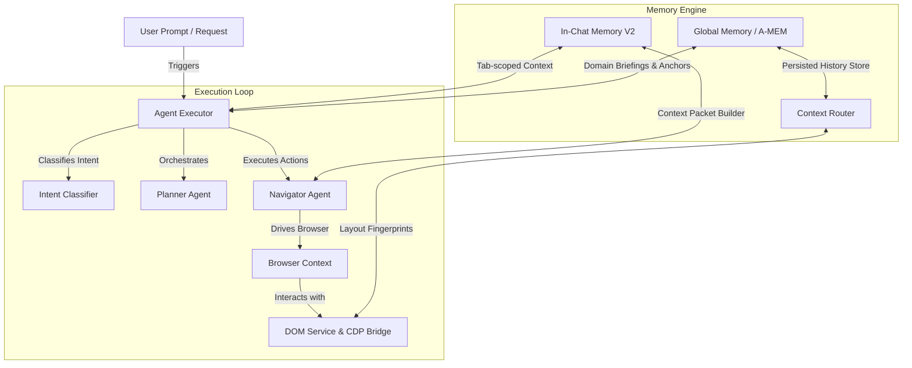
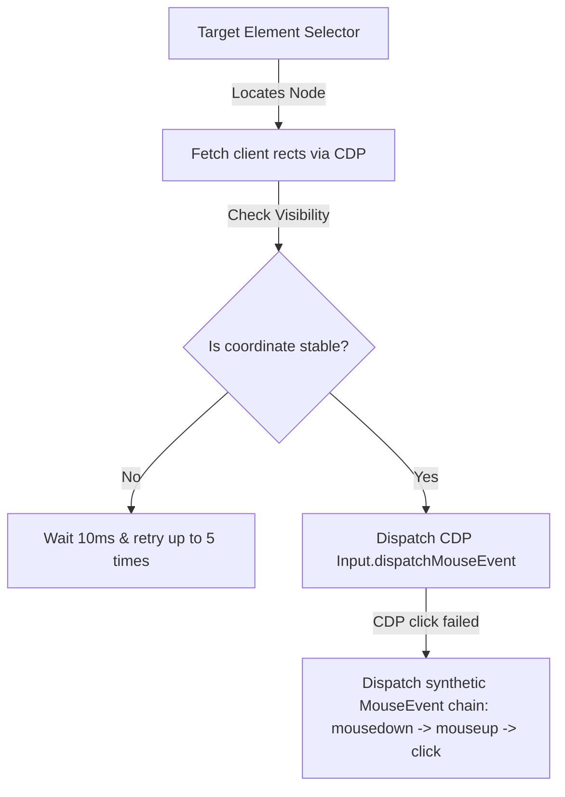

# WebGenie Complete Backend & Memory System Architecture: Technical Reference Manual

This document provides an exhaustive, low-level technical explanation of the WebGenie backend system architecture. It covers the folder structures, class definitions, function signatures, data flow mechanics, serialization structures, and the concrete integrations between the execution engine, the browser context, and the memory systems.

---

## 1. System Architecture Overview

WebGenie runs as an event-driven agentic browser assistant inside a Chrome Extension service worker (`background.iife.js`). The system architecture is split into three main layers:
1. **Execution & Coordination Layer**: Drives the agent loops and schedules planning, navigation, and API orchestration.
2. **Browser Control & DOM Intelligence Layer**: Inspects the tab DOM, builds tree representations, checks click targets, and executes CDP automation.
3. **Double-Engine Memory Layer**:
   * **In-Chat Memory V2**: Tab-scoped, structured representation of current session context (goals, constraints, decisions, progress, timeline events, completed task outcomes).
   * **Global Memory (A-MEM)**: Cross-session persistent storage (episodic learnings, past selector success maps, and structural attention masks).



---

## 2. Directory Structure & File-by-File Reference

The backend codebase is organized as follows:

```
chrome-extension/src/background/
├── index.ts                         # Service worker root entry point
├── log.ts                           # Namespace-bound console logging utility
├── agent/                           # Main agent orchestration folder
│   ├── executor.ts                  # Central execution loop and lifecycle manager
│   ├── types.ts                     # TypeScript types for execution contexts and failure registries
│   ├── helper.ts                    # Helper utilities for prompt cleaning and message formatting
│   ├── history.ts                   # Sliding window tracker for executing step details
│   ├── agents/                      # Specialized agent LLM wrappers
│   │   ├── base.ts                  # Base agent wrapper providing generic message formatting
│   │   ├── planner.ts               # Planner Agent (schedules steps and checks goals)
│   │   ├── navigator.ts             # Navigator Agent (determines tab interactions)
│   │   └── navigator/               # Action schemas, handlers, and click verifications
│   ├── actions/                     # CDP browser automation tools
│   │   ├── schemas.ts               # Action parameter validation schemas (Zod)
│   │   └── handlers/                # Automation commands (click, input, scroll)
│   ├── prompts/                     # Structured instructions sent to LLMs
│   └── memory/                      # Memory systems folder
│       ├── index.ts                 # Main export aggregator
│       ├── in-chat/                 # Tab-scoped session state
│       │   ├── types.ts             # Memory item, goal context, and intent type specifications
│       │   ├── in-chat-memory.ts    # Main in-chat state container and conflict resolver
│       │   ├── goal-manager.ts      # Tracks goal updates, completed/abandoned goals
│       │   ├── progress-tracker.ts  # Builds visual progress checklists
│       │   ├── recent-actions.ts    # Sliding window queue of last 5 executed actions
│       │   ├── task-archive.ts      # Structured historical outcome register
│       │   ├── conversation-timeline.ts # Lifecycle milestone timeline logger
│       │   ├── intent.ts            # Intent classification system using Zod schemas
│       │   └── context-builder.ts   # Context message assembler
│       └── global/                  # Permanent cross-session storage
│           ├── types.ts             # Selector mappings, domain KV entries, and note schemas
│           ├── memory-store.ts      # Chrome storage wrapper with local file fallback
│           └── context-router.ts    # Layout fingerprint matcher and dynamic attention mask router
└── browser/                         # CDP and Tab management layer
    ├── context.ts                   # Page selector, screenshot, and tab focus container
    ├── page.ts                      # Coordinate click stability checks and mouse dispatches
    └── chromium-apis/               # Direct CDP bindings, DOM tree extractors, scripting tools
```

---

## 3. Core Backend Components & API Integration

### A. The Agent Executor (`executor.ts`)
The `Executor` class governs the lifetime of a navigation run.

#### 1. Lifecycle Initialization
When a user prompt arrives:
* `Executor` is initialized with the target task string.
* `AgentContext` is instantiated, linking a fresh `InChatMemory` session.
* `MessageManager` initializes the message history:
```typescript
this.context.messageManager.initTaskMessages(this.navigatorPrompt.getSystemMessage(), task);
```

#### 2. Intent Classification
Prior to executing any steps, the executor runs the classification:
```typescript
const intent = await classifyIntent(this.navigator.getChatLLM(), taskText);
```
Based on the returned `UserIntent` value:
* `NEW_TASK`: Goals are reset; a `TASK_STARTED` timeline event is logged.
* `MODIFY_TASK`: Inserts a constraint or fact from the prompt text, then modifies subgoals.
* `CONTINUE_TASK`: Overrides subgoals, leaving facts intact.
* `REFERENCE_PREVIOUS_TASK`: Redirects goal targets to archives retrieval, injecting past records.

#### 3. Step Loop Execution
Inside the main loop, for each step:
1. Captures the current page state, screenshots, and URLs.
2. If `nSteps` matches the `planningInterval`, invokes `PlannerAgent` to return an updated JSON plan.
3. The context updates its goals (`GoalManager`) and progress checklist (`ProgressTracker`).
4. Invokes `NavigatorAgent` to get a structured browser action (e.g. `click_element`).
5. Executes the action through the CDP browser automation layer.
6. Invokes `InChatMemory.importFromLLMResponse()` to digest newly extracted facts and decisions from the Navigator's response.
7. Calls `InChatMemory.resolveConflicts()` to deduplicate slots.
8. Triggers `compactHistory()` to prune message queues and retain memory health.

#### 4. Task Termination
* **Success**: Saves a structured `TaskRecord` to the `taskArchive` containing the active facts, decisions, final outcome text, and logs a `TASK_COMPLETED` event.
* **Failure (Max Steps)**: Logs `TASK_COMPLETED` with a failed state and invokes cleanup.
* **Cancellation**: Logs `TASK_COMPLETED` with a cancelled state.

---

### B. The Planner Agent (`planner.ts`)
The `PlannerAgent` manages structured planning cycles. It takes the context packet and compares the page status to the primary goal.

* **Structured Schema Output**:
```json
{
  "completed_steps": ["step 1 description"],
  "current_step": "step 2 description",
  "remaining_steps": ["step 3 description", "step 4 description"]
}
```
* **Integration**: The planning steps are parsed and injected directly into `InChatMemory.progressTracker` to construct the active `<structured_memory>` prompt component.

---

### C. The Navigator Agent (`navigator.ts` & `actions/`)
The `NavigatorAgent` maps the browser view and active memory into a target interaction.

* **DOM Snapshot Intake**:
  Receives a flattened list of interactive elements compiled by `dom-snapshot-extractor.ts`.
* **Action Schema Validation**:
  Every generated action matches one of the schemas in `chrome-extension/src/background/agent/actions/schemas.ts`:
  * `click_element`: `{ selector: string }`
  * `input_text`: `{ selector: string, text: string }`
  * `scroll_page`: `{ direction: "up" | "down" | "left" | "right" }`
  * `done`: `{ text: string, success: boolean }`
* **Interaction Failures**:
  If an action fails (e.g., clicking a button doesn't trigger a DOM structure modification or page navigation), `executor.ts` calls `context.registerFailure(selector, url)`. This selector key is marked as `⛔ [BLOCKED - repeated no-op]` in future prompts, forcing the Navigator to attempt alternate nodes.

---

### D. DOM Engine & CDP Coordinate Verification (`browser/page.ts`)
Standard Puppeteer/Playwright clicks can fail if elements are overlapping, hidden, or moving. WebGenie uses browser-native validation loops:



1. **Precision Rects**: Feeds selectors to CDP and queries `getClientRects()` to find the exact center of the visible area.
2. **Stability Verification**: Executes coordinate monitoring loops to check if the element is actively scrolling or animating.
3. **CDP Mouse Dispatches**: Dispatches native events through `Input.dispatchMouseEvent` for type `mousePressed` and `mouseReleased`.
4. **MouseEvent Fallback Chain**: If the native action is blocked or fails, evaluates a synthetic script execution chain:
```javascript
const el = document.querySelector(selector);
el.dispatchEvent(new MouseEvent('mousedown', { bubbles: true }));
el.dispatchEvent(new MouseEvent('mouseup', { bubbles: true }));
el.dispatchEvent(new MouseEvent('click', { bubbles: true }));
```

---

## 4. In-Chat Memory V2 Deep-Dive

The V2 Memory Engine acts as the absolute source of truth for the navigator, completely superseding standard chat transcripts.

### A. The Memory State XML Schema (`context-builder.ts`)
The `ContextBuilder` aggregates the components of `InChatMemory` into an XML-compliant format injected directly into the LLM system prompt:

```xml
<structured_memory>
[GOAL HIERARCHY]
PRIMARY GOAL: [Primary Goal String]
CURRENT GOAL: [Current Step Goal String]
CURRENT SUBGOAL: [Active Subgoal String]
GOAL REVISION: [Integer Revision Number]

[ACTIVE FACTS]
- [Fact content 1] (Source: task-id)
- [Fact content 2] (Source: task-id)

[ACTIVE CONSTRAINTS]
- [Constraint content 1]
- [Constraint content 2]

[ACTIVE DECISIONS]
- [Decision description]

[PROGRESS STATUS]
Completed:
* [Completed Step 1]
Currently working on:
* [Current Step]
Remaining:
* [Remaining Step 1]

[PINNED SENSITIVE MEMORY]
- [Pinned items, e.g., keys, codes]

[RECENT EXECUTION HISTORY]
Step Action 1: [Action taken at step N-4]
Step Action 2: [Action taken at step N-3]
Step Action 3: [Action taken at step N-2]
Step Action 4: [Action taken at step N-1]
Step Action 5: [Action taken at step N]

[COMPLETED TASK REFERENCES]
- Goal: "First Goal" | Outcome: "Success details" | Summary: "Goal summary details"
</structured_memory>
```

---

### B. GoalManager State Machine (`goal-manager.ts`)
The GoalManager handles hierarchical goals and conflict tracking.

* **Revisions**: Incremented every time a primary, current, or subgoal is changed.
* **Archival Rules**:
  * If a primary goal or current goal changes, it is classified as superseded and appended to the `abandonedGoals` array:
  ```typescript
  private abandonActiveGoal(content: string, reason: string): void {
    if (!content || content === 'Initialize task execution') return;
    if (this.abandonedGoals.some(g => g.content === content)) return;
    this.abandonedGoals.push({
      id: Math.random().toString(36).substring(2, 11),
      content,
      status: 'abandoned',
      createdAt: Date.now(),
      completedAt: Date.now(),
    });
  }
  ```
  * When a subgoal is completed, it is moved to `completedGoals` and the active subgoal slot is cleared.

---

### C. Slot-Based Conflict Resolution (`in-chat-memory.ts`)
To prevent token growth and contradictory conditions, `InChatMemory.resolveConflicts()` deduplicates semantic slots using regex parsing:

1. **Slot Identification**:
   Checks content against slot assignment patterns (e.g. `budget = 80000` or `brand: Dell`):
   `const match = item.content.match(/^([a-zA-Z0-9_\-\s]+)\s*(?:=|:|is|set to)\s*(.+)$/i);`
2. **Indexed Sort**:
   Sorts items from newest to oldest based on index and the `updatedAt` timestamps.
3. **Deactivation**:
   Maintains a map of observed slot keys. If a key (e.g., `budget`) has already been mapped, all subsequent older occurrences of that slot are flagged as inactive (`active: false`).

---

### D. Conversation Timeline & Logger Binding (`conversation-timeline.ts`)
Tracks runtime lifecycle transitions.

```typescript
export type TimelineEventType =
  | 'TASK_STARTED'
  | 'TASK_COMPLETED'
  | 'GOAL_CHANGED'
  | 'DECISION_MADE'
  | 'FACT_UPDATED';

export interface TimelineEvent {
  timestamp: number;
  type: TimelineEventType;
  description: string;
  metadata?: Record<string, any>;
}
```

* **Standard Output Binding**:
  To ensure these timeline transitions show up directly in development, test, and background console logs, the timeline writer is integrated with the namespace-bound background log engine:
  ```typescript
  import { createLogger } from '../../../log';
  const logger = createLogger('Memory');

  public addTimelineEvent(type: TimelineEventType, description: string, metadata?: Record<string, any>): void {
    this.timeline.addEvent(type, description, metadata);
    logger.info(`[Timeline] [${type}] ${description}`);
  }
  ```

---

## 5. Global Memory (A-MEM) & Context Router Deep-Dive

Global memory operates across browser restarts, storing permanent semantic selectors and layout signatures.

### A. WebGenieMemoryStore (`global/memory-store.ts`)
Wraps Chrome's session and local storage layers:
* **Session Storage**: Stores fast-access tab transaction details.
* **Local Storage**: Persists domain records and episodic notes.
* **File System Fallback**: In non-extension test environments, falls back to local JSON file persistence (`.webgenie_global_memory.json`).

---

### B. ContextRouter & Structural Masking (`global/context-router.ts`)
Calculates dynamic visibility parameters for the DOM.

```
[CDP DOM tree extract] ──> [Filter nodes] ──> [Compute layout fingerprint hash]
                                                    │
                                                    ├──> Matches existing hash?
                                                    │     ├──> YES: Retrieve cached Selector IDs
                                                    │     └──> NO: Create new fingerprint entry
                                                    │
                                                    └──> Generate Attention Mask
                                                          └──> Prunes static header/footer structures
                                                               focus LLM attention on updated containers
```

1. **Fingerprint Hashing**: Matches element nodes, depth, and tag types into a structural signature.
2. **Selector Prioritization**: Queries the stored selector success ratios. Nodes matching historically successful targets receive prioritized ranking labels in the elements list.
3. **Attention Masking**: Prunes structural templates (e.g., menus, footers, headers) that have not changed since the prior step, saving substantial prompt tokens.

---

## 6. End-to-End Execution Flow (Line-by-Line Call Stack)

When a user initiates the prompt `"Search for HackerNews and select the top story"`:

1. **`background/index.ts`** catches the message event and instantiates `Executor`:
   `const executor = new Executor(task, taskId, browserContext, llm);`
2. **`executor.ts:execute()`** starts:
   * Calls `classifyIntent(llm, task)` -> Returns `'NEW_TASK'`.
   * Calls `GoalManager.updateGoals('Search for HackerNews...', 'Search for HackerNews...', 'Initialize task execution')`.
   * Logs timeline event: `[Timeline] [TASK_STARTED] Started task: "Search for HackerNews..."`.
3. **Loop Step 0** begins:
   * Calls `browserContext.getState()` to retrieve URL, active tab screenshot, and DOM elements.
   * Compiles elements through `dom-snapshot-extractor.ts`.
   * Calls `ContextBuilder.buildContextPacket()`:
     * Reads goals, facts, constraints, and progress.
     * Merges instructions and `<structured_memory>` XML block into a single unified `SystemMessage` at index 0.
   * Invokes `NavigatorAgent.invoke([SystemMessage, HumanMessage])`.
   * Navigator returns target action: `search_web({ query: "Hacker News" })`.
4. **Action Execution**:
   * Executor catches `search_web`.
   * Runs `searchWebHandler.execute({ query: "Hacker News" })`.
   * CDP loads `https://www.google.com/search?q=Hacker+News`.
5. **Loop Step 1** begins:
   * Captures the search results page state.
   * Invokes Navigator -> Returns `click_element({ selector: "a[href*='news.ycombinator.com']" })`.
   * Executor calls `browserPage.clickElementNode("a[href*='news.ycombinator.com']")`.
   * CDP runs click stability loops and dispatches native mouse events.
6. **Goal Consolidation**:
   * Navigator detects Hacker News loaded. Returns `done({ success: true, text: "Hacker News loaded successfully" })`.
   * Executor captures `isCompleted = true`.
   * Compiles active facts/decisions and calls `taskArchive.addRecord()`.
   * Logs timeline event: `[Timeline] [TASK_COMPLETED] Completed task: "Search for HackerNews..."`.
   * Saves selectors and note mappings permanently using `ContextRouter.consolidateAfterTask()`.
