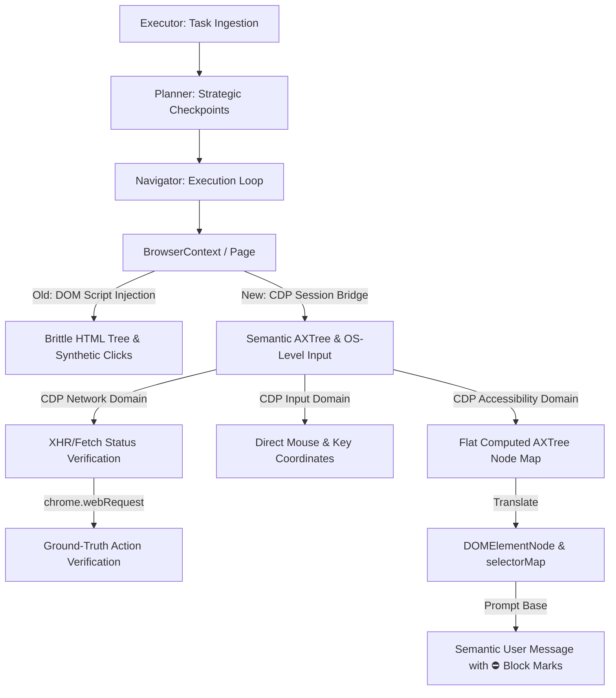

# WebGenie Master Upgrade Plan: Chromium APIs & CDP Integration

This document outlines the detailed master plan for upgrading the WebGenie agent to utilize native Chromium Manifest V3 APIs and the Chrome DevTools Protocol (CDP). This plan addresses perception accuracy, interaction reliability, network validation, and memory management.



---

## 1. Upgrade Phase Strategy

The upgrade is divided into five sequential phases to ensure zero degradation of the current system. Each phase has fallback mechanisms to revert to the old architecture if trust/confidence parameters drop.

| Phase | Title | Primary API | Target Files | Objective |
|---|---|---|---|---|
| **Phase 1** | **CDP Session & Bridge Manager** | `chrome.debugger` + `Puppeteer.CDPSession` | `browser/context.ts`, `browser/page.ts` | Establish a reliable CDP communication channel reusing the Puppeteer connection. |
| **Phase 2** | **Semantic AXTree Extraction** | `CDP Accessibility` + `CDP DOM` | `browser/dom/service.ts`, `browser/page.ts` | Replace injected JS parsing with accessibility trees, piercing Shadow DOM and cross-origin iframes. |
| **Phase 3** | **OS-Level Input Pipeline** | `CDP Input` | `agent/actions/handlers/interaction.ts` | Replace Puppeteer `.click()` / JS typing with low-level coordinates and OS input simulation. |
| **Phase 4** | **Ground-Truth Network Watcher** | `chrome.webRequest` + `CDP Network` | `agent/agents/navigator.ts` | Implement HTTP request interception to verify action outcomes instead of DOM polling. |
| **Phase 5** | **Session-Scoped Memory Pyramid** | `chrome.storage.session` + Gemini Nano | `agent/messages/service.ts` | Move memory storage to session limits and use on-device AI for step compaction. |

---

## 2. Phase-by-Phase Technical Specifications

---

### Phase 1: CDP Session & Bridge Manager

#### Current State Analysis
Currently, `Page.ts` connects Puppeteer using:
```typescript
const browser = await connect({
  transport: await ExtensionTransport.connectTab(this._tabId),
  defaultViewport: null,
  protocol: 'cdp',
});
```
This is a wrapper around `chrome.debugger.attach`. To avoid multiple attachments on a single tab, we must hook into Puppeteer's existing CDPSession instead of creating a raw debugger connection.

#### Blueprint Changes in `chrome-extension/src/background/browser/page.ts`
1. Expose a getter for the active `CDPSession`.
2. Wrap session management to automatically recreate it if the session is detached.

```typescript
// Add to Page class in page.ts
private _cdpSession: CDPSession | null = null;

async getCDPSession(): Promise<CDPSession> {
  if (!this._puppeteerPage) {
    await this.attachPuppeteer();
  }
  if (!this._cdpSession) {
    this._cdpSession = await this._puppeteerPage!.target().createCDPSession();
    
    // Listen for session detachment
    this._cdpSession.on('Inspector.detached', () => {
      logger.warning(`CDP Session detached from tab ${this._tabId}`);
      this._cdpSession = null;
    });
  }
  return this._cdpSession;
}
```

---

### Phase 2: Semantic AXTree Extraction

#### Target Files to Modify:
*   `chrome-extension/src/background/browser/dom/service.ts`
*   `chrome-extension/src/background/browser/page.ts`

#### Current Loop vs. New AXTree Pipeline
Instead of injecting scripts that scan HTML elements, we query the `Accessibility` and `DOM` domains:

```
[CDP getFullAXTree] ──> [Filter Ignored/Presentational Nodes] ──> [Build Flat Node List] ──> [Map to DOMElementNode]
```

#### Node Structure Mapping: CDP AXNode to `DOMElementNode`

| `DOMElementNode` Property | Source from CDP `AXNode` |
|---|---|
| `tagName` | Calculated from `role.value` (e.g., role `button` → tag `button`, role `textbox` → tag `input`) |
| `xpath` | Resolved using `DOM.describeNode` by passing the `backendDOMNodeId` to build the tag hierarchy |
| `attributes` | Populated by mapping node attributes like `name` (maps to `aria-label`/`title`), `description`, `disabled`, `value`, `placeholder` |
| `highlightIndex` | Assigned sequentially to interactive accessibility nodes |
| `viewportCoordinates` | Derived by calling `DOM.getBoxModel` with `backendDOMNodeId` |

#### Detailed Implementation Blueprint for `getClickableElements` in `service.ts`:

```typescript
import type { CDPSession } from 'puppeteer-core';
import { DOMElementNode } from './views';

export interface AXElementNode {
  nodeId: string;
  role: string;
  name: string;
  description?: string;
  disabled: boolean;
  focused: boolean;
  value?: string;
  backendDOMNodeId: number;
}

export async function getClickableElementsViaCDP(
  page: Page,
  showHighlightElements = true,
  viewportExpansion = 0
): Promise<DOMState> {
  const session = await page.getCDPSession();
  
  // 1. Enable Accessibility and DOM domains
  await session.send('Accessibility.enable');
  await session.send('DOM.enable');

  // 2. Fetch the entire accessibility tree
  const { nodes } = await session.send('Accessibility.getFullAXTree') as { nodes: any[] };

  const interactiveElements: DOMElementNode[] = [];
  const selectorMap = new Map<number, DOMElementNode>();
  let highlightCounter = 0;

  // Filter for interactive roles
  const INTERACTIVE_ROLES = new Set([
    'button', 'link', 'textbox', 'combobox', 'checkbox', 
    'radio', 'listbox', 'searchbox', 'menuitem', 'tab', 'treeitem'
  ]);

  for (const node of nodes) {
    if (node.ignored || !node.role) continue;
    const roleValue = node.role.value;
    if (!INTERACTIVE_ROLES.has(roleValue)) continue;

    // Resolve bounding box via DOM domain
    let coordinates;
    try {
      const { model } = await session.send('DOM.getBoxModel', {
        backendNodeId: node.backendDOMNodeId
      }) as { model: any };
      
      const content = model.content; // [x1,y1, x2,y2, x3,y3, x4,y4]
      coordinates = {
        left: content[0],
        top: content[1],
        width: content[2] - content[0],
        height: content[5] - content[1],
        x: (content[0] + content[4]) / 2,
        y: (content[1] + content[5]) / 2,
      };
    } catch {
      // Element might be offscreen or unrendered
      continue;
    }

    // Map attributes
    const attributes: Record<string, string> = {
      role: roleValue,
      'aria-label': node.name?.value || '',
      value: node.value?.value || '',
      placeholder: node.description?.value || ''
    };

    const elementNode = new DOMElementNode({
      tagName: mapAXRoleToTagName(roleValue),
      xpath: null, // calculated on-demand if required
      attributes,
      children: [],
      isVisible: true,
      isInteractive: true,
      isInViewport: true,
      highlightIndex: highlightCounter++,
      viewportCoordinates: coordinates,
    });

    selectorMap.set(elementNode.highlightIndex!, elementNode);
  }

  // Construct a pseudo root element for compatibility with current elementTree
  const elementTree = new DOMElementNode({
    tagName: 'root',
    xpath: '',
    attributes: {},
    children: Array.from(selectorMap.values()),
    isVisible: true,
  });

  return { elementTree, selectorMap };
}

function mapAXRoleToTagName(role: string): string {
  switch (role) {
    case 'link': return 'a';
    case 'button': return 'button';
    case 'textbox': return 'input';
    case 'combobox': return 'select';
    default: return 'div';
  }
}
```

---

### Phase 3: OS-Level Input Pipeline

#### Target Files to Modify:
*   `chrome-extension/src/background/agent/actions/handlers/interaction.ts`
*   `chrome-extension/src/background/browser/page.ts`

#### Current Execution
Current interaction uses standard DOM script executions or Puppeteer `.click()`, which dispatch event triggers from within the page context. These are easily blocked by modern anti-bot setups and fail on SPAs that listen to standard hardware mouse-up/down events.

#### Upgrade Specification
Replace synthetic interactions with lower-level hardware inputs directed to the `CDPSession` using exact layout coordinates.

```typescript
// Inside background/browser/page.ts
async cdpClick(coordinates: { x: number; y: number }): Promise<void> {
  const session = await this.getCDPSession();
  
  // 1. Move mouse to target
  await session.send('Input.dispatchMouseEvent', {
    type: 'mouseMoved',
    x: coordinates.x,
    y: coordinates.y,
  });

  // 2. Press Mouse Down
  await session.send('Input.dispatchMouseEvent', {
    type: 'mousePressed',
    button: 'left',
    x: coordinates.x,
    y: coordinates.y,
    clickCount: 1,
  });

  // 3. Release Mouse Up
  await session.send('Input.dispatchMouseEvent', {
    type: 'mouseReleased',
    button: 'left',
    x: coordinates.x,
    y: coordinates.y,
    clickCount: 1,
  });
}

async cdpType(text: string): Promise<void> {
  const session = await this.getCDPSession();
  
  // 1. Insert text directly into the focused field
  await session.send('Input.insertText', { text });
}

async cdpPressKey(key: string): Promise<void> {
  const session = await this.getCDPSession();
  
  // Send key down and key up sequence
  await session.send('Input.dispatchKeyEvent', {
    type: 'rawKeyDown',
    key: key,
    windowsVirtualKeyCode: mapKeyToVirtualCode(key)
  });
  await session.send('Input.dispatchKeyEvent', {
    type: 'keyUp',
    key: key,
  });
}
```

---

### Phase 4: Ground-Truth Network Watcher

#### Target Files to Modify:
*   `chrome-extension/src/background/agent/agents/navigator.ts`
*   `chrome-extension/src/background/agent/types.ts`

#### Heuristics vs Network Integration
Currently, the agent validates action success using the path hashes of the DOM tree. If an AJAX submit happens without a direct visual routing change, it has to guess if it worked.

#### Integration Logic
1. Start an asynchronous HTTP listener *before* triggering the click.
2. Filter for non-GET requests (POST/PUT/PATCH) originating from the active tab.
3. If an API request responds with `2xx`, verify success. If it responds with `4xx` or `5xx`, extract the network failure payload and register it in the Failure Registry.

```typescript
// Inside background/agent/agents/navigator.ts (doMultiAction)
const currentTabId = this.context.browserContext.getCurrentTabId();

// Set up webRequest hooks
let networkStatus: { ok: boolean; errorText?: string } | null = null;

const onCompletedListener = (details: chrome.webRequest.WebResponseCacheDetails) => {
  if (details.tabId === currentTabId && details.method !== 'GET') {
    if (details.statusCode >= 200 && details.statusCode < 300) {
      networkStatus = { ok: true };
    } else {
      networkStatus = { ok: false, errorText: `API Server returned status ${details.statusCode}` };
    }
  }
};

const onErrorListener = (details: chrome.webRequest.WebResponseErrorDetails) => {
  if (details.tabId === currentTabId && details.method !== 'GET') {
    networkStatus = { ok: false, errorText: `Network error: ${details.error}` };
  }
};

// Bind listeners
chrome.webRequest.onCompleted.addListener(onCompletedListener, { urls: ["<all_urls>"] });
chrome.webRequest.onErrorOccurred.addListener(onErrorListener, { urls: ["<all_urls>"] });

try {
  // Execute the click/input interaction
  const result = await actionInstance.call(actionArgs);
  
  // Wait up to 2 seconds for any network responses to settle
  await new Promise(r => setTimeout(r, 1500));

  if (networkStatus && !networkStatus.ok) {
    // Overwrite visual change check if the network layer explicitly reported an API error
    result.error = networkStatus.errorText;
    result.isDone = false;
  }
} finally {
  // Always unbind listeners to prevent memory leaks
  chrome.webRequest.onCompleted.removeListener(onCompletedListener);
  chrome.webRequest.onErrorOccurred.removeListener(onErrorListener);
}
```

---

### Phase 5: Session-Scoped Memory Pyramid

#### Target Files to Modify:
*   `chrome-extension/src/background/agent/messages/service.ts`

#### Current Issue
The `MessageManager` stores an in-memory array of messages that is prone to memory loss if the service worker goes idle. When limits are exceeded, character-slicing can break Zod validation structures, causing agent crashes.

#### Upgrade Specification
1. Migrate the memory history storage backend to `chrome.storage.session` so that the model's history survives service worker state cycles but automatically garbage-collects when the browser window closes.
2. Integrate local Gemini Nano (`window.ai` or `chrome.ai` Prompt API) to compact trace steps on-device for free.

```typescript
// Inside background/agent/messages/service.ts
export class StorageSessionMessageManager {
  private taskId: string;

  constructor(taskId: string) {
    this.taskId = taskId;
  }

  async getMessages(): Promise<BaseMessage[]> {
    const data = await chrome.storage.session.get(this.taskId);
    return data[this.taskId] || [];
  }

  async addMessage(message: BaseMessage): Promise<void> {
    const messages = await this.getMessages();
    messages.push(message);
    await chrome.storage.session.set({ [this.taskId]: messages });
  }

  // Local compaction helper using native Prompt API (Gemini Nano)
  async compactTraceStepsLocally(steps: string[]): Promise<string> {
    if (typeof (chrome as any).aiOriginTrial === 'undefined') {
      return steps.join(' | '); // fallback
    }

    try {
      const session = await (chrome as any).aiOriginTrial.languageModel.create({
        systemPrompt: "Summarize the browser agent's trace steps into a concise summary. Keep URLs and IDs."
      });
      return await session.prompt(steps.join('\n'));
    } catch {
      return steps.join(' | ');
    }
  }
}
```

---

## 3. Detailed Upgrade Verification Matrix

To ensure zero degradation during this upgrade, we will run the following verification checks at each phase:

| Phase | Verification Command | Metric of Success | Fallback Trigger |
|---|---|---|---|
| **Phase 1** | `pnpm type-check` | Clean typescript build, no debugger attachment collisions. | Connection failure → fallback to direct tab scripting. |
| **Phase 2** | `pnpm test` + manual run | Selector map correctly resolves on dynamic SPAs (Gmail, YouTube). | Extraction timeout (>5s) → revert to DOM parsing scripts. |
| **Phase 3** | Form interaction test | Coordinates mapped to `[index]` correctly dispatch clicks. | Click ignored → fallback to synthetic DOM click dispatch. |
| **Phase 4** | API network test | Tab requests intercepted. API failures captured without console crash. | Request timeout (>3s) → proceed with default DOM state checks. |
| **Phase 5** | Memory limit stress test | Message list stored in session. Truncation does not cause Zod parse errors. | Local model unavailable → fallback to remote LLM compaction. |
