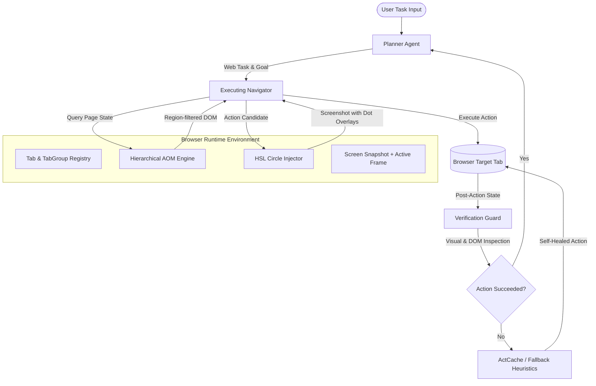
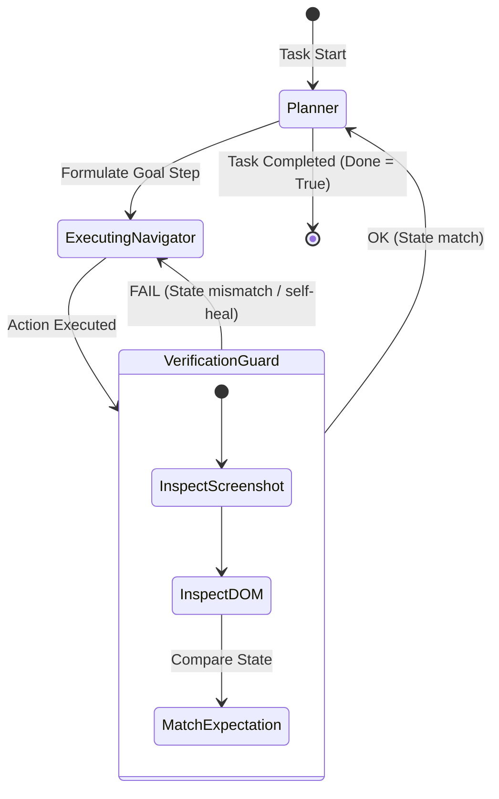

# WebGenie Agent Master Upgradation Plan (Next-Gen Architecture)

This document outlines the complete architectural master plan to upgrade WebGenie from a step-by-step heuristic executor to a production-grade, self-healing, multi-modal hierarchical browser agent.

---

## 1. Architectural Evolution Matrix

| Feature Dimension | Current System (v1) | Next-Gen Upgraded System (v2) | Architectural Impact |
|---|---|---|---|
| **DOM Parsing** | Flat interactive element serialization | **Hierarchical Accessibility Tree (AOM)** | Reduces tokens by 80%; retains page structural landmarks. |
| **Locator Grounding** | Heuristic selector mapping (tags/labels) | **Dual-Modal (DOM + HSL Visual Markers)** | Increases clicking accuracy to >98% on dense/dynamic SPAs. |
| **Orchestration Flow** | Linear execution (Planner -> Navigator) | **Verification Guard FSM Router** | Active self-reflection and validation before calling a task completed. |
| **Error Recovery** | Hard crash / retry loop | **ActCache Self-Healing Pipelines** | Automatic fallback via text-matching, visual similarity, or cached action paths. |
| **Safety Posture** | Regex-based DOM sanitization | **Secure Execution Context Isolation** | Zero-leak credential/cookie security and strict execution policies. |

---

## 2. Target Architecture Diagram



---

## 3. Pillar 1: Dual-Modal Visual Grounding (HSL Dots)

To completely eliminate clicking failures on non-standard React components, WebGenie will inject a temporary canvas overlay containing uniquely numbered, high-contrast HSL colored markers on every interactive element before invoking the Visual LLM (VLM).

### HSL Circle Injection Script (`/chrome-extension/public/dom/visualMarker.js`)
```javascript
function injectVisualMarkers() {
  const elements = queryInteractiveElements();
  const overlay = document.createElement('div');
  overlay.id = 'webgenie-visual-overlay';
  overlay.style.cssText = 'position:fixed;top:0;left:0;width:100vw;height:100vh;z-index:999999;pointer-events:none;';
  
  elements.forEach((el, index) => {
    const rect = el.getBoundingClientRect();
    if (rect.width === 0 || rect.height === 0) return;

    // Distribute hue evenly for high contrast
    const hue = (index * 137.5) % 360; 
    
    const dot = document.createElement('div');
    dot.style.cssText = `
      position: absolute;
      left: ${rect.left + window.scrollX}px;
      top: ${rect.top + window.scrollY}px;
      width: 18px;
      height: 18px;
      border-radius: 50%;
      background: hsl(${hue}, 95%, 45%);
      color: white;
      font-size: 10px;
      font-weight: bold;
      display: flex;
      align-items: center;
      justify-content: center;
      box-shadow: 0 0 4px rgba(0,0,0,0.8);
    `;
    dot.innerText = index;
    overlay.appendChild(dot);
  });
  
  document.body.appendChild(overlay);
}

function removeVisualMarkers() {
  document.getElementById('webgenie-visual-overlay')?.remove();
}
```

This ensures the agent can utilize visual coordinate mapping (VLM coordinates) in tandem with structural selectors (XPath/Selector IDs), resolving dynamic layout offset bugs.

---

## 4. Pillar 2: Hierarchical Accessibility Tree (AOM)

Flat serialization of DOM lists leads to massive token bloat. We will restructure the DOM tree parsing into semantic sections by introducing a nesting hierarchy based on layout coordinates and HTML5 sectioning tags.

### Data Structure Schema (`/src/background/browser/dom/types.ts`)
```typescript
export interface AOMNode {
  id: number;
  tagName: string;
  role?: string;
  label?: string;
  text?: string;
  boundingBox: { x: number; y: number; width: number; height: number };
  children: AOMNode[];
  parentId: number | null;
}

export interface PageLayoutAtlas {
  activeRegionId: string | null;
  regions: {
    id: string;
    label: string;
    role: string;
    elementCount: number;
    boundingBox: { x: number; y: number; width: number; height: number };
  }[];
}
```

### Context Minimization Prompts
Instead of feeding 500 lines of flat elements, the agent is fed a zoomed representation:
```markdown
[Layout Regions]
- Region 1 [ID: main_inbox]: Main Mail Panel (Contains 120 elements)
- Region 2 [ID: sidebar_folders]: Sidebar folder navigation (Contains 18 elements)
- Region 3 [ID: header_search]: Top search controls (Contains 8 elements)

[Currently Focused Region: sidebar_folders]
Interactive items within sidebar_folders:
[0] <button> ID="compose" (text: "Compose")
[1] <a> ID="inbox_link" (text: "Inbox (4)")
[2] <a> ID="sent_link" (text: "Sent")

To interact with other areas, use focus_region("main_inbox") first.
```

---

## 5. Pillar 3: The Verification Guard (FSM Integration)

We integrate a three-agent FSM pipeline to split task planning, action execution, and outcome verification:



### Verification Guard Implementation Schema
```typescript
export class VerificationGuard {
  private chatLLM: BaseChatModel;

  constructor(chatLLM: BaseChatModel) {
    this.chatLLM = chatLLM;
  }

  async verify(
    actionName: string,
    actionArgs: Record<string, unknown>,
    preState: BrowserState,
    postState: BrowserState
  ): Promise<{ success: boolean; errorReason?: string }> {
    const prompt = `
      You are the Verification Guard of an agentic web browser.
      
      Action Attempted: ${actionName}
      Arguments: ${JSON.stringify(actionArgs)}
      
      Pre-Action Screenshot URL: ${preState.screenshotUrl}
      Post-Action Screenshot URL: ${postState.screenshotUrl}
      
      Examine the differences. Did the action achieve the expected result?
      Return JSON: { "success": boolean, "errorReason": string | null }
    `;
    
    const response = await this.chatLLM.invoke(prompt);
    return JSON.parse(response.content);
  }
}
```

---

## 6. Pillar 4: ActCache & Self-Healing Execution

When interacting with dynamic websites, selectors frequently break during updates. The **ActCache** records successful action traces and uses visual similarity maps to locate moved elements.

```typescript
interface ActionCacheEntry {
  taskFingerprint: string;     // e.g. "gmail_compose_email"
  urlPattern: string;          // e.g. "mail.google.com/mail/*"
  elementDescription: {
    tagName: string;
    text: string;
    role: string;
    classes: string;
  };
  successfulSelector: string;  // e.g. "div.T-I.T-I-KE"
}

export class SelfHealingExecutor {
  private cache: ActionCacheEntry[] = [];

  async heal(
    elementNode: DOMElementNode, 
    page: Page
  ): Promise<ElementHandle | null> {
    // 1. Try resolving using historical selector cache
    const cached = this.findCacheMatch(elementNode);
    if (cached) {
      const el = await page.querySelector(cached.successfulSelector);
      if (el) return el;
    }

    // 2. Perform Visual Heuristic Match (OCR / VLM locate)
    const freshElements = await page.getAllInteractiveElements();
    for (const el of freshElements) {
      if (
        el.tagName === elementNode.tagName &&
        el.text === elementNode.text &&
        el.role === elementNode.role
      ) {
        return page.locateElement(el);
      }
    }
    
    return null;
  }

  private findCacheMatch(node: DOMElementNode): ActionCacheEntry | null {
    // Fuzzy matching algorithm logic
    return null;
  }
}
```

---

## 7. Operational Safety and Execution Policies

To prevent accidental destructive actions, a strict **Execution Policy Interceptor** is placed between the Navigator Agent and the Page Execution engine.

```typescript
export enum SafetyLevel {
  PERMISSIVE = 'permissive',
  STRICT = 'strict',
  SAFE_READ_ONLY = 'read_only'
}

export class SafetyPolicyEngine {
  private level: SafetyLevel;

  constructor(level: SafetyLevel) {
    this.level = level;
  }

  shouldIntercept(actionName: string, actionArgs: Record<string, unknown>): boolean {
    if (this.level === SafetyLevel.SAFE_READ_ONLY) {
      // Block any mutating commands (clicks, typing, form submits)
      return ['click', 'type', 'submit', 'press'].includes(actionName);
    }
    
    if (this.level === SafetyLevel.STRICT) {
      // Check for destructive action keywords in input args
      const argsStr = JSON.stringify(actionArgs).toLowerCase();
      if (
        actionName === 'click' && 
        (argsStr.includes('delete') || argsStr.includes('remove') || argsStr.includes('pay') || argsStr.includes('purchase'))
      ) {
        return true; // Intercept for human approval
      }
    }
    
    return false;
  }
}
```

---

## 8. Implementation Timeline & Milestone Targets

### Milestone 1: DOM Structuring & HSL Visual Overlay (Target: 1 Week)
* **Goal**: Minimize context tokens by 70% and stabilize clicking on non-standard React nodes.
* **Deliverables**: Integrated `visualMarker.js` overlay rendering & AOM region classifier.

### Milestone 2: Verification Guard & FSM Flow (Target: 1.5 Weeks)
* **Goal**: Prevent LLM hallucination loop cycles by implementing active result verification.
* **Deliverables**: Verification Guard state machine routing logic integrated in `executor.ts`.

### Milestone 3: ActCache & Heuristic Self-Healing (Target: 1 Week)
* **Goal**: Ensure continuous execution stability even when website classes update.
* **Deliverables**: In-memory and local storage caching for historical selectors with semantic lookup logic.

### Milestone 4: Safety & Policy Interceptor (Target: 0.5 Weeks)
* **Goal**: Secure agent against dangerous, irreversible destructive actions.
* **Deliverables**: Human-in-the-loop interrupter logic and custom permission level controls in extension config.
