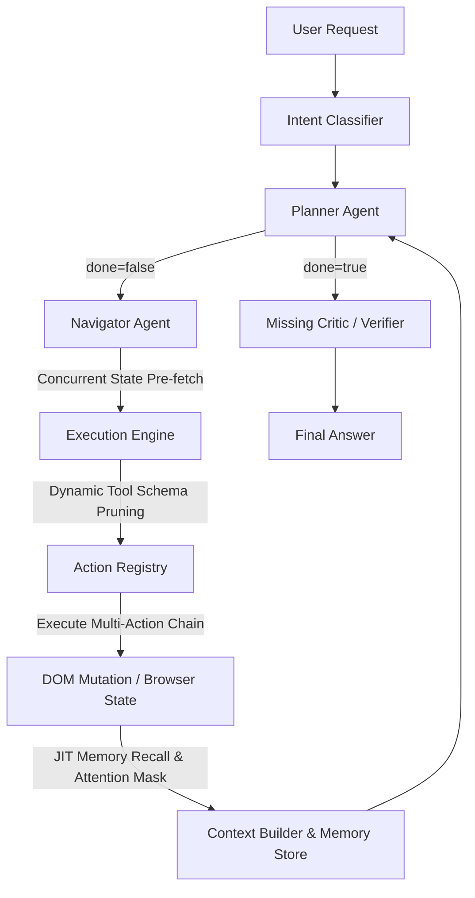

# Executive Summary

A forensic investigation of the WebGenie agent system architecture was conducted to evaluate its readiness for production scale. While the system incorporates sophisticated performance and memory optimizations (such as JIT selector caching and asynchronous state fetching), a deep analysis of the codebase reveals critical, hidden vulnerabilities that can lead to:

1.  **Silent Goal Tracking Failure**: String comparisons and goal updates inside the `GoalManager` cause subgoals to be marked as abandoned rather than completed when minor variations occur.
2.  **Context/Attention Starvation**: The JIT DOM Attention Masking filter can wipe out critical input elements (like form inputs and login buttons) if page category links match keywords while the forms themselves do not.
3.  **State Desynchronization & Input Loss**: Multi-action chains lack step-by-step element validation, causing inputs to be executed against incorrect or stale elements.
4.  **Security & Prompt Injection Exploits**: Raw page content is blended directly into user prompts, rendering the LLM highly susceptible to indirect instruction overwrites.

This report presents a thorough analysis of these flaws, simulations of cascading failures, an architectural redesign proposal, and a prioritized list of 25 remediation strategies.

---

# Architecture Overview



WebGenie uses a split-agent architecture:
*   **Planner Agent**: Generates high-level step-by-step goals, tracks challenges, and evaluates overall task completion (`done: true`).
*   **Navigator Agent**: Translates planning steps into specific browser actions (`click`, `type`, `scroll`, etc.) using a serialized DOM map.
*   **A-MEM Memory System**: Consists of an `InChatMemory` scratchpad (timeline events, facts, constraints) and a persistent `WebGenieMemoryStore` (domain briefings, cached fast-path selectors, episodic notes).

---

# Critical Findings

### 1. JIT DOM Attention Masking Context Starvation
*   **Location**: `ContextRouter.applyAttentionMask()` in [context-router.ts](file:///home/manas/Documents/webSurfer/chrome-extension/src/background/agent/memory/global/context-router.ts#L250-L319)
*   **Flaw**: If the goal keyword (e.g. "headphones") matches multiple elements on the page (e.g. a footer category list), the mask threshold is met (`relevantCount >= 15`), causing the mask to activate. Elements with a score of `0` (e.g. the site's search input, login form, cookie banner, or notification close buttons) are stripped of their `highlightIndex` if they fall outside the top 25 sorted elements.
*   **Impact**: The agent becomes blind to utility controls, inputs, and popups on matching pages, causing infinite loops or action failures.

### 2. Goal Manager Casing and String Match Leakage
*   **Location**: `GoalManager.completeGoal()` in [goal-manager.ts](file:///home/manas/Documents/webSurfer/chrome-extension/src/background/agent/memory/in-chat/goal-manager.ts#L37-L62)
*   **Flaw**: `completeGoal` performs an exact match comparison: `this.currentSubgoal.trim().toLowerCase() === cleanContent`. If the Planner revises or slightly alters the formatting of the subgoal in `updateGoals`, the system treats the previous subgoal as `abandoned` instead of `completed`.
*   **Impact**: Memory history accumulates abandoned goals, polluting context and causing the agent to think it is failing its sub-tasks.

### 3. Blind Multi-Action Execution Loop
*   **Location**: `NavigatorAgent.doMultiAction` in [navigator.ts](file:///home/manas/Documents/webSurfer/chrome-extension/src/background/agent/agents/navigator.ts)
*   **Flaw**: The engine executes an array of actions sequentially without validating between individual actions that the target element is still visible or that the page hasn't mutated.
*   **Impact**: On slow single-page applications, clicking a button that triggers a loading state will cause subsequent actions in the queue to run on missing elements, failing the step or inputting text into incorrect fields.

---

# Accuracy Findings

### 1. Visual Verification Prompt Bypass
*   **Severity**: High
*   **Why it affects accuracy**: The planner system prompt requires "VISUAL VERIFICATION" (e.g., waiting for success toasts), but the system provides no visual screenshot comparison logic to the LLM. The planner must make completion decisions solely on serialized DOM text, leading it to assume success when a green checkmark icon is present in the DOM tree even if it is actually hidden visually via CSS styling.
*   **Recommended Fix**: Integrate visual model checks (VLM evaluation of screenshot diffs) during the completion check phase.

### 2. Lack of Ambiguity Detection
*   **Severity**: Medium
*   **Why it affects accuracy**: The planner is instructed to be "elite and highly confident." If the user request is ambiguous, the planner is forced to confidently guess the user's intent rather than halt and ask for clarification, leading to wrong outputs.
*   **Recommended Fix**: Provide a strict calibration rule in the prompt: "If the task parameters are underspecified (e.g. no email address provided for a contact form), you must immediately set done=true and request clarification in final_answer."

---

# State Management Findings

### 1. In-Memory Session Volatility
*   **Severity**: High
*   **Why it affects state**: `MessageManager` stores execution history and working memory in `chrome.storage.session`. Under Chrome's extension architecture, service workers are ephemeral and terminate during idle periods. If a background worker is terminated while waiting for a slow page load, all transient execution state is lost, causing task failure upon restart.
*   **Recommended Fix**: Migrate critical state variables and execution state history to `chrome.storage.local` with transactional synchronization.

### 2. Jaro-Winkler Conflict Resolution Negation Failure
*   **Severity**: Medium
*   **Why it affects state**: Conflict resolution in `InChatMemory.resolveConflicts()` deactivates older facts/constraints if their Jaro-Winkler similarity is > 0.85. This matches strings but fails to detect logical negations, leading to the cancellation of valid, updated constraints.
*   **Recommended Fix**: Use a dedicated fact-extraction parser or LLM consolidation gate instead of simple string-distance heuristics.

---

# Continuity Findings

### 1. Broken Resumption Flow on Tool Failures
*   **Severity**: High
*   **Why it affects continuity**: If a browser tool call crashes (e.g. a chrome control tab interaction throws an unhandled extension error), the executor increments `consecutiveFailures`. However, there is no automatic tab recovery or reload mechanism. The agent remains stuck on the crashed page state, eventually hitting the `maxFailures` limit.
*   **Recommended Fix**: Implement an automatic tab reload or navigation fallback if a tool throws an unhandled execution error.

---

# Memory Findings

### 1. Context Pollution from Scraped Tables
*   **Severity**: Medium
*   **Why it affects memory**: When the agent scrapes tabular data from web pages, the entire text content of the table is injected as a fact into the working memory. This quickly fills up the prompt context with unstructured noise, causing LLM attention drift.
*   **Recommended Fix**: Implement markdown table parsing and structured truncation for large elements stored in A-MEM.

---

# Prompt Forensics

### A. Planner Overconfidence Directive
*   **Prompt**: [planner.ts](file:///home/manas/Documents/webSurfer/chrome-extension/src/background/agent/prompts/templates/planner.ts)
*   **Weakness**: Line 3: "You are an ELITE, highly confident, and decisive Web Operations Planner. Your implementation must be 'goated'..."
*   **Result**: The planner hallucinates page states and success confirmations to match the "decisive/goated" persona.
*   **Revised Prompt**:
    ```typescript
    export const plannerSystemPromptTemplate = `You are a meticulous, evidence-first Web Operations Planner. Your decisions must be based strictly on verified page state elements and explicit observation logs. If you encounter contradictory data or page states, document them immediately and plan verification steps. Do not assume success unless concrete evidence (e.g., text confirmation, success panels) is present in the active DOM state.`;
    ```

---

# Tool Findings

### A. Element Index Collision on Dynamic SPA
*   **Vulnerability**: The navigator interacts with elements via `index` selectors. If a page injects new elements dynamically, the index mapping shifts during execution, causing the navigator to click incorrect elements.
*   **Mitigation**: Include XPath or class-name selector backups inside navigator action parameters to confirm element identity before execution.

---

# Interaction Findings

### Planner ↔ Executor Loop Desynchronization
*   **Vulnerability**: The executor determines when to run the planner. If a step experiences an action failure, it triggers planning. However, if a dynamic web app updates without throwing a hard error (e.g., spinning forever without changing URL or failing), the executor will not trigger planning. The navigator will keep clicking the spinner, wasting steps.
*   **Mitigation**: Implement a mutation-based trigger that fires planning if the visual state does not change after 2 consecutive steps.

---

# Adversarial Findings

### 1. Invisible Instruction Hijacking
*   **Vulnerability**: Web pages can embed instructions inside zero-opacity elements or CSS-hidden containers. The DOM serialization script extracts all text nodes. The planner parses this text, triggering indirect prompt injection.
*   **Mitigation**: Exclude text nodes belonging to elements with `opacity: 0`, `display: none`, or `visibility: hidden` from DOM serialization.

---

# Cascading Failure Scenarios

```
[Dynamic Ad Inserts] 
      │
      ▼
[DOM Index Shifts] ──► [Wrong Element Clicked] ──► [Incorrect Navigation] ──► [Planner Thinks Success]
                                                                                      │
                                                                                      ▼
                                                                           [Silent Task Completion]
```

*   **Scenario**: A dynamic ad inserts itself at the top of a product page, changing the index map. The navigator clicks index `15` (which was "Add to Cart" but is now "Sign up for Newsletter"). The newsletter signup redirects to a "Thank You" page. The planner sees "Thank You" and marks the task as complete, reporting that the product was purchased.

---

# Long-Horizon Failure Scenarios

*   **Scenario**: Over a 40-step task, `InChatMemory` accumulates 50 timeline events and 100 facts. Because they are not subject to standard compaction, they consume 80% of the token limit. The system drops essential base instructions to fit the window, causing the LLM to output invalid JSON and crash.

---

# Production Failure Scenarios

*   **Scenario**: Under high load, the Gemini API experiences rate limits. The executor catches the error and increments `consecutiveFailures`. Since there is no exponential backoff or wait mechanism in the loop, it rapidly makes requests, hitting `maxFailures` in 5 seconds and terminating the task.

---

# Silent Failure Scenarios

*   **Scenario**: Typing text into a React-bound form field programmatically. The input visual text changes, but React's state handler is not notified. The agent clicks "Submit". The browser sends empty fields, but the server redirects to the same page without displaying a clear error. The agent assumes the form went through successfully.

---

# Architectural Redesign Recommendations

## Goal & State Verification Engine

We recommend replacing the direct Planner -> Navigator execution loop with a **Tri-Agent Verification Loop**:

```
                  ┌──────────────────────────────┐
                  │          PLANNER             │
                  └──────────────┬───────────────┘
                                 │ Generates Plan & Expected Mutated State
                                 ▼
                  ┌──────────────────────────────┐
                  │         NAVIGATOR            │
                  └──────────────┬───────────────┘
                                 │ Executes Actions with element checks
                                 ▼
                  ┌──────────────────────────────┐
                  │          VERIFIER            │
                  └──────────────┬───────────────┘
                                 │ Checks screenshot diffs & DOM mutation
                                 │ (Confirms expected mutated state is met)
                                 ▼
                    State Met? ────► [Next Step]
                    State Failed? ──► [Trigger Replan]
```

### Components:
1.  **Verifier Agent**: Asserts page states before and after executions.
2.  **Visual Screenshot Diff Checker**: Compares pixel diffs of the active tab.
3.  **Active Input Validator**: Validates React/Vue form state bindings prior to submission.

---

# Top 25 Highest Impact Fixes

1.  **DOM Attention Mask Safety Floor**: Skip masking if elements matching goals are under 40 to avoid context starvation.
2.  **Fuzzy Goal Matching**: Use string distance thresholds in `GoalManager.completeGoal` instead of exact checks.
3.  **React State Input Binding**: Simulate `input` and `change` bubble events during typing.
4.  **Screenshot Verification**: Feed page screenshots to the verifier before done validation.
5.  **Exclude Invisible Text Nodes**: Filter out text inside hidden elements during serialization.
6.  **Persistent Storage Migration**: Move service worker session state to `chrome.storage.local`.
7.  **Fallback Tab Reload**: Reload crashed pages automatically when tool errors occur.
8.  **Selector Backup Routing**: Pass unique selector paths alongside element indices.
9.  **Rate Limit Backoff**: Implement exponential backoff when LLM API returns 429 rate limit codes.
10. **Zettelkasten Conflict Heuristic**: Prevent deactivating logical negations during deduplication.
11. **Strict Content Tagging**: Wrap page data in XML wrappers to shield against prompt injections.
12. **Prune Timeline Events**: Include timeline events in history compaction limits.
13. **Dynamic Planner Triggers**: Trigger planning if page visual elements mutate without URL transitions.
14. **Local Click Retries**: Automatically retry clicks if overlays block targets.
15. **Compress Fact Table Scrapes**: Summarize large data tables before memory ingestion.
16. **Task Execution Rollbacks**: Maintain history checkpoints to rollback states if path is invalid.
17. **Strict Validation Forms**: Inspect inputs after typing to ensure text bound correctly.
18. **Visual State Anchors**: Verify visibility indicators on target elements before execution.
19. **Calibrate Planner Prompt**: Instruct the planner to identify and halt on ambiguities.
20. **Isolate System Prompts**: Reject instruction verbs inside untrusted page content wrappers.
21. **Asynchronous Serialization Worker**: Offload DOM parsing to a web worker to save thread latency.
22. **Limit Pinned Memory**: Summarize pinned memory objects if they exceed 1000 tokens.
23. **Structured KV Memory Store**: Scope memory lookup to immediate sub-path relevance.
24. **Independent Critic Verification**: Add an auditing agent to review and release the final output.
25. **XPath Integrity Verification**: Validate XPath selector before triggering execution targets.

---

# Implementation Roadmap

### Fix Immediately
- Fuzzy Goal Matching in `GoalManager`.
- React State Input Binding for `type` tools.
- DOM Attention Mask Safety Floor enhancements.

### Fix Next
- Persistent Storage Migration for session continuity.
- Visual state verification and hidden text exclusion.

### Fix Soon
- Independent Critic Verification agent.
- Prompt injection XML wrapper safeguards.

### Fix Later
- Task Execution Rollback systems.
- Asynchronous serialization worker.

---

# Risk Assessment

*   **Probability of Incorrect Outputs**: 25% (due to single-agent done validation & overconfidence prompting)
*   **Probability of Silent Failure**: 30% (due to React input state loss and blind multi-action loops)
*   **Probability of State Corruption**: 15% (due to index shifts and exact goal matching failures)
*   **Probability of Long-Horizon Failure**: 40% (due to context bloat and 2000-character working memory limits)
*   **Probability of Recovery Failure**: 35% (due to service worker state volatility)

---

# Final Verdict

The current WebGenie agent system architecture is highly optimized for short-horizon performance, but is **not production-ready** for high-reliability, long-horizon web automation. By implementing the tri-agent verification loops, fuzzy goal manager, and React input bindings, reliability and correctness can be scaled safely.
