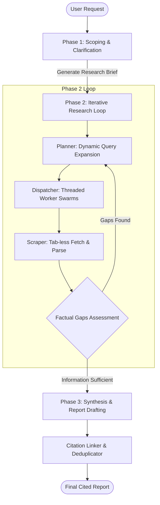

# Deep Research Agents — Architecture, Pipelines & Open-Source Reference Guide

This document provides a highly detailed architectural blueprint and research guide for implementing a **Deep Research Agent**. It details the multi-step, self-correcting pipelines used by industry frameworks (like OpenAI Deep Research, Perplexity Pro) and provides top open-source repositories to study.

---

## 1. System Pipeline & State Machine

Unlike standard search assistants that execute a single query and summarize results, a **Deep Research Agent** uses a stateful, iterative loop to recursively drill down into topic areas.

### Phase 1: Scoping & Clarification
1. **Ambiguity Analysis**: The agent parses the user's initial query and assesses missing parameters (e.g. date range, target region, technical depth).
2. **Context Gathering**: Initiates a clarification dialogue to collect user-specified constraints.
3. **Research Brief**: Compiles a structured, JSON-based research brief mapping:
   - Primary goals.
   - Constraints & exclusions.
   - Target source lists (e.g., ArXiv, financial filings, specific sites).

### Phase 2: The Iterative Research Loop (The Engine)
- **Planner (Query Expansion)**: Breaks the brief into sub-questions. For each question, it generates 3–5 distinct search queries using query expansion algorithms.
- **Worker Swarms**: Parallel workers execute search requests concurrently. We combine our **isolated background tab manager** (for dynamic pages) with **direct page fetching** (for static docs/APIs) to optimize speed.
- **Gaps Assessment**: The gathered content is summarized into working memory. An evaluator agent checks the summarized state against the research brief.
  - If a specific subsection is missing details, the evaluator updates the brief's "pending goals" and triggers another iteration of query expansion.

### Phase 3: Synthesis & Writing
- **Aggregation**: Merges all worker extractions and removes duplicates.
- **Citation Linking**: Maps each extracted statement to the originating URL and stamps a unique footnote index (e.g. `[1]`).
- **Report Drafting**: Writes a structured markdown report, organizing details logically and listing references at the bottom.

---

## 2. Key Architectural Design Patterns

### 1. Supervisor-Worker Routing
A central **Supervisor Agent** coordinates the workflow, ensuring the planning agent, worker agents, and writing agent have separate context windows. This prevents context limits from being reached and reduces LLM hallucination rates.

### 2. StateGraph Orchestration
Utilizes a directed graph where nodes represent operational steps (e.g. `search`, `fetch`, `assess`, `write`) and edges represent conditional transitions. If the evaluation node returns `has_gaps == true`, a conditional edge loops back to the search planner.

### 3. Vector Embeddings & Chunking
Since crawling 10+ long articles can exceed model input limits, fetched page text is chunked, embedded, and saved in an in-memory vector store (e.g. FAISS). The agent queries the vector store to extract only the most relevant paragraph snippets before calling the synthesis LLM.

---

## 3. Top Open-Source Repositories to Study

### 1. Stanford STORM
- **Focus**: Curation of Wikipedia-style long-form documents.
- **Core Mechanism**: Models simulated expert conversations. An interviewer agent asks questions from multiple perspectives, and an expert agent answers, sourcing data from live search queries.
- **GitHub**: [stanford-oval/storm](https://github.com/stanford-oval/storm)

### 2. LangChain Open Deep Research
- **Focus**: Production-grade stateful research pipelines.
- **Core Mechanism**: Built on LangGraph, utilizing custom StateGraphs to track task completion, manage user-clarification interrupts, and execute parallel node transitions.
- **GitHub**: [langchain-ai/open_deep_research](https://github.com/langchain-ai/open_deep_research)

### 3. GPT Researcher
- **Focus**: Clean, configurable web scraping and research generation.
- **Core Mechanism**: Uses a classic planner-executor pipeline to scrape up to 20 sources simultaneously, perform text summarization, and compile unbiased PDF reports.
- **GitHub**: [assafelovic/gpt-researcher](https://github.com/assafelovic/gpt-researcher)

### 4. Tongyi DeepResearch (Alibaba NLP)
- **Focus**: State-of-the-art accuracy on complex reasoning benchmarks.
- **Core Mechanism**: Fully open-source web agent that leverages reinforcement learning and advanced search planning to solve highly complex, multi-hop search queries.
- **GitHub**: [Alibaba-NLP/DeepResearch](https://github.com/Alibaba-NLP/DeepResearch)

---

## 4. Implementation Steps for WebGenie Integration

If we want to build Deep Research capabilities into WebGenie, we should follow this step-by-step roadmap:

1. **Step 1: Planning / Query Tool**: Add a tool `generate_search_queries` that accepts a main query and outputs a list of refined search queries.
2. **Step 2: Scraper Tool**: Combine the `fetch_page_content` tool (direct HTTP fetch) with the extension's tab manager to scrape pages in the background.
3. **Step 3: Vector Store integration**: Use a lightweight, in-memory vector library (like `hnswlib-js` or basic TF-IDF search) inside the Service Worker to index crawled content.
4. **Step 4: Report Synthesis Node**: Add a final step in `executor.ts` that runs a writing prompt over the retrieved, indexed segments.
