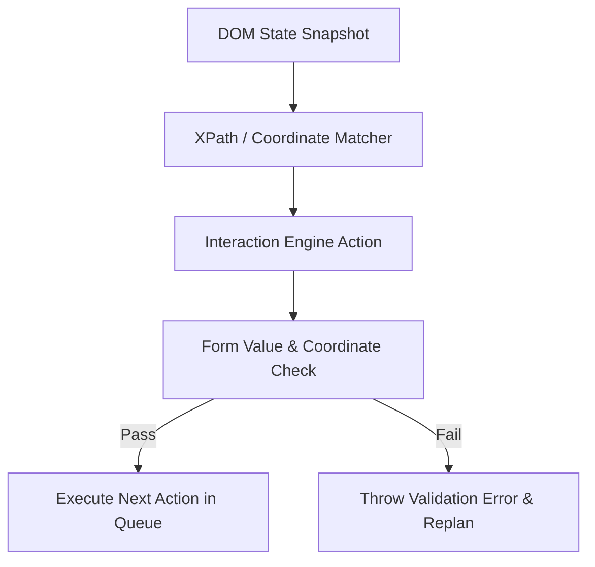
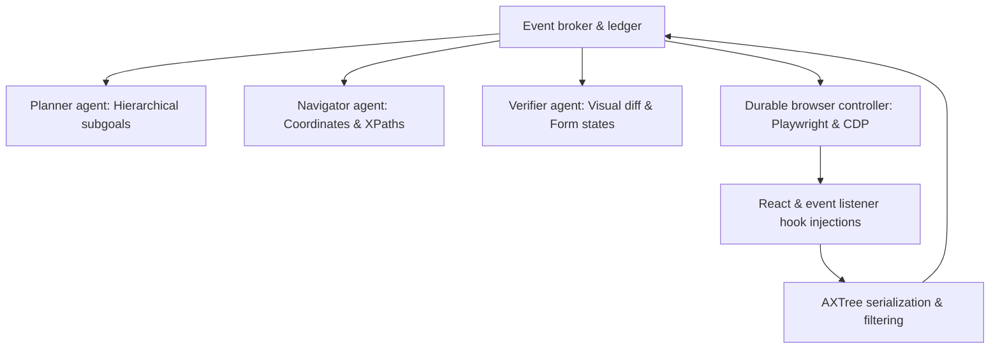

# The DOM as a Core Agent Subsystem: A Systems Engineering Handbook

This document serves as a systems engineering handbook for AI browser agents. It treats the Document Object Model (DOM) not merely as a data format to be parsed and sent to an LLM, but as a foundational subsystem that underpins and constrains planning, reasoning, state management, memory, verification, recovery, navigation, and long-horizon task execution.

---

# 1. DOM ↔ Planner Interface

The Planner relies on DOM serialization to construct its view of the environment, decompose the user request, and evaluate completion state.

```
┌───────────┐         DOM Tree / Page URL         ┌───────────┐
│    DOM    ├────────────────────────────────────►│  Planner  │
│ Subsystem │◄────────────────────────────────────┤ Subsystem │
└───────────┘       Re-query / Stability Triggers └───────────┘
```

## Planner Decisions Dependent on DOM Data
-   **Feasibility Assessment**: The Planner analyzes the presence of search bars, links, input fields, or third-party OAuth options to determine whether a target site is capable of satisfying the task.
-   **Task Decomposition**: The layout geometry and hierarchical depth of forms dictate how the task is split into sequential subgoals.
-   **Terminal Completion Check**: The presence of specific completion signatures (toasts, receipts, receipt URL hashes) determines when the planner issues the final `done: true` command.

## Planner Failures Induced by DOM Failures
-   **Visual Overlay Blindness**: If the DOM parser serializes elements that are covered by an active modal backdrop, the Planner attempts to interact with the covered controls, leading to repeated click exceptions.
-   **Hydration Stutter**: If the DOM state is extracted before JavaScript hydration completes, the Planner assumes buttons are ready for action when they are actually non-responsive, causing execution loops.
-   **Truncated Label Hallucinations**: Standard attribute capping (e.g. limiting attributes to 40 characters) truncates long options. The Planner is forced to guess the target choice, leading to incorrect selections.

---

# 2. DOM ↔ Interaction Engine Interface

DOM understanding dictates action generation, target selection, and physical input simulation.



## Interactive Failure Chains
1.  **Index Drift Failure**:
    ```
    [Page Mount] ──► [Retrieve Index Map] ──► [Dynamic Ad Insert] ──► [Indices Shift] ──► [Wrong Element Clicked]
    ```
    *Root Cause*: Relying on numerical arrays (`[12]`) generated at state extraction time. If any element injects dynamically before execution, indices map to incorrect targets.

2.  **Virtual DOM State Dissociation**:
    ```
    [Type Text] ──► [Modify DOM Value] ──► [Skip Framework Event Bubbles] ──► [React State Empty] ──► [Submit Empty Form]
    ```
    *Root Cause*: Directly updating the value attribute of an input element without dispatching Native React/Vue input event cycles.

---

# 3. DOM ↔ Memory Interface

Information extracted from the DOM represents the primary stream of sensory data stored in short-term and episodic memory.

```
┌───────────┐            Scraped Text / Tables            ┌───────────┐
│    DOM    ├────────────────────────────────────────────►│  Memory   │
│ Subsystem │◄────────────────────────────────────────────┤ Subsystem │
└───────────┘    💡 FAST PATH Hints / Proven Selectors    └───────────┘
```

-   **Information to Store**: Element interaction outcomes, target paths, successful XPath selectors for specific layout hashes, and extracted raw fact values.
-   **Information to Discard**: Repetitive visual structural hierarchies, decorative nodes, and scripts.
-   **Information to Summarize**: Large tabular structures (converted to aggregated KV properties) and dense paragraph groupings.
-   **Information Never to Store**: Input passwords, authentication tokens, and user credentials.

## Memory Pollution Vectors
If table data is scraped without structure compaction, raw DOM layouts saturate the episodic memory window, triggering context dilution. The LLM loses its ability to locate historical instructions, causing decision drift.

---

# 4. DOM ↔ State Management Interface

State representation must remain synchronized across five distinct layers:

```
┌──────────────────┐
│ Task State       │  Goal DAGs and User Constraints
└────────┬─────────┘
         ▼
┌──────────────────┐
│ Planner State    │  High-level Step Progress
└────────┬─────────┘
         ▼
┌──────────────────┐
│ Navigator State  │  Action Queue Sequences
└────────┬─────────┘
         ▼
┌──────────────────┐
│ Browser State    │  Tab URLs, History, Cookies
└────────┬─────────┘
         ▼
┌──────────────────┐
│ DOM State        │  Node Trees, Input Values, Coordinates
└──────────────────┘
```

## State Inconsistency Scenarios
-   **Stale DOM Fingerprints**: If the agent executes page navigation, and the background thread reads the DOM state before the transition completes, the state cache contains element mappings from the *previous* domain linked to the *new* URL, causing selector errors.
-   **Tab Desynchronization**: If the active page opens a popup window, the browser context updates, but the DOM subsystem continues to poll the background parent window, creating inconsistent state boundaries.

---

# 5. DOM ↔ Verification Interface

Verification determines whether browser changes align with target plans.

-   **Action Verification**: Inspect the targeted input element's value property after execution. Confirm the bounding box or visibility state altered as expected.
-   **Form Verification**: Query form elements to verify validation error strings (e.g. invalid fields highlighted in red) are not present in the DOM tree post-submission.
-   **Navigation Verification**: Compare pre-action and post-action layout hashes and URL paths. If both remain unchanged after a navigation attempt, fail the execution.

---

# 6. DOM ↔ Recovery Interface

When failures disrupt execution, the DOM subsystem coordinates recovery:

1.  **State Reconstruction**: On browser tab crashes, the recovery manager re-opens the target URL, waits for stability, and computes a new layout fingerprint.
2.  **Verification Check**: Compare the new layout fingerprint against the last event checkpoint. If there is a layout mismatch (e.g. user session expired and redirected to login), halt the executor and roll back to the nearest authentication checkpoint.
3.  **Selector Repair**: If the cached selector path fails to locate the element post-recovery, use the semantic tags and bounding coordinates to self-heal the path.

---

# 7. DOM ↔ Long-Horizon Execution Interface

As step sequences scale to 100, 250, or 500 actions, DOM data accumulation behaves exponentially:

-   **Timeline Expansion**: Every step adds dynamic DOM modification logs. The timeline context window expands, leaving fewer tokens for active page trees.
-   **Coordinate Degradation**: Highly dynamic Single Page Applications accumulate memory allocations in the browser process. This degrades DOM query latency from 10ms to >2000ms over long sessions.
-   **Mitigation Strategy**: Enforce a strict sliding window of state history. Discard intermediate DOM states. Retain only a tabular log of actions, outcomes, and current URL targets.

---

# 8. Interaction Engine Deep Deconstruction

The ideal interaction lifecycle ensures execution integrity:

```
[Pre-Check Viewport] ──► [Scroll to Target] ──► [Perform Action] ──► [Dispatch Bubbles] ──► [Post-Check Mutate]
```

### 1. Click Lifecycle
-   **Required Inputs**: Bounding coordinates, target selector XPath, and element role.
-   **Pre-execution Check**: Bounding box > 0x0. Verify `pointer-events !== none`.
-   **Execution**: Focus target, dispatch visual hover events, wait 50ms, trigger click.
-   **Verification**: Check if the element tree has mutated or if a network request is pending.

### 2. Type Lifecycle
-   **Required Inputs**: Target element, text content, and input parameters.
-   **Pre-execution Check**: Focus input element. Verify target is writable (`disabled === false`, `readOnly === false`).
-   **Execution**: Call `element.focus()`. Simulate keypresses sequentially.
-   **Verification**: Read `element.value` and confirm it matches the target text. Trigger `input` and `change` events.

---

# 9. Agent Loop Integration Analysis

```
User Goal ──► Planner ──► Memory Retrieval ──► State Retrieval ──► DOM Parsing ──► Action Selection ──► Verification ──► Replan
```

-   **DOM Parsing → Action Selection**:
    -   *Data Flow*: Active interactive element tree is formatted into accessibility strings.
    -   *Failure Flow*: Highly nested DOM structures exceed the token limit.
    -   *Recovery Flow*: Dynamically mask out off-screen sections and decrease depth.
-   **Action Execution → Verification**:
    -   *Data Flow*: Bounding boxes are verified against screenshots.
    -   *Failure Flow*: Element is obscured by a transparent layout box.
    -   *Recovery Flow*: Scan element layers to click coordinates of the top overlapping node.

---

# 10. Source of Truth Conflict Resolution

In dynamic browser automation, conflicts will occur between perceptual systems:

| Scenario | DOM State | Screenshot (VLM) | AXTree State | Resolution Rule |
| :--- | :--- | :--- | :--- | :--- |
| **Obscured Button** | Clickable | Covered | Clickable | **Screenshot Wins**. Reject execution if covered. |
| **React Bind Stutter** | Value filled | Value filled | Value empty | **AXTree Wins**. Do not submit; repeat type sequence. |
| **Invisible Loader** | Exists | Blank page | Empty | **Screenshot Wins**. Wait for rendering before action. |

---

# 11. Ideal World-Class Browser Agent Architecture

The ultimate browser agent architecture is structured as a **Perception-Decoupled Event-Sourced Swarm**:



-   **The Event Broker**: Acts as the central event ledger. All systems are fully decoupled, subscribing to and publishing state modifications to the ledger.
-   **CDP-Based Accessibility Mapping**: Bypasses the noisy raw HTML DOM completely, utilizing Playwright accessibility trees to minimize token consumption by 70%.
-   **Visual Grounding Verification**: Evaluates layout screenshots prior to committing actions, ensuring zero click-through anomalies on dynamic pages.
-   **Durable State Rollback**: Saves page states as transaction journals. If an execution path breaks, the agent rolls back the tab state to recover without starting over.
