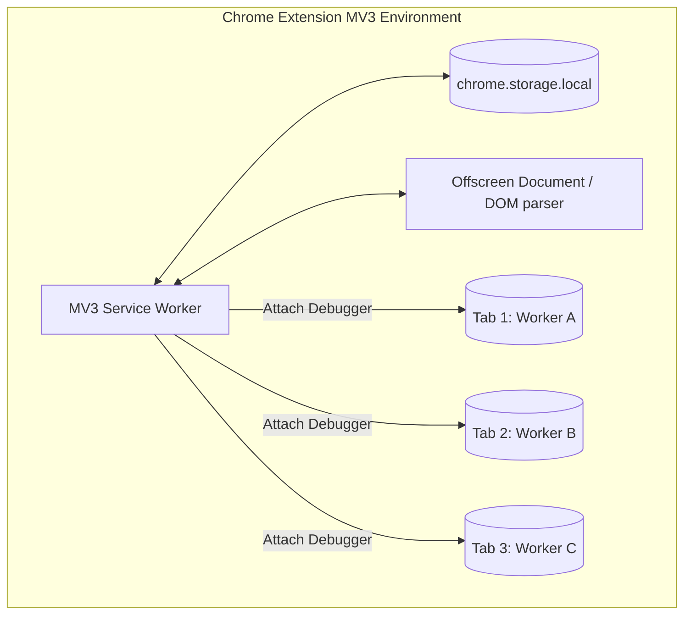

# Chrome Extension Manifest V3 — Swarm Agent Architecture Blueprint

Implementing a multi-agent browser swarm inside a Manifest V3 Chrome Extension presents unique challenges compared to standard Node.js or Python automation frameworks (like `browser-use`). This document outlines the architectural blueprint to address service worker ephemerality, debugger connection constraints, and memory isolation.

---

## 1. Extension Topology & State Machine



### Architecture Specifications

1. **State Persistence (`chrome.storage.local`)**
   - **Problem**: MV3 background service workers are ephemeral and will terminate if idle for ~30 seconds, which wipes out in-memory queues and promises.
   - **Solution**: The `SwarmManager` maintains the queue state, worker task mappings, and intermediate outputs inside `chrome.storage.local`. 
   - **Re-hydration**: On worker restart, the `chrome.runtime.onStartup` or message listener reads the storage state and resumes pending execution slots.

2. **Isolated Tab Execution & Debugging**
   - **Problem**: Extension debuggers (`chrome.debugger`) can only attach to one tab target at a time.
   - **Solution**: The `SwarmManager` maps each worker to a unique `{ tabId: number }` target. The service worker attaches to multiple tabs concurrently using individual debugger targets, which lets the extension run parallel DOM extractions and accessibility tree parses.
   - **Backgrounding**: Tabs are spawned using `chrome.tabs.create({ url: '...', active: false })` so they run invisibly to the user.

3. **DOM Parsing Offloading**
   - **Problem**: MV3 Service Workers lack access to `window`, `document`, or full DOM parsers (like `DOMParser` or `XMLSerializer`).
   - **Solution**: An **Offscreen Document** is spawned to act as a background utility thread. Whenever a worker needs to execute complex HTML parsing or serializing, it posts a message to the offscreen document and awaits the parsed JSON representation.

---

## 2. Worker Lifecycle & Queue Control

To prevent memory bloat and API rate-limiting issues, execution is managed by a token-throttled queue with a concurrency limit.

```
                  ┌────────────────────────┐
                  │    User Goal Submit    │
                  └───────────┬────────────┘
                              ▼
                  ┌────────────────────────┐
                  │ Coordinator Decompose  │
                  └───────────┬────────────┘
                              ▼
                  ┌────────────────────────┐
                  │  chrome.storage Queue  │
                  └───────────┬────────────┘
                              ▼
                  ┌────────────────────────┐
                  │ Concurrency Throttler  │◄────┐ Loop until
                  │   (Max Concurrency)    │     │ queue is empty
                  └───────────┬────────────┘     │
                              ▼                  │
            ┌─────────────────┼─────────────────┐│
            ▼                 ▼                 ▼│
      ┌───────────┐     ┌───────────┐     ┌───────────┐
      │ Worker A  │     │ Worker B  │     │ Worker C  │
      │ (Tab 101) │     │ (Tab 102) │     │ (Tab 103) │
      └─────┬─────┘     └─────┬─────┘     └─────┬─────┘
            │                 │                 │
            └─────────────────┼─────────────────┘
                              ▼
                  ┌────────────────────────┐
                  │  Synthesize & Respond  │
                  └────────────────────────┘
```

### Protocol Schemas

#### 1. Swarm State Schema
```typescript
interface SwarmState {
  mainTaskId: string;
  mainGoal: string;
  status: 'idle' | 'decomposing' | 'running' | 'synthesizing' | 'completed';
  tasks: Array<{
    id: string;
    goal: string;
    startUrl?: string;
    status: 'pending' | 'running' | 'success' | 'failed';
    tabId?: number;
    result?: string;
    error?: string;
  }>;
}
```

#### 2. Communication Messages
```typescript
// Background to Content Script / Offscreen Document
interface SwarmMessage {
  action: 'SWARM_EXECUTE_STEP';
  tabId: number;
  payload: {
    actionType: string;
    params: any;
  };
}

// Worker to Coordinator Response
interface WorkerResponse {
  taskId: string;
  status: 'success' | 'failed';
  extractedContent?: string;
  error?: string;
}
```

---

## 3. Consensus & Aggregation (Reviewer Pattern)

When all workers complete execution, the coordinator passes the compiled content to a synthesis LLM payload. To minimize hallucinations, the coordinator uses a **multi-turn validation loop**:

```
1. Gather outputs from all worker tabs.
2. Send outputs to the Reviewer Agent:
   - "Verify if all requested search items are present."
   - "Verify if there are any contradictions in values (e.g. price $400 vs $800)."
3. If errors are found, automatically dispatch a corrective worker task:
   - Target tab: [tabId]
   - Corrective goal: "Re-scrape the page to confirm value X."
4. If verified, output the clean comparison/summary to the user.
```
This multi-turn consensus mechanism dramatically improves response accuracy for data scraping and verification workflows.
