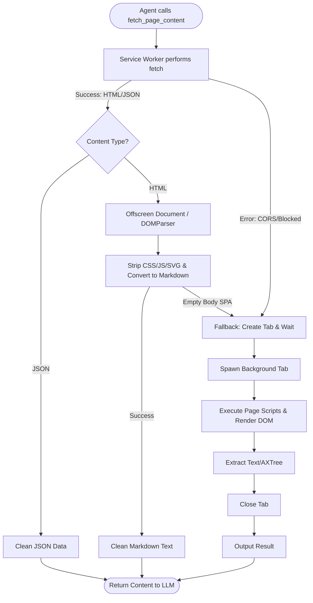

# Fast Content Extraction Tool (`fetch_page_content`) — Research & Implementation Plan

This document details the research, architecture, and implementation plan for the `fetch_page_content` action. This tool enables the agent to extract webpage text and data without spawning a browser tab, achieving a **5x to 10x speedup** for static pages and structured APIs.

---

## 1. Architectural Flow & Fallback Strategy

Instead of launching a browser tab and waiting for rendering pipelines, the tool performs a direct network request and parses the raw payload in memory.



---

## 2. Performance Comparison

| Attribute | Normal Tab Navigation (`openPage`) | Direct Fetch (`fetch_page_content`) |
| :--- | :--- | :--- |
| **Execution Latency** | 1,500ms – 5,000ms | **100ms – 400ms** (5x–10x speedup) |
| **Bandwidth Usage** | 2MB – 10MB (Images, JS, CSS) | **10KB – 200KB** (Raw text/Gzip) |
| **System Overhead** | High (Tab processes, rendering engine) | **Negligible** (In-memory fetch & parse) |
| **Dynamic JS** | Yes (Executes React, Angular, Vue) | No (Static raw source only) |
| **Bot Detection Risk** | Low (Runs in full browser context) | Medium (Cloudflare might block simple headers) |

---

## 3. Implementation Details

### A. Action Schema Definition (`chrome-extension/src/background/agent/actions/schemas.ts`)
```typescript
export const fetchPageContentActionSchema: ActionSchema = {
  name: 'fetch_page_content',
  description: 'Instantly fetch and extract the text content of a URL without opening a browser tab. Extremely fast. Use this for reading articles, scraping static tables, or fetching API data.',
  schema: z.object({
    url: z.string().describe('The URL of the webpage or API to fetch'),
    selector: z.string().optional().describe('Optional CSS selector to narrow down the extraction target (e.g. "article", "#main-content")'),
  }),
};
```

### B. Service Worker Fetch & Offscreen Parsing
Since Manifest V3 Service Workers do not have access to the native `DOMParser`, we pass the raw HTML string to the extension's Offscreen Document:

```typescript
// background/actions/handlers/fetch-content.ts
import { parseHtmlInOffscreen } from '../../browser/offscreen-client';

export async function handleFetchPageContent(url: string, selector?: string): Promise<string> {
  const response = await fetch(url, {
    method: 'GET',
    headers: {
      'User-Agent': 'Mozilla/5.0 (Windows NT 10.0; Win64; x64) AppleWebKit/537.36...',
      'Accept': 'text/html,application/xhtml+xml,application/xml;q=0.9,image/webp,*/*;q=0.8',
    },
    credentials: 'include'
  });

  if (!response.ok) {
    throw new Error(`HTTP error! status: ${response.status}`);
  }

  const contentType = response.headers.get('content-type') || '';
  if (contentType.includes('application/json')) {
    const json = await response.json();
    return JSON.stringify(json, null, 2);
  }

  const htmlText = await response.text();
  
  // Parse HTML string to markdown using Offscreen Document
  const cleanMarkdown = await parseHtmlInOffscreen(htmlText, selector);
  
  // If the page is a blank single-page app frame, trigger fallback
  if (cleanMarkdown.trim().length < 100 && htmlText.includes('id="app"')) {
    throw new Error('SPA detected: Falling back to full browser tab rendering.');
  }

  return cleanMarkdown;
}
```

---

## 4. Verification Plan

### Automated Tests
1. Fetch a mock static webpage and verify markdown structure matches expectations.
2. Fetch a mock JSON API and verify formatted JSON string output.
3. Fetch a known SPA (e.g., empty div container) and verify successful fallback triggers tab execution.

### Manual Verification
- Execute `fetch_page_content` on standard documentation sites (e.g. MDN Web Docs, news articles) and verify the agent receives clean, readable markdown in milliseconds.
