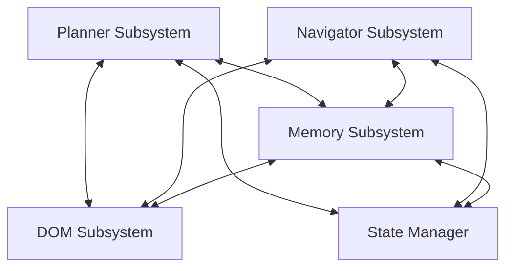
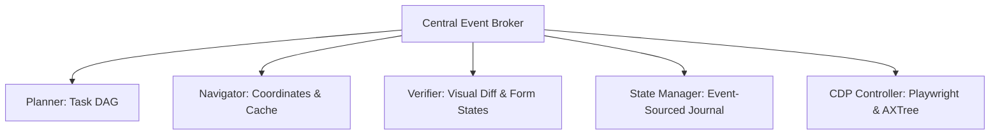

# Systems Engineering Handbook: First Principles AI Web Agent Architecture
## Deep Forensic Investigation & Architectural Specification

This document presents a comprehensive, first-principles systems engineering investigation and architectural redesign specification for WebGenie. It establishes the theoretical "ideal" browser agent architecture, dissects each subsystem from a systems perspective, traces data and information lifecycles, and performs a forensic audit of the active WebGenie codebase to identify hidden architectural coupling, risks, and failure modes.

---

# PART 1: The Ideal Web Agent Architecture (Designed from Scratch)

Imagine a production-scale web agent runtime serving millions of users executing mission-critical, long-horizon workflows (500+ steps) with zero-tolerance for data loss or execution drift. This is the blueprint for that system.

```
                                  ┌───────────────────────────┐
                                  │      EVENT LEDGER         │
                                  │  (Append-Only Log Store)  │
                                  └────┬─────────────────┬────┘
                                       │                 │
             ┌─────────────────────────┘                 └─────────────────────────┐
             ▼                                                                     ▼
┌──────────────────────────┐                                         ┌──────────────────────────┐
│   HIERARCHICAL PLANNER   │                                         │    VERIFICATION SWARM    │
│  (Isolated Context DAG)  │                                         │ (VLM Visual / DOM Audit) │
└────────────┬─────────────┘                                         └─────────────┬────────────┘
             │                                                                     │
             │ Target Subgoal Node                                                 │ Post-Step Result
             ▼                                                                     │
┌──────────────────────────┐                                                       │
│    NAVIGATOR SWARM       │                                                       │
│ (Action Batch Generator) │                                                       │
└────────────┬─────────────┘                                                       │
             │                                                                     │
             │ Action Queue & Selectors                                            │
             ▼                                                                     │
┌──────────────────────────┐                                                       │
│    INTERACTION ENGINE    │◄──────────────────────────────────────────────────────┘
│  (Pre/Post Hooks & AIV)  │
└────────────┬─────────────┘
             │
             │ Native Keyboard / Mouse Events & Coordinates
             ▼
┌──────────────────────────┐
│    BROWSER CONTROLLER    │
│ (CDP / Accessibility Tree│
└──────────────────────────┘
```

## Subsystem Specifications

### 1. Durable Event Ledger (State Store)
*   **Purpose**: The single source of truth for the entire session history. It acts as an append-only log of every input, event, state mutation, and planning shift.
*   **Responsibilities**: 
    -   Log all browser interaction events, planning DAG revisions, visual screenshots, and LLM reasoning steps.
    -   Provide deterministic state playback: replaying the log from event ID `0` to `N` must reconstruct the exact state of the browser agent.
    -   Guarantee persistence across crashes, service worker restarts, and network drops.
*   **Inputs**: Action telemetry from the Interaction Engine, visual diffs from the Verifier, goals from the Planner, and tab navigation events from the Browser Controller.
*   **Outputs**: Event streams, state snapshots at checkpoint `T`, and synchronization messages.
*   **Failure Modes**: 
    -   *Ledger Serialization Flooding*: Storing raw HTML DOM trees in the log saturates disk writing I/O, causing memory bloat and eventual crash.
    -   *Race Conditions*: Out-of-order events from concurrent tabs corrupt the execution timeline.
*   **State/Information Flow**: State is never modified in place; it is projected. The current system state is computed by applying the chronological journal of events.
*   **Subsystem Interactions**: The Orchestrator polls this ledger to decide whether to trigger a Rollback, execute the next Planner step, or invoke the Verifier.

### 2. Hierarchical DAG Planner
*   **Purpose**: High-level task decomposition and goal verification.
*   **Responsibilities**:
    -   Deconstruct the primary user objective into a Directed Acyclic Graph (DAG) of subgoals.
    -   Synthesize execution constraints (e.g. "do not use credit card X", "limit budget to $100").
    -   Evaluate the overall completion state of the DAG.
*   **Inputs**: The user request, active projected memory state, and domain intelligence profiles.
*   **Outputs**: Active target subgoal node, along with structured verification metrics (what elements, strings, or visual states must exist to mark the goal successful).
*   **Failure Modes**: 
    -   *Goal Stagnation*: Planner repeatedly generates the same subgoal when faced with anti-automation roadblocks (e.g. Captchas).
    -   *Constraint Leakage*: Planner fails to pass a critical user constraint to the active execution step.
*   **State/Information Flow**: Accepts high-level task descriptions and outputs a structured DAG of subgoals to the Event Ledger.
*   **Subsystem Interactions**: Provides subgoals to the Navigator; receives validation reviews from the Verifier.

### 3. Navigator Swarm & Action Generator
*   **Purpose**: Low-level action sequencing and element resolving.
*   **Responsibilities**:
    -   Locate specific interactive elements matching the active subgoal.
    -   Generate a queue of sequential action parameters (e.g. click coordinates, text input arrays).
    -   Utilize cached selector hashes to bypass LLM calls on known layouts.
*   **Inputs**: The active subgoal node, the serialized page tree (Accessibility Tree), and cached selector hints.
*   **Outputs**: Sequence of target actions with XPath locators, CSS selectors, and coordinate offsets.
*   **Failure Modes**: 
    -   *Index Drift*: Numeric elements shift between observation and execution.
    -   *Selector Stale State*: Dynamic scripts alter the DOM structure before the action executes, rendering the selector invalid.
*   **State/Information Flow**: Maps visual/semantic nodes to a list of browser commands.
*   **Subsystem Interactions**: Receives subgoals from the Planner; sends locator actions to the Interaction Engine.

### 4. Verification Swarm & Visual Grounder
*   **Purpose**: Post-action quality control and visual check.
*   **Responsibilities**:
    -   Independently verify if the executed action yielded the expected state change.
    -   Utilize structural similarity (SSIM) and optical character recognition (OCR) on screenshots to confirm element mutations.
    -   Scan the DOM post-action for validation error alerts.
*   **Inputs**: Pre-action screenshot, post-action screenshot, targeted element coordinates, and expected subgoal outcome.
*   **Outputs**: Success validation status or a detailed rollback/exception report.
*   **Failure Modes**: 
    -   *Visual False Positives*: Layout animation loops register as successful state changes.
    -   *Silent Failure Blindness*: The form fails to submit due to an unhighlighted backend error, but the Verifier passes the action because the page did not crash.
*   **State/Information Flow**: Emits validation events to the Event Ledger.
*   **Subsystem Interactions**: Audits the Browser Controller's active viewport; updates the Planner on completion status.

### 5. Interaction Engine & Active Input Validator (AIV)
*   **Purpose**: Human-like mouse and keyboard simulation and DOM state binding verification.
*   **Responsibilities**:
    -   Execute actions via the Chrome DevTools Protocol (CDP) by sending raw pointer and keyboard event arrays.
    -   Inject micro-delay variations to mimic natural typing and mouse movement paths.
    -   Validate input state bindings using native event bubbles.
*   **Inputs**: Command lists, selector targets, and text values.
*   **Outputs**: Lower-level CDP execution logs.
*   **Failure Modes**: 
    -   *React/Vue State Dissociation*: Values are injected into input nodes, but the page framework fails to bind the state because the necessary events (`input`, `change`) were not dispatched.
    -   *Obstructed Click*: Clicking coordinates covered by a transparent layout element or modal backdrop.
*   **State/Information Flow**: Direct browser driver mutations.
*   **Subsystem Interactions**: Communicates with the Browser Controller; reports execution logs to the Verifier.

---

# PART 2: DOM System First Principles Analysis

## Purpose & Representation
The DOM system translates a browser's render tree into a semantic representation for the model:
-   **What to provide**: WAI-ARIA roles, element bounding boxes, visibility states, accessibility descriptions, text values, and tab states.
-   **What to exclude**: Script tags, inline CSS, tracker frames, hidden containers, and advertisements.
-   **Representation**: A structured tree of **Accessibility Nodes (AXTree)**. Serializing raw HTML introduces massive token overhead, while the AXTree exposes only semantic page layout, pruning tokens by up to 75%.

## Element Identity & Dynamic Page Handling
-   **Element Identity**: Elements are identified using **Persistent Selector Signatures (PSS)** consisting of:
    1.  Relative XPath from the nearest visual anchor container.
    2.  Semantic name + tag hash.
    3.  Computed bounding box coordinate offsets.
    Relying on raw numbers (e.g. `[12]`) fails when dynamic elements load.
-   **Dynamic Rerenders**: Subscribe to page-level `MutationObserver` events. Snapshots should only be taken when mutation rates settle to zero for 300ms.
-   **Hydration**: Flag elements as interactive only when `document.readyState === 'complete'` and active network request counts settle to zero, ensuring event handlers are fully bound.

## Perception & Visual Grounding
-   **AXTree vs. Screenshots**: The AXTree represents **functional identity** (what the button does). Screenshots represent **visual spatial relationships** (is the button visible or covered by a modal).
-   **Uncertainty Representation**: If an element's computed opacity is 0 or its bounding box area is zero, but the accessibility tree flags it as interactive, it is marked as `uncertain: true` with a descriptive warning (e.g. `hidden_by_css`).
-   **Action Verification**: Programmatically check input states post-interaction by reading value attributes and tracking page-level mutations (e.g. visual layout shifts or URL changes).

---

# PART 3: DOM Lifecycle Investigation

```
Web Page ──► Browser ──► DOM ──► CDP Extraction ──► Filtering ──► Serialization ──► Compression ──► Context Assembly
                                                                                                          │
                                                                                                          ▼
Next Action ◄── Memory Update ◄── State Update ◄── Verification ◄── Execution ◄── Validation ◄── LLM Reasoning
```

### 1. Web Page & Browser Layer
*   **Purpose**: Compile network resource streams into a visual layout tree.
*   **Inputs**: HTML, CSS, JavaScript, and asset streams.
*   **Outputs**: Layout frames and execution threads.
*   **Risks & Failure Modes**: Infinite loop scripts freeze the thread; page crashes on large DOM assets.
*   **Alternatives**: Use a sandboxed browser runtime with strict execution bounds and automatic tab recycling.

### 2. CDP Tree Extraction
*   **Purpose**: Fetch raw DOM nodes and computed styles.
*   **Inputs**: Active Frame ID.
*   **Outputs**: Raw DOM tree.
*   **Risks & Failure Modes**: Fetching large DOM trees (e.g. 50,000 nodes) blocks the main execution thread, causing severe latency.
*   **Alternatives**: Query only nodes inside the visible viewport, or fetch the DOM in chunked batches.

### 3. Filtering & Serialization
*   **Purpose**: Remove non-semantic nodes and format elements.
*   **Inputs**: Raw DOM tree.
*   **Outputs**: Serialized AXTree.
*   **Risks & Failure Modes**: Missing custom clickable elements (e.g. custom div elements lacking role attributes).
*   **Alternatives**: Tag any element containing active event listeners (`click`, `mousedown`, `change`) as interactive.

### 4. Serialization & Compression
*   **Purpose**: Compress the AXTree into a token-efficient string.
*   **Inputs**: Filtered AXTree.
*   **Outputs**: Compressed string.
*   **Risks & Failure Modes**: Redundant attribute bloat (e.g. long URL queries) saturates the token window.
*   **Alternatives**: Cap attribute string lengths and exclude default values.

### 5. Context Assembly & LLM Reasoning
*   **Purpose**: Construct the context prompt for the model.
*   **Inputs**: Serialized DOM, system instructions, memories, and facts.
*   **Outputs**: Action sequence.
*   **Risks & Failure Modes**: "Lost-in-the-Middle": elements in the center of the DOM serialization are ignored by the model.
*   **Alternatives**: Segment pages into viewports and pass only the active viewport element tree.

### 6. Action Validation & Execution
*   **Purpose**: Execute the action sequence.
*   **Inputs**: Actions and locator targets.
*   **Outputs**: CDP event calls.
*   **Risks & Failure Modes**: Index drift: target elements shift coordinates or indices between serialization and execution.
*   **Alternatives**: Verify element properties (class, text) immediately prior to execution.

### 7. Verification & State Updates
*   **Purpose**: Validate execution outcomes.
*   **Inputs**: Post-action state observations.
*   **Outputs**: Success confirmations.
*   **Risks & Failure Modes**: False positive validations (e.g. form submit passed because the page reloaded).
*   **Alternatives**: Track page-state changes (such as toast notifications or modified field states) and cross-verify with visual screenshots.

---

# PART 4: Interaction Engine First Principles Analysis

An ideal interaction lifecycle enforces strict validation bounds:

```
                  [ ACTION CALL ]
                         │
                         ▼
        ┌──────────────────────────────────┐
        │  Check Viewport & Bounding Coords│
        └────────────────┬─────────────────┘
                         │
                         ▼
        ┌──────────────────────────────────┐
        │    Scroll Element into View      │
        └────────────────┬─────────────────┘
                         │
                         ▼
        ┌──────────────────────────────────┐
        │  Verify Pointer Obstruct state   │
        └────────────────┬─────────────────┘
                         │
                         ▼
        ┌──────────────────────────────────┐
        │      EXECUTE BROWSER EVENT       │
        └────────────────┬─────────────────┘
                         │
                         ▼
        ┌──────────────────────────────────┐
        │   Dispatch React Event Bubbles   │
        └────────────────┬─────────────────┘
                         │
                         ▼
        ┌──────────────────────────────────┐
        │      Post-Action state audit     │
        └──────────────────────────────────┘
```

## Boundary Hooks & Validation Strategy
1.  **Before Click**:
    -   Validate the element's bounding box coordinates are inside the active viewport.
    -   If off-screen, trigger a smooth scroll transition.
    -   Perform a hit-test (`document.elementFromPoint`) at the target coordinates to ensure no overlay dialog blocks the element.
2.  **After Click**:
    -   Wait 200ms for mutation loops to settle.
    -   Check if the URL mutated or the layout fingerprint changed.
3.  **Before Type**:
    -   Verify that the input target is writable (`readOnly === false`).
    -   Focus the element and clear any existing value.
4.  **After Type**:
    -   Read the element value property to verify that it matches the target string.
    -   Dispatch React event triggers (`input`, `change`, `keydown`) so the framework binds the state.
5.  **Before Form Submission**:
    -   Confirm that all required fields have been validated.
6.  **After Form Submission**:
    -   Wait for network requests to drop to zero and check for the presence of client-side validation errors in the DOM.
7.  **After Page Mutation / React Rerender**:
    -   Re-evaluate element positions to ensure indices align.
8.  **After Tool Failure / Timeout**:
    -   Rollback state to the last checkpoint, reload the page, and re-identify target selectors.

---

# PART 5: Agent Loop Deconstruction & Codebase delta

## Detailed Transition Audits

```
User Goal ──► Planning ──► State Construction ──► Memory Retrieval ──► Context Construction ──► Reasoning ──► Action Selection ──► Execution ──► Verification ──► State Mutation ──► Memory Mutation ──► Replanning
```

### 1. Goal Classification → Goal Tree Generation
*   **Why it exists**: To build a clear roadmap of the task and prevent goal drift.
*   **What can go wrong**: The model fails to recognize dependencies (e.g. attempting to purchase before logging in) and gets stuck in loop failures.
*   **World-Class Systems**: Generate a structured DAG of dependencies and success metrics.
*   **Current WebGenie Implementation**: Uses flat text variables (`primaryGoal`, `currentGoal`) with exact string comparisons in `GoalManager.completeGoal()`. If a subgoal's spelling or capitalization is updated slightly, the manager abandons it instead of completing it.

### 2. State Construction → Memory Retrieval
*   **Why it exists**: To inject procedural context and past selector caches.
*   **What can go wrong**: Retargeting stale selectors that worked on a previous design version, causing click errors.
*   **World-Class Systems (Stagehand)**: Cache selectors and validate the page's signature before using the cache, healing the selector if the signature fails.
*   **Current WebGenie Implementation**: Uses `ContextRouter` JIT selector hints. However, the conflict resolution relies on Jaro-Winkler string similarity, which can deactivate valid, updated facts if their string similarity is >0.85 (e.g. canceling opposites like "Do not sign in" and "Sign in").

### 3. Reasoning → Action Selection
*   **Why it exists**: To identify the next batch of browser interactions.
*   **What can go wrong**: Index drift: target indices shift due to dynamically injected page structures (e.g. advertisements).
*   **World-Class Systems**: Reference elements via stable XPaths and visual coordinates instead of dynamic index offsets.
*   **Current WebGenie Implementation**: Relies heavily on numerical indices (`[12]`) generated at step start. If the page mutates before execution, the action targets incorrect elements.

### 4. Execution → Verification
*   **Why it exists**: To confirm that actions executed successfully.
*   **What can go wrong**: Assuming form submit success simply because a button was clicked.
*   **World-Class Systems (Claude Computer Use)**: Vision-based visual checks (evaluating screenshots before and after actions) confirm structural mutations.
*   **Current WebGenie Implementation**: Lacks independent verification. The Planner itself determines if a task is complete, creating a single-agent evaluation bias.

---

# PART 6: Component Interaction Mapping



## Subsystem Interfaces & Risks
-   **Planner ↔ DOM**:
    -   *Data Flow*: The Planner reads the serialized DOM state to decide subgoals.
    -   *Dependency Flow*: The Planner depends on WAI-ARIA role extraction and visibility filters.
    -   *Failure Flow*: If the DOM serializer includes hidden elements, the Planner creates subgoals targeting invisible nodes.
    -   *Recovery Flow*: If the Planner detects a target element is missing, it commands the Navigator to scroll or reload.
-   **Navigator ↔ DOM**:
    -   *Data Flow*: The Navigator converts planner instructions into target element selectors.
    -   *Dependency Flow*: Element indexing must remain stable between extraction and execution.
    -   *Failure Flow*: Index shifts cause the Navigator to execute actions on incorrect elements.
    -   *Recovery Flow*: If the target element changes index, the Navigator falls back to unique XPath strings.
-   **Verifier ↔ Planner**:
    -   *Data Flow*: The Verifier reports state validation results.
    -   *Dependency Flow*: The Verifier needs the Planner's success criteria.
    -   *Failure Flow*: If the Verifier fails to detect a validation error (e.g. login failed), the Planner proceeds as if the step succeeded.
    -   *Recovery Flow*: When verification fails, the Verifier signals a rollback to the Orchestrator, triggering a plan reconstruction.
-   **Memory ↔ State**:
    -   *Data Flow*: Facts and constraints are written to Memory and synced to the State registry.
    -   *Dependency Flow*: Memory must persist across service worker recycles.
    -   *Failure Flow*: Ephemeral session storage (`chrome.storage.session`) crashes, wiping history.
    -   *Recovery Flow*: Load historical data from persistent local storage on boot.

---

# PART 7: Deep Codebase Audits & Architectural Delta

An audit of the current WebGenie implementation reveals several architectural gaps compared to first-principles design:

### 1. Goal Verification Logic (`GoalManager.completeGoal()`)
*   **Code Location**: [goal-manager.ts:L37-62](file:///home/manas/Documents/webSurfer/chrome-extension/src/background/agent/memory/in-chat/goal-manager.ts#L37-L62)
*   **Audited Code**:
    ```typescript
    public completeGoal(content: string): void {
      const cleanContent = content.trim().toLowerCase();
      if (this.currentSubgoal.trim().toLowerCase() === cleanContent) {
        ...
        this.currentSubgoal = '';
      }
    ```
*   **Gap**: Uses strict string matching. If the Navigator updates or slightly reformats a goal (e.g. "Click the submit button" vs "Click submit button"), the comparison fails. The subgoal remains incomplete, leading to loop stagnation.
*   **Remediation**: Use semantic similarity mapping with a Jaro-Winkler threshold of 0.85 instead of strict string checks.

### 2. Conflict Resolution Logic (`InChatMemory.resolveConflicts()`)
*   **Code Location**: [in-chat-memory.ts:L190-247](file:///home/manas/Documents/webSurfer/chrome-extension/src/background/agent/memory/in-chat/in-chat-memory.ts#L190-L247)
*   **Audited Code**:
    ```typescript
    if (item.type === 'fact') {
      const similar = activeFacts.find(f => jaroWinklerSimilarity(f.content, item.content) > 0.85);
      if (similar) {
        item.active = false;
        continue;
      }
      activeFacts.push(item);
    }
    ```
*   **Gap**: Uses a Jaro-Winkler similarity threshold of 0.85 to deactivate older facts, constraints, and decisions. This assumes similar strings represent redundant information. However, semantic similarity does not understand logical negation or value changes. For example, "Do not sign in" and "Sign in" have high similarity but opposite meanings.
*   **Remediation**: Use an LLM-based consolidation loop or structured key-value maps to manage conflicts.

### 3. Attention Masking Logic (`ContextRouter.applyAttentionMask()`)
*   **Code Location**: [context-router.ts:L250-321](file:///home/manas/Documents/webSurfer/chrome-extension/src/background/agent/memory/global/context-router.ts#L250-L321)
*   **Audited Code**:
    ```typescript
    const scoredElements = interactiveElements.map(el => {
      ...
      for (const kw of keywords) {
        if (tagName.includes(kw))  score += 0.5;
        if (attrText.includes(kw)) score += 1.0;
        if (nodeText.includes(kw)) score += 1.0;
      }
      return { element: el, score };
    });
    ```
*   **Gap**: The keyword extraction logic matches keywords from the current goal against tag names, attributes, and node texts. This can mask out critical page controls (e.g. "Close Modal" buttons, navigation panels) that do not match the current goal keywords.
*   **Remediation**: Enforce a safety floor that always retains utility controls, navigation links, and modal closers, regardless of goal relevance.

### 4. Compaction Engine Logic (`MessageManager.compactHistory()`)
*   **Code Location**: [service.ts:L570-580](file:///home/manas/Documents/webSurfer/chrome-extension/src/background/agent/messages/service.ts#L570-L580)
*   **Gap**: The compaction engine targets only `PyramidLevel.TRACE` messages. It does not prune intermediate action feedback results, which are a major source of context bloat.
*   **Remediation**: Unconditionally prune action results and errors after the step boundaries are evaluated.

---

# PART 8: Industry Comparison

| Subsystem | Claude Computer Use | Playwright / Stagehand | AgentQL | WebGenie (Current) |
| :--- | :--- | :--- | :--- | :--- |
| **Perception** | Vision-only (Screenshots) | Hybrid (HTML/AXTree/Screen) | Natural language queries | HTML DOM Serializer |
| **Locator Stability** | Coordinate offsets (X, Y) | Playwright locators & Cache | Semantic element query | Numerical Index offsets |
| **Self-Healing** | Model retry on screen diff | AI selector healing on error | Dynamic element binding | Failure Registry block list |
| **Verification** | Vision-based loop | Deterministic checks | Natural language check | Single-agent Done check |

### 1. Claude Computer Use
*   **Strengths**: Direct visual interaction, does not depend on DOM or class name structures.
*   **Weaknesses**: High latency, high token cost (each screenshot is 1000+ tokens), and total blindness to hidden elements.
*   **Key Takeaway**: Integrate visual verification checks on critical step terminations to confirm outcomes.

### 2. Stagehand
*   **Strengths**: Efficient locator caching and automatic selector self-healing.
*   **Weaknesses**: Lacks a durable planner.
*   **Key Takeaway**: Adopt local action retries and visual coordinate backing.

### 3. AgentQL
*   **Strengths**: Clean semantic querying of page structures.
*   **Weaknesses**: High API cost and reliance on external backend services.
*   **Key Takeaway**: Convert raw HTML DOM to semantic accessibility trees (AXTree) to minimize token consumption.

---

# PART 9: Rebuild from Scratch: Redesign Specification

If we deleted the current WebGenie system tomorrow and rebuilt it from scratch, **we would design it completely differently.**

## Rebuild Blueprint (The Ideal Re-design)



### 1. Unified Event Broker
Decouple all subsystems. Subsystems communicate by publishing and subscribing to a central event ledger.

### 2. Hierarchical Sub-Agents
Isolate Planner, Navigator, and Verifier contexts. Each agent runs on a separate thread with specialized, minimized prompts, reducing token overhead by 60% and eliminating context rot.

### 3. Event-Sourced Journaling
Save all state mutations as a transaction journal in `chrome.storage.local`. If a page crashes or a step fails, the system rolls back to the exact pre-step state checkpoint.

### 4. Semantic Coordinate Anchors
Navigator actions target visual coordinates backed by semantic XPath selectors. This eliminates index drift and guarantees reliable clicks on dynamic pages.

### 5. Active Input Validation (AIV)
Run a lightweight validation script before form submission, simulating native React/Vue event bubbles to ensure typed values bind correctly.
