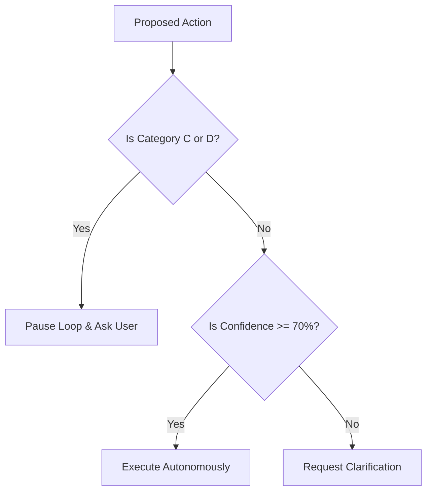

# Specification: Human Approval, Decision Gates & Collaborative Execution

This specification defines the architectural design, decision engines, and verification gates to implement a collaborative execution model in WebGenie. It details classification categories, confidence thresholds, over-questioning mitigation, approval budgeting, and state-restoration frameworks.

---

## 1. Decision Classification Engine

To balance autonomy and safety, the execution engine must filter all proposed Planner and Navigator actions through a **Decision Classifier**. 

```
                                [ PROPOSED ACTION ]
                                         │
                                         ▼
                           ┌───────────────────────────┐
                           │    Decision Classifier    │
                           └─────────────┬─────────────┘
                                         │
           ┌─────────────────────────────┼─────────────────────────────┐
           ▼                             ▼                             ▼
  ┌─────────────────┐           ┌─────────────────┐           ┌─────────────────┐
  │   CATEGORY A    │           │   CATEGORY B    │           │   CATEGORY C    │
  │  (Autonomous)   │           │  (Preferences)  │           │  (High Impact)  │
  │  Auto-Execute   │           │ Option-Discovery│           │ Mandatory Gate  │
  └─────────────────┘           └─────────────────┘           └─────────────────┘
```

Every action is mapped to one of four categories:

### Category A: Safe Autonomous Decisions
*   **Actions**: Page scrolling, tab switching, data scraping, text extraction, search queries, filter selections, and image loading.
*   **Policy**: **Implicit Consent**. These actions run without user intervention. Reasoning traces are logged silently to the event ledger.

### Category B: Preference Decisions
*   **Actions**: Selecting between multiple product listings, choosing flight times, filtering hotels, or choosing shipping options.
*   **Policy**: **Deferred Selection (Option Discovery)**. The agent must not block execution immediately to ask. Instead, it gathers alternatives, ranks them using semantic preference weights, and presents a comparative batch of options (e.g. Option A, B, C) at the next natural execution boundary.

### Category C: High-Impact Decisions
*   **Actions**: Credit card payments, final form submissions, message dispatches (emails, chat posts), reservation bookings, data deletions, or password modifications.
*   **Policy**: **Mandatory Consent Gate**. Execution pauses immediately. The agent renders an "Approval Request Card" detailing the action parameters, expected costs, and target fields, resuming only upon explicit user confirmation.

### Category D: Ambiguous Decisions
*   **Actions**: Element targets where locator confidence falls below `70%`, conflicting instructions in working memory, or search queries returning zero relevant hits.
*   **Policy**: **Confidence-Based Clarification**. The agent pauses, saves the current browser tab checkpoint, and prompts the user with specific clarification queries.

---

## 2. Confidence-Based Clarification System

WebGenie must evaluate element locators and action targets using a quantitative **Confidence Score** ($\mathcal{C}$):

$$\mathcal{C} = w_1 \cdot S_{\text{visual}} + w_2 \cdot S_{\text{semantic}} + w_3 \cdot S_{\text{history}}$$

Where:
*   $S_{\text{visual}}$ is the visual coordinate matching score.
*   $S_{\text{semantic}}$ is the AXTree node name similarity to the target intent.
*   $S_{\text{history}}$ is the success rate of the selector in the cached history log.

### Confidence Action Policies:

| Confidence Range | Action Policy | System Response |
| :--- | :--- | :--- |
| **$\mathcal{C} \ge 90\%$** | **Autonomous Execute** | Run action; log selector parameters to the event ledger. |
| **$70\% \le \mathcal{C} < 90\%$** | **Proceed & Document** | Run action; write warning note to working memory. |
| **$\mathcal{C} < 70\%$** | **Clarification Lock** | Pause loop; request user selector validation in the UI. |

---

## 3. Over-Questioning Mitigation & Option Discovery

To prevent user interruptions for minor actions (e.g. "Should I click search?"), WebGenie implements two core patterns:

### A. Option Discovery Workflow
Instead of blocking execution step-by-step during shopping or travel searches, the agent executes an autonomous gathering loop:
1.  Locate and extract the top 5 matches matching the user criteria.
2.  Compile a comparison table summarizing price, ratings, delivery date, and specifications.
3.  Pause execution and present a structured **Selection Card** to the user.
4.  Once the user selects an option, resume execution to complete checkout.

### B. Plan-Ahead Approvals (Batching)
Before embarking on a complex, multi-step workflow (e.g., booking a flight), the Planner compiles a **Pre-Flight Check Plan**:

```markdown
Planned Decisions Required:
1. Select outgoing flight (Options gathered: 6:00 AM, 10:00 AM, 4:00 PM).
2. Choose seat type (Window vs Aisle).
3. Confirm luggage add-on ($30 fee).
```

The user approves the batch of decisions in a single click, granting the agent authorization to execute the rest of the workflow autonomously.

---

## 4. Approval Budget System

To optimize user interactions, tasks are initialized with an **Approval Budget**:

```typescript
interface ApprovalBudget {
  maxInterrupts: number;
  interruptsUsed: number;
  priorityFloor: 'HIGH' | 'ALL';
}
```

*   **Low Budget Tasks (e.g. Budget = 1)**: The agent prioritizes autonomous heuristics and auto-resolves preference conflicts using statistical defaults.
*   **High Budget Tasks (e.g. Budget = 5)**: The agent pauses for preference checks, ensuring high alignment with user choices.

---

## 5. Execution Pause & State Restoration Architecture

When an action triggers a Category C (High Impact) or Category D (Ambiguous) gate, the execution loop is halted:

```
[Agent Running] ──► [Trigger Gate] ──► [Save Checkpoint] ──► [Render UI Card] ──► [User Decides] ──► [Restore & Resume]
```

### State-Saving Requirements:
1.  **Browser State Checkpoint**: Lock the active browser tab, disable user input listeners temporarily to prevent coordinate shifts, and cache active cookies.
2.  **Planner State Checkpoint**: Freeze the active Goal DAG, archiving pending actions to a temporary buffer.
3.  **Memory State Checkpoint**: Commit current working facts to `chrome.storage.local`.
4.  **Resume**: Upon user approval, restore the tab handle, re-run the `waitForStability` check, and execute the next subgoal.

---

## 6. Approval & Preference Memory

WebGenie must learn user choices over time to reduce the frequency of approval requests.

### Preference Memory Engine:
*   Decisions made in Category B (Preferences) and Category C (High Impact) cards are parsed into semantic preference rules:
    
    ```json
    {
      "domain": "delta.com",
      "preferenceKey": "flight.seating",
      "preferenceValue": "window",
      "confidenceWeight": 0.85
    }
    ```
    
*   When a new task is initialized, preference rules are loaded into the Planner's episodic context, enabling automatic selection of preferred configurations without user prompting.

---

## 7. Usability Evaluation Matrix

The final determination of agent behavior follows a structured decision matrix:



---

## 8. Implementation Roadmap

### Sprint 1: Decision Classification & Pause Gates (Sprint 1)
*   **Tasks**:
    - Implement the Decision Classifier filter in `executor.ts`.
    - Build pause/resume handlers at the boundary of critical actions (Category C).
    - Design and render basic "Approval Request Cards" in the UI.

### Sprint 2: Confidence Evaluators & Option Discovery (Sprint 2)
*   **Tasks**:
    - Integrate the confidence scoring formula ($\mathcal{C}$) into the Navigator element resolver.
    - Implement Option Discovery compile routines in page scripts.
    - Add batch-approval interfaces to the frontend.

### Sprint 3: Preference Memory & Budgeting (Sprint 3)
*   **Tasks**:
    - Implement preference memory saving and recall routines in the Memory Store.
    - Add session Approval Budget configuration fields.
