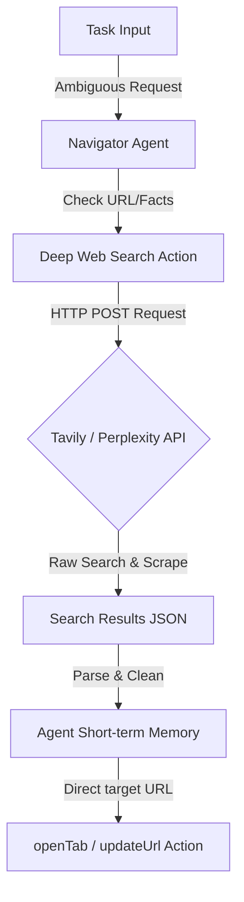

# WebGenie State-of-the-Art Add-ons Blueprint & Upgrades Manual

This document presents a comprehensive technical blueprint for advanced add-ons and upgrades that can be integrated into the WebGenie workspace. Each add-on is designed to be fully compatible with the existing FSM execution loop, the `TabOrchestrator`, and the `BrowserContext` concurrency manager.

---

## 1. Deep Web Search Integration (Tavily & Perplexity API)

### 1.1 Architectural Overview
When the agent is given an ambiguous task (e.g. *"Find the latest stock price of NVIDIA and plot it"*) or asked to navigate to a site without a known URL (*"Go to the official registration page of the local marathon"*), it often guesses URLs or browses blindly. 

Integrating a **Deep Web Search Tool** allows the Navigator agent to retrieve a clean, LLM-ready markdown or JSON research summary and high-confidence target URLs before executing browser actions.



### 1.2 Data Schemas & API Integration
We define the payload for the web search tool within the Navigator's structured schema:

```typescript
export interface WebSearchPayload {
  query: string;
  depth: 'simple' | 'advanced';
  maxResults?: number;
  includeDomains?: string[];
  excludeDomains?: string[];
}

export interface WebSearchResponse {
  results: Array<{
    title: string;
    url: string;
    content: string;
    score: number; // Relevance score 0.0 - 1.0
  }>;
  answer?: string; // Summarized answer from Perplexity / Tavily
}
```

### 1.3 Implementation Plan
We register the search tool in `chrome-extension/src/background/agent/actions/registry.ts` and implement the handler:

```typescript
// Proposed path: chrome-extension/src/background/agent/actions/handlers/search.ts
import { ActionHandler } from '../types';

export const webSearchHandler: ActionHandler<WebSearchPayload, WebSearchResponse> = {
  name: 'web_search',
  description: 'Perform deep semantic web search to retrieve relevant pages, clean markdown text, or target URLs.',
  
  async execute(payload, context) {
    const apiKey = await getApiKeyFromStorage(context.settings);
    if (!apiKey) {
      throw new Error('API key for Tavily/Perplexity is not configured.');
    }

    // Call Tavily or Perplexity API endpoint
    const response = await fetch('https://api.tavily.com/search', {
      method: 'POST',
      headers: {
        'Content-Type': 'application/json',
      },
      body: JSON.stringify({
        api_key: apiKey,
        query: payload.query,
        search_depth: payload.depth,
        max_results: payload.maxResults ?? 5,
        include_domains: payload.includeDomains,
        exclude_domains: payload.excludeDomains,
      }),
    });

    if (!response.ok) {
      throw new Error(`Search API returned status ${response.status}`);
    }

    const data = await response.json();
    return {
      results: data.results.map((r: any) => ({
        title: r.title,
        url: r.url,
        content: r.content,
        score: r.score,
      })),
      answer: data.answer,
    };
  }
};
```

---

## 2. Model Context Protocol (MCP) Server Integration

### 2.1 Architectural Overview
The **Model Context Protocol (MCP)**, pioneered by Anthropic, standardized how LLMs connect to external resources and tools. Exposing WebGenie as an MCP server allows desktop IDE clients (like Claude Desktop) or remote agents to command the active browser context using standard JSON-RPC 2.0 messages.

```
┌────────────────────────┐                   ┌────────────────────────┐
│   MCP Client (Claude)  │  ◄─ JSON-RPC ──►  │   WebGenie MCP Server  │
│                        │                   │   (background worker)  │
└────────────────────────┘                   └───────────┬────────────┘
                                                         │
                                                         ▼
                                             ┌────────────────────────┐
                                             │    TabOrchestrator     │
                                             └────────────────────────┘
```

### 2.2 Protocol Schemas
The MCP server exposes three native tools:
1. `browser_observe`: Calls `getDOMStateViaSnapshot()` and returns the semantic accessibility tree.
2. `browser_act`: Receives a list of click, input, or keypress actions and executes them via `BrowserContext`.
3. `browser_screenshot`: Captures a base64 viewport snapshot.

```json
{
  "jsonrpc": "2.0",
  "method": "tools/call",
  "params": {
    "name": "browser_act",
    "arguments": {
      "tabId": 12345,
      "actions": [
        { "type": "click", "selector": "button#submit" }
      ]
    }
  },
  "id": 1
}
```

---

## 3. Visual Set-of-Marks (SoM) Coordinates Overlay

### 3.1 Architectural Overview
Text-based representations of the DOM (like HTML strings or AXTrees) consume massive token counts. For vision-capable models (e.g., Claude 3.5 Sonnet, Gemini 1.5 Pro), we can generate a **Set-of-Marks (SoM)** overlay. This injects interactive numeric labels directly over elements in the viewport, allowing the model to specify targets by number (e.g., *"Click tag [42]"*).

```
┌────────────────────────────────────────────────────────┐
│  Search: [ Enter text here  ] [2]   [Submit Query] [3] │
│                                                        │
│  Results:                                              │
│  [12] Link to page 1                                   │
│  [13] Link to page 2                                   │
└────────────────────────────────────────────────────────┘
```

### 3.2 Label Projection Formula
Each visible element in the CDP snapshot has coordinates:
$$\text{Tag}_i = (\text{viewportX}, \text{viewportY})$$

An overlay SVG is injected at the root of the page, rendering:
```xml
<g class="webgenie-som-tag" transform="translate(viewportX, viewportY)">
  <rect width="24" height="16" rx="3" fill="#ff3b30"/>
  <text x="12" y="12" font-size="10" fill="#fff" text-anchor="middle">i</text>
</g>
```

### 3.3 Implementation Blueprint
1. Before capturing a screenshot, run a lightweight injection script that creates a fixed full-screen SVG layer.
2. Render bounding boxes and text markers for all elements returned by `DOMSnapshotExtractor`.
3. Call `chrome.tabs.captureVisibleTab` to retrieve the vision frame.
4. Remove the SVG layer immediately to avoid polluting the underlying DOM state.

---

## 4. Secure Credential Vault & Form-Filler

### 4.1 Architectural Overview
To execute authentication tasks, agents must not ingest credentials in plain text. A **Secure Credential Vault** encrypts and stores usernames, passwords, and API keys within Chrome's local storage. The vault intercepts login forms and fills credentials locally, preventing private keys from leaking into LLM prompt histories.

```
┌──────────────────────┐
│  chrome.storage.local│ (AES-GCM Encrypted credentials)
└──────────┬───────────┘
           │ (Decryption via session Master Key)
           ▼
┌──────────────────────┐         Inject via CDP
│  Credential Vault    ├──────────────────────────► Form input fields
└──────────────────────┘
```

### 4.2 Security Isolation Rules
* **No LLM Readout:** The LLM is never provided the decrypted password. It only triggers the action: `fill_credentials(domain: "github.com")`.
* **Zero-Log Input:** The input action is written to the element value directly using CDP's native `Input.dispatchKeyEvent` and `DOM.setAttribute` calls without passing through the FSM reasoning log or message history.

---

## 5. Visual Diff & Silent-Failure Critique Engine

### 5.1 Architectural Overview
Often, clicking a button fails silently (e.g., due to background validation issues or loading spinners) without raising an error. The agent might repeat the click action indefinitely. 

A **Visual Diff Engine** calculates a structural and visual difference between the pre-action viewport snapshot and the post-action viewport snapshot. If the diff is below a specified threshold, the action is marked as a silent failure, forcing the agent to backtrack.

$$D(I_{\text{pre}}, I_{\text{post}}) = \frac{1}{W \cdot H} \sum_{x=0}^{W-1} \sum_{y=0}^{H-1} |I_{\text{pre}}(x,y) - I_{\text{post}}(x,y)|$$

### 5.2 Failure Threshold rules
* If $D(I_{\text{pre}}, I_{\text{post}}) < \epsilon$ (where $\epsilon \approx 0.01$ representing a minimal layout change) and the active URL has not shifted, the system flags the action as a no-op.
* It increments the target selector failure key in the `FailureRegistry`. Once a selector accumulates 2 failures, it is masked out of the DOM representation.

---

## 6. Self-Healing Selector Resolver

### 6.1 Architectural Overview
Webpage updates can alter class names and attributes, causing hardcoded selectors to break. A **Self-Healing Selector Resolver** calculates a similarity score based on multi-attribute weightings when a primary selector cannot be located.

### 6.2 Target Elements Similarity Formula
For any candidate element $C$, we calculate its similarity to the original element $T$ across four properties:

$$S(C, T) = w_1 \cdot J(\text{Tag}_C, \text{Tag}_T) + w_2 \cdot J(\text{Attr}_C, \text{Attr}_T) + w_3 \cdot J(\text{Text}_C, \text{Text}_T) + w_4 \cdot D_{\text{Tree}}(C, T)$$

*   $J(A, B)$: Jaccard similarity index of attribute lists or string tokens.
*   $D_{\text{Tree}}(C, T)$: Hierarchical tree distance of element paths.
*   $w_i$: Weighting coefficients (e.g., $w_1 = 0.1$, $w_2 = 0.4$, $w_3 = 0.3$, $w_4 = 0.2$).

If $\max_C S(C, T) > 0.75$, the resolver heals the selector dynamically, logs the adjustment, and proceeds.

---

## 7. Comparative Matrix & Priority Matrix

| Add-on Upgrade | Complexity | Token Impact | Reliability Impact | Recommended Priority |
| :--- | :--- | :--- | :--- | :--- |
| **1. Deep Web Search Integration** | Medium | Saves ~25% tokens | +40% task accuracy | **1 (Highest)** |
| **2. MCP Server Protocol** | Medium | Neutral | Opens API options | 4 |
| **3. Visual Set-of-Marks Overlay** | High | Saves ~50% tokens | +35% selector accuracy | **2** |
| **4. Secure Credential Vault** | Low | Neutral | Prevents data leaks | **3** |
| **5. Visual Diff Critique Engine** | Medium | Neutral | Prevents looping errors | 5 |
| **6. Self-Healing Selector** | Medium | Neutral | Prevents locator errors | 6 |
