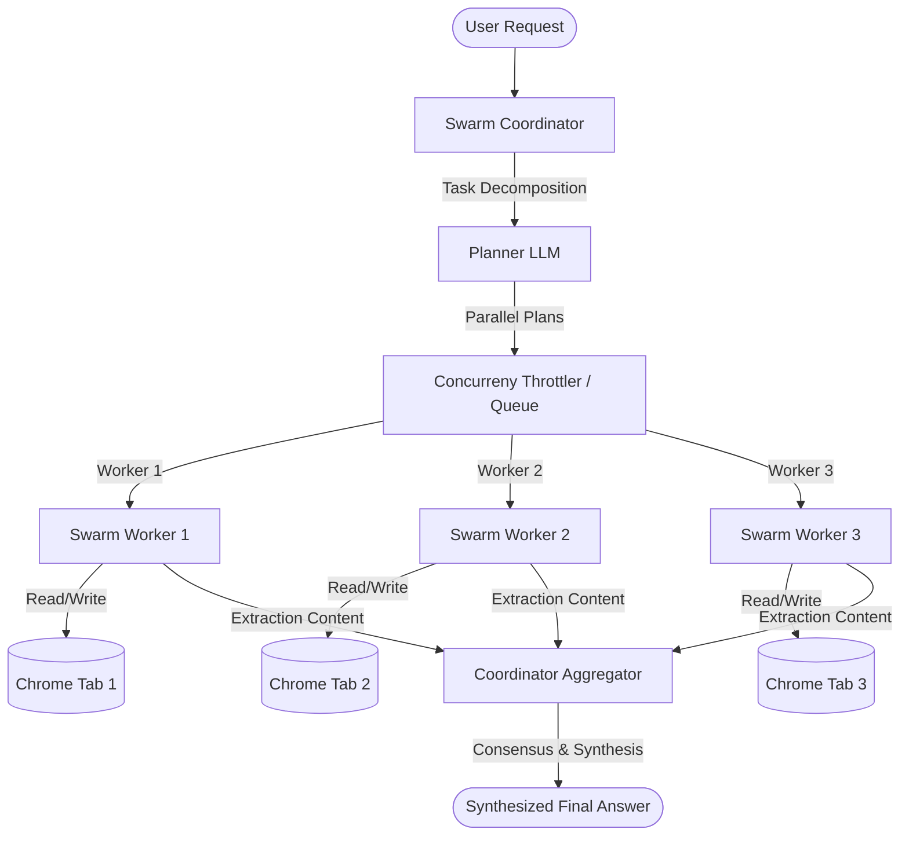

# Swarm Agent Orchestration — Architecture & Deep Research Plan

This document provides a highly detailed architectural blueprint and research notes for implementing a **Multi-Agent Browser Swarm** inside the WebGenie extension. This design allows the agent to decompose a user request into independent sub-tasks, execute them concurrently in isolated background tabs, and aggregate the findings into a single answer.

---

## 1. System Topology & Architecture

To scale browser operations efficiently, the monolithic execution loop is split into a hierarchical, decoupled coordinator-worker topology:



### Coordinator (The Dispatcher & Orchestrator)
The **Coordinator** acts as the parent agent. It does not perform low-level browser clicks or typing itself. Instead, it:
1. **Decomposes**: Uses the Planner LLM to break down the user request into list-form instructions.
2. **Schedules**: Feeds the sub-tasks into a concurrency-controlled queue managed by the `SwarmManager`.
3. **Aggregates**: Awaits resolution of all sub-tasks, processes the returned data, runs a consensus-verification check, and outputs the final result.

### Workers (The Browser Executors)
Each **Worker** is an independent, lightweight instance of the agent's core navigator engine.
- **State Isolation**: Each worker has its own `AgentContext`, `MessageManager`, and `BrowserContext` instances. This prevents DOM history pollution, memory leaks, and variables bleeding across tabs.
- **Tab Scoping**: A worker is strictly bound to a single Chrome `tabId`. It cannot query or interact with other tabs.
- **Background Execution**: Workers run on tabs created with `active: false`, allowing silent background processing without stealing focus from the user.

---

## 2. Dynamic Task Decomposition & Decision Logic

When a task is submitted, the Coordinator calls the LLM with a structural decomposition prompt to determine parallelizability.

### Prompt Strategy
```
Evaluate if the following user request can be split into parallel sub-tasks.
Criteria:
- The sub-tasks must be independent (the outcome of task A does not affect the input of task B).
- The sub-tasks can be run concurrently in different browser tabs.
- Example of parallelizable: "Find the price of flight X on Kayak and Expedia" -> Task A (Kayak), Task B (Expedia).
- Example of non-parallelizable: "Log in to Amazon, then search for X, then add to cart" -> requires sequential session state.
```

### JSON Plan Output Schema
```json
{
  "canParallelize": true,
  "reasoning": "We can query Kayak and Expedia in parallel tabs to retrieve prices concurrently.",
  "subTasks": [
    {
      "id": "expedia_search",
      "goal": "Search flight from NYC to London on July 10, 2026 and extract the lowest price.",
      "startUrl": "https://www.expedia.com"
    },
    {
      "id": "kayak_search",
      "goal": "Search flight from NYC to London on July 10, 2026 and extract the lowest price.",
      "startUrl": "https://www.kayak.com"
    }
  ]
}
```

---

## 3. Tab Lifecycle & Browser Resource Management

Chrome extensions must run efficiently to avoid crashing the browser process or triggering security triggers.

### 1. The Concurrency Queue
To limit memory consumption, `SwarmManager` implements a sliding-window execution manager:
```typescript
class SwarmManager {
  private maxConcurrency = 3;
  private activeWorkers = new Set<Promise<WorkerOutput>>();
  private queue: SwarmTask[] = [];

  // Pushes tasks into the queue and triggers execution
  // ensuring activeWorkers.size <= maxConcurrency at all times.
}
```

### 2. Tab Allocation Flow
For each worker task:
1. **Creation**: Call `chrome.tabs.create({ url: 'about:blank', active: false })`.
2. **Binding**: Pass the generated `tabId` to a new `BrowserContext` instance.
3. **Execution**: Execute the worker's execution steps.
4. **Disposal**: Once execution completes (success, failure, or timeout), call `chrome.tabs.remove(tabId)` to free resources immediately.

---

## 4. API Rate Limit & Cost Mitigations

Running multiple agents concurrently translates to multiple parallel LLM requests, which can trigger API rate-limits (`TPM` / `RPM` exhausted) and increase token cost.

### Mitigations
1. **AXTree perception mode by default**:
   - Reduces the page DOM description sent to the LLM by 60–80%, significantly cutting input token usage.
2. **Prompt Caching**:
   - Since workers share the same system prompts and action schemas, utilizing LLMs with prompt caching support (like Gemini) drastically cuts down cost and response latency.
3. **Token Throttling**:
   - Introduce an asynchronous rate-limit wrapper around the LLM instance to delay requests if the concurrent workers approach RPM/TPM thresholds.

---

## 5. Reviewer & Consensus Pattern

To ensure accuracy, the Coordinator runs a lightweight validation step after workers report their findings:

```
Analyze the extracted data from our parallel worker agents:
[Worker Kayak]: Found flight at $450
[Worker Expedia]: Found flight at $480

Verify:
- Did any worker fail or timeout? (If yes, should we fall back to manual search?)
- Is there any contradiction in the extracted details?
- Format the aggregated comparison clearly for the user.
```

If the data is verified, it is presented to the user. If a discrepancy is found, the Coordinator can re-dispatch a specific corrected sub-task to clear up the confusion.

---

## 6. Scientific & Industry References

To ensure a state-of-the-art implementation, our architecture incorporates design patterns from leading academic papers and production multi-agent frameworks:

### 1. OpenAI Swarm & Agents SDK (Routines & Handoffs)
- **Concept**: Promotes the use of lightweight, specialized agents communicating via explicit routines rather than a single monolithic generalist prompt.
- **Application**: The `SwarmCoordinator` acts as the triage router, handing off tasks to specialized worker instances based on goal categorization.
- **Reference**: OpenAI Agents SDK (formerly Swarm Framework) — [GitHub Repository](https://github.com/openai/swarm).

### 2. WebVoyager: An End-to-End Multimodal Web Agent (2024)
- **Concept**: Proposes an end-to-end multimodal agent loop utilizing both screenshots and accessibility trees (AXTree) to navigate live, real-world sites.
- **Application**: Grounding our default perception engine in AXTree to achieve 60–80% input token size reductions without sacrificing layout accuracy.
- **Reference**: He et al., "WebVoyager: Building an End-to-End Multimodal Web Agent" — [arXiv:2401.13919](https://arxiv.org/abs/2401.13919).

### 3. Mind2Web: Generalist Web Agents & MINDACT (2023)
- **Concept**: Emphasizes the "Filter-then-Act" design pattern. Because raw DOM trees exceed context windows, a filtering model removes non-interactable HTML tags before passing them to the planning LLM.
- **Application**: Scopes the elements sent to workers using AXTree element filters to keep our token budget small.
- **Reference**: Deng et al., "Mind2Web: Towards a Generalist Agent for the Web" — [arXiv:2306.06070](https://arxiv.org/abs/2306.06070).

### 4. WebArena: Sandboxed Functional Validation (2023)
- **Concept**: Outlines the standard modular agent paradigm: Planner (high-level goals), Executor (browser control APIs), and Memory (context/history state).
- **Application**: Structuring our `SwarmWorker` with an isolated Executor runtime and executing validation logic on final outcomes.
- **Reference**: Zhou et al., "WebArena: A Realistic Web Environment for Generalist Agents" — [arXiv:2307.13854](https://arxiv.org/abs/2307.13854).

### 5. Open-Source GitHub Repositories for Reference
- **[browser-use](https://github.com/browser-use/browser-use)**: A leading Python library that enables LLM agents to interact directly with browser environments. Useful to study for prompt orchestration and visual bounding box overlays.
- **[skyvern](https://github.com/skyvern-ai/skyvern)**: Uses LLMs and computer vision to automate workflows. Excellent reference for robust web element locating and failure recovery.
- **[lavague](https://github.com/la-vague-ai/LaVague)**: Framework for building Large Action Model (LAM) web agents. Integrates seamlessly with Playwright and LlamaIndex.
- **[awesome-web-agents](https://github.com/steel-dev/awesome-web-agents)**: A curated directory of web automation agents, datasets, benchmarks, and active open-source repositories.


