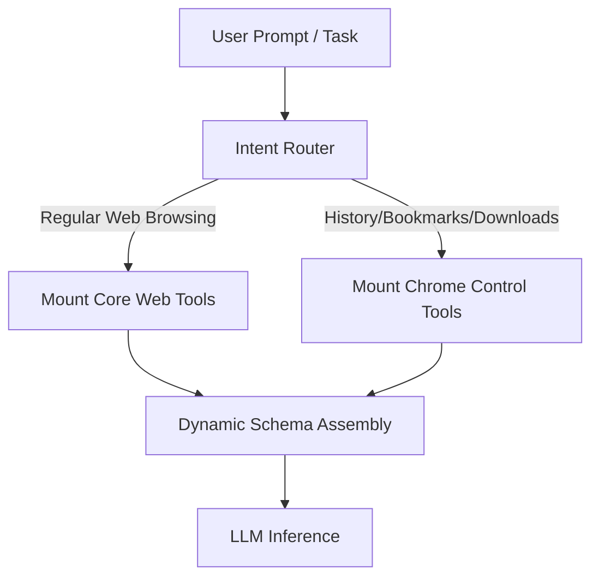

# Research Blueprint: Optimized Tool Delivery Strategies for LLM Agents

Passing an exhaustive list of 20+ tool definitions into an LLM's system prompt causes context window pollution, high token overhead, and tool selection interference (where similar tools confuse the model). 

Below is an analysis of state-of-the-art research and execution patterns for tool delivery, followed by an actionable proposal for WebGenie.

---

## Key Paradigms in Modern Tool Delivery

### 1. Dynamic Tool Dependency Retrieval (DTDR)
Instead of a static registry, tools are loaded dynamically using a semantic search or query-routing engine.
* **Mechanism**: A lightweight retriever (e.g., semantic search index over tool descriptions or a small router classifier) matches the user's task description against a tool database. Only the top-5 most relevant tools are injected into the active prompt context.
* **Evolutionary Filtering**: As the agent performs actions and transitions through steps, the retriever re-ranks tools based on both the original query and the current page context (e.g., if the URL is `chrome://downloads`, the downloads toolset is dynamically mounted).

### 2. DRAFT Framework (Dynamic Refinement of Tool Documentation)
LLM tool usage improves when descriptions are optimized dynamically.
* **Mechanism**: When execution failures occur (e.g., a model calls a tool with incorrect parameters, causing a registry exception), the error log is fed to a compiler that rewrites the tool description/instructions to explicitly outline the constraint that was violated.

### 3. "Code Mode" (Sandboxed Executable Output)
Instead of predicting individual API calls, the model outputs a short script (e.g., Javascript) containing sequential actions.
* **Mechanism**: The agent outputs a Javascript block (e.g., `await page.click('#submit'); await page.type('#search', 'query');`). The extension runs this block in a sandboxed content script executor. 
* **Benefits**: Cuts roundtrip latency to a single turn, eliminating the need to parse nested JSON arrays for multiple consecutive actions.

---

## Actionable Integration Plan for WebGenie

To achieve maximum accuracy and lower token usage in WebGenie, we propose a hybrid **Dynamic Registry + Intent Router** pipeline:

### Phase 1: Context-Aware Dynamic Schema Pruning
We modify the `ActionBuilder` to filter the schema based on the current browser state:
* **Web-Only Mode**: If the active page is a public URL, strip `chromeControl` actions (`bookmarks`, `downloads`, `readingList`, `history`) from the JSON schema.
* **Subsystem Mode**: If the active page is `chrome://bookmarks`, mount only the `bookmarks` sub-actions.

### Phase 2: Rationale Pre-Processing (Chain-of-Thought Guardrails)
Ensure the model outputs reasoning steps *before* generating the tool call. WebGenie currently implements this by nesting `current_state` (containing memory and evaluation) alongside the `action` array. This prevents the LLM from executing hasty, incorrect tool choices.
