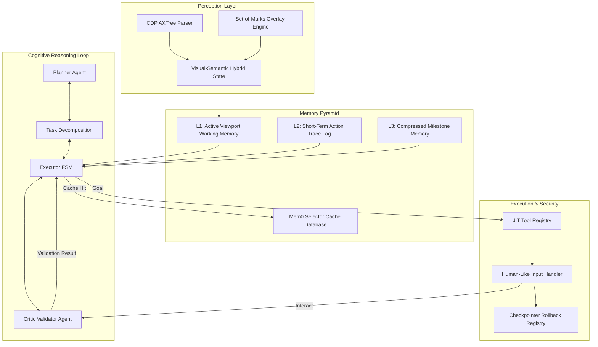

# WebGenie Ultimate Browser Agent: SOTA Cognitive & Component Architecture Blueprint

This document defines the complete target architecture for the WebGenie Browser Agent. It details the eight core modules, introduces six new advanced components, and structures the cognitive thinking loop to align with state-of-the-art (SOTA) agentic systems.

---

## 1. Overall Target Cognitive Architecture

The proposed target architecture transitions WebGenie from a sequential ReAct loop to a **Hierarchical Metacognitive System**. It integrates visual and structural perception with dynamic planning, validation, and rollbacks:



---

## 2. Deep-Dive Component Architecture (The 8 Existing Modules)

Below are the architectural specifications for upgrading WebGenie's eight existing core modules:

---

### Module 1: Execution Loop FSM (`Executor`)
* **Core Role**: Manages execution state transitions and coordinates the planning, validation, and rollback loops.
* **Interface Specification**:
```typescript
export enum ExecutorState {
  INITIALIZING = 'INITIALIZING',
  PLANNING = 'PLANNING',
  FETCHING_DOM = 'FETCHING_DOM',
  EXECUTING_ACTION = 'EXECUTING_ACTION',
  VALIDATING_ACTION = 'VALIDATING_ACTION',
  BACKTRACKING = 'BACKTRACKING',
  HUMAN_INTERRUPT = 'HUMAN_INTERRUPT',
  SUCCESS = 'SUCCESS',
  FAILED = 'FAILED'
}

export interface IExecutorFSM {
  currentState: ExecutorState;
  stepCount: number;
  maxSteps: number;
  executeTask(task: string): Promise<TaskResult>;
}
```

---

### Module 2: Browser Context Manager (`BrowserContext`)
* **Core Role**: Manages persistent browser profiles and coordinates isolated multi-tenant contexts.
* **Interface Specification**:
```typescript
export interface IBrowserContextManager {
  createIncognitoProfile(workspaceId: string): Promise<chrome.debugger.Debuggee>;
  destroyProfile(workspaceId: string): Promise<void>;
  synchronizeState(workspaceId: string): Promise<SessionState>;
}
```

---

### Module 3: Page Agent (`Page`)
* **Core Role**: Manages page-level navigation and debugger attachments, bypassing Content Security Policies (CSP) via native CDP network interception.
* **Interface Specification**:
```typescript
export interface IPageAgent {
  attachDebugger(tabId: number): Promise<void>;
  detachDebugger(tabId: number): Promise<void>;
  bypassCSPHeaders(tabId: number): Promise<void>;
}
```

---

### Module 4: DOM Tree & Selector Map (`DOMBuilder`)
* **Core Role**: Parses the page structure using the native Chromium Accessibility Tree (`AXTree`) and generates robust, layout-agnostic selector hashes.
* **Interface Specification**:
```typescript
export interface IDOMBuilder {
  captureSemanticAXTree(tabId: number): Promise<AXTreeSnapshot>;
  applyGoalAwareMask(tree: AXTreeSnapshot, currentGoal: string): AXTreeSnapshot;
  generateRobustElementHash(node: AXTreeNode): string;
}
```

---

### Module 5: Action Registry (`NavigatorActionRegistry`)
* **Core Role**: Manages tool registration, dynamically filtering active schemas to match the interactive elements on the page.
* **Interface Specification**:
```typescript
export interface IActionRegistry {
  registerTool(name: string, schema: z.ZodObject<any>): void;
  filterToolsForState(domState: DOMState): z.ZodObject<any>[];
}
```

---

### Module 6: Action Handlers
* **Core Role**: Dispatches human-like interactions (e.g. Bezier curve mouse movements, keypress delay jitter) using low-level CDP events.
* **Interface Specification**:
```typescript
export interface IActionHandlers {
  dispatchHumanClick(tabId: number, x: number, y: number): Promise<void>;
  dispatchHumanType(tabId: number, text: string, selector: string): Promise<void>;
  dispatchHumanScroll(tabId: number, selector: string, distancePercent: number): Promise<void>;
}
```

---

### Module 7: Memory & Context Manager (`AgentContext`)
* **Core Role**: Compiles active context data and manages memory across three tiers (Working, Short-Term, and Milestone).
* **Interface Specification**:
```typescript
export interface IMemoryManager {
  updateWorkingMemory(domState: DOMState): void;
  appendActionTrace(trace: ActionTrace): void;
  compressTracesToMilestones(): Promise<void>;
  getCompiledPromptContext(): string;
}
```

---

### Module 8: Logger & Test Panel
* **Core Role**: Provides real-time execution tracing, step replay, and visual selector debugging.
* **Interface Specification**:
```typescript
export interface ITelemetryReporter {
  streamStepEvent(event: AgentStepEvent): void;
  captureStateDiff(preUrl: string, postUrl: string, screenshotDiff: string): void;
}
```

---

## 3. The 6 New Cognitive Components

To build the best possible complete architecture, the following six new components must be integrated:

---

### New Component 1: Set-of-Marks (SoM) Visual Overlay Engine
* **Purpose**: Overlays unique numeric ID markers (e.g., `[14]`) onto interactable elements in a visual screenshot.
* **Why it is needed**: Purely text-based DOM descriptions lose spatial layout details. Combining the AXTree structure with visually annotated screenshots helps Multimodal LLMs locate elements more accurately.
* **Blueprint**:
```typescript
export interface IVisualOverlayEngine {
  annotateViewport(tabId: number, elements: DOMElementNode[]): Promise<string>; // returns base64 screenshot
  clearOverlays(tabId: number): Promise<void>;
}
```

---

### New Component 2: Metacognitive Critic Validator Agent
* **Purpose**: Verifies action outcomes after every step.
* **Why it is needed**: The agent can get stuck in loops if it clicks a button that fails silently. A dedicated Critic verifies layout and URL transitions before the next planning step starts.
* **Blueprint**:
```typescript
export interface ICriticValidator {
  validateStep(
    goal: string,
    action: ActionDescription,
    preState: BrowserState,
    postState: BrowserState
  ): Promise<ValidationOutcome>;
}

export interface ValidationOutcome {
  status: 'PASSED' | 'FAILED';
  reason?: string;
  suggestedAction?: 'RETRY' | 'BACKTRACK' | 'REPLAN';
}
```

---

### New Component 3: Checkpoint & State Rollback Registry
* **Purpose**: Saves cookies, storage, and history indices before risky actions.
* **Why it is needed**: Enables the FSM to revert the tab context to a previous "known-good" checkpoint if the Critic detects a failure path.
* **Blueprint**:
```typescript
export interface ICheckpointRegistry {
  saveCheckpoint(tabId: number, stepIndex: number): Promise<string>; // returns checkpointId
  restoreCheckpoint(checkpointId: string): Promise<void>;
  purgeCheckpoints(): void;
}
```

---

### New Component 4: JIT Tool Routing Layer
* **Purpose**: Dynamically loads tool schemas based on the active page context.
* **Why it is needed**: Exposing all tool descriptions at every step wastes tokens and can cause model hallucinations. The router loads only the schemas needed for the active element types (e.g., input tools only when text fields are present).
* **Blueprint**:
```typescript
export interface IToolRouter {
  bindActiveTools(domState: DOMState): string; // returns tool description block
}
```

---

### New Component 5: Human-Like Interaction Engine (Stealth Engine)
* **Purpose**: Generates natural-like interaction patterns.
* **Why it is needed**: Bots can be blocked by protection systems (e.g., Cloudflare, Akamai) if they use straight-line, instant clicks. This engine uses Bezier curves and randomized typing jitter to emulate human behavior.
* **Blueprint**:
```typescript
export class SOTAStealthEngine {
  static interpolateBezier(start: Point, end: Point): Point[] {
    const deviation = (Math.random() - 0.5) * 100;
    const cp1 = { x: start.x + (end.x - start.x) / 3, y: start.y + deviation };
    const cp2 = { x: start.x + 2 * (end.x - start.x) / 3, y: end.y - deviation };
    // Generate curved path
    const points: Point[] = [];
    for (let t = 0; t <= 1; t += 0.05) {
      const x = Math.round((1 - t) ** 3 * start.x + 3 * (1 - t) ** 2 * t * cp1.x + 3 * (1 - t) * t ** 2 * cp2.x + t ** 3 * end.x);
      const y = Math.round((1 - t) ** 3 * start.y + 3 * (1 - t) ** 2 * t * cp1.y + 3 * (1 - t) * t ** 2 * cp2.y + t ** 3 * end.y);
      points.push({ x, y });
    }
    return points;
  }
}
```

---

### New Component 6: Persistent Mem0 Selector Cache
* **Purpose**: Caches successful click paths and selector maps in a local database.
* **Why it is needed**: Allows the agent to reuse cached selectors for repeated tasks on recognized domains (e.g., GitHub, Gmail), bypassing LLM calls and reducing execution latency to sub-100ms.
* **Blueprint**:
```typescript
export interface ISelectorCache {
  getSelectorForIntent(domain: string, userIntent: string): Promise<string | null>;
  cacheSuccessfulSelector(domain: string, userIntent: string, xpath: string): Promise<void>;
}
```

---

## 4. Upgraded Cognitive Thinking Loop (Algorithm Design)

The target thinking loop incorporates dynamic validation and rollbacks at each step:

```typescript
async function runThinkingLoop(taskId: string, objective: string): Promise<void> {
  const context = new SOTAAgentContext(taskId);
  const planner = new SOTAPlanner(objective);
  
  while (!context.isCompleted() && context.stepCount < context.maxSteps) {
    const activeGoal = planner.getCurrentGoal();
    
    // 1. Snapshot State & Save Checkpoint
    const checkpointId = await context.checkpointer.saveCheckpoint(context.tabId, context.stepCount);
    
    // 2. Fetch DOM & AXTree State
    const rawDOM = await context.page.captureSemanticAXTree(context.tabId);
    
    // 3. Multimodal Perception (SoM Overlay)
    const base64Screenshot = await context.visualOverlay.annotateViewport(context.tabId, rawDOM.interactiveElements);
    
    // 4. JIT Tool Routing
    const activeTools = context.toolRouter.bindActiveTools(rawDOM);
    
    // 5. Select & Execute Action
    const action = await context.navigator.selectAction(activeGoal, rawDOM, base64Screenshot, activeTools);
    await context.actionHandlers.execute(action);
    
    // 6. Validation (Critic) Phase
    const validation = await context.critic.validateStep(
      activeGoal, 
      action, 
      rawDOM, 
      await context.page.captureSemanticAXTree(context.tabId)
    );
    
    if (validation.status === 'PASSED') {
      context.memory.appendActionTrace({ action, status: 'SUCCESS' });
      await context.memory.compactTrace(); // Tiered compression
      context.stepCount++;
    } else {
      logger.warn(`Critic failed validation: ${validation.reason}. Restoring checkpoint...`);
      await context.checkpointer.restoreCheckpoint(checkpointId);
      planner.injectNegativeFeedback(activeGoal, validation.reason);
    }
  }
}
```
