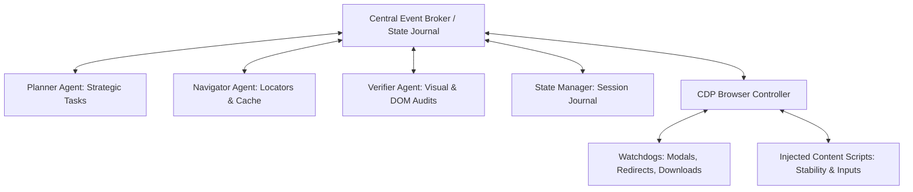
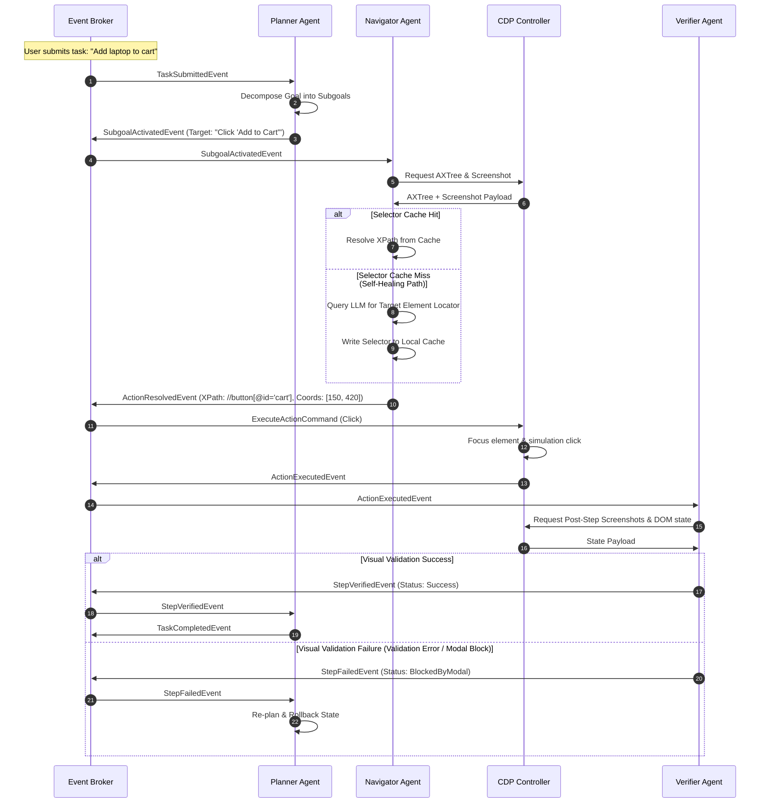

# WebGenie: Ideal Event-Driven Browser Agent Architecture

This document provides a detailed architectural specification and visual diagrams for a production-grade, event-driven browser agent. It is designed to be implemented directly within WebGenie to resolve state synchronization delays, reasoning latency, and fragile element locator bindings.

---

## 1. System Topology (Event-Driven Broker Architecture)

Instead of a tightly coupled execution loop, the ideal agent relies on a **Central Event Broker** (acting as an append-only event ledger) to coordinate interactions between decoupled, single-responsibility agents and watchdogs.



### Components:
1.  **Central Event Broker**: Orchestrates state propagation and serves as an append-only transaction log.
2.  **Planner Agent**: Decomposes user goals into a hierarchical Directed Acyclic Graph (DAG) of subgoals.
3.  **Navigator Agent**: Maps target subgoals to precise browser interactors, managing selector caching and self-healing.
4.  **Verifier Agent**: Performs post-action visual (SSIM) and semantic (DOM validator) checks before committing changes.
5.  **State Manager**: Tracks tab handles, URLs, and active session credentials in persistent storage (`chrome.storage.local`).
6.  **CDP Controller**: Connects to the browser context via Playwright or Chrome DevTools Protocol to query accessibility trees (AXTree).
7.  **Watchdog Services**: Asynchronous background workers monitoring modal popups, file downloads, and cross-origin navigation loops.

---

## 2. Interactive Action-Observation Lifecycle (Data Flow)

The sequence diagram below traces an action from natural language intent to selector validation, execution, and verification.



---

## 3. Asynchronous Watchdog Handlers

To handle asynchronous events (such as unexpected alert popups, browser redirects, or cookie consent banners) without blocking the main reasoning loop, WebGenie must implement background **Watchdog Listener tasks** connected to the CDP socket:

```
                            [ CDP SOCKET CONNECTION ]
                                        │
             ┌──────────────────────────┼──────────────────────────┐
             ▼                          ▼                          ▼
   ┌───────────────────┐      ┌───────────────────┐      ┌───────────────────┐
   │  Popup Watchdog   │      │ Redirect Watchdog │      │ Download Watchdog │
   │ (Detects alerts & │      │ (Detects domain   │      │ (Saves file path  │
   │  closes dialogs)  │      │  context changes) │      │  to memory)       │
   └─────────┬─────────┘      └─────────┬─────────┘      └─────────┬─────────┘
             │                          │                          │
             └──────────────────────────┼──────────────────────────┘
                                        │
                                        ▼
                           ┌──────────────────────────┐
                           │   Central Event Broker   │
                           └──────────────────────────┘
```

When a Watchdog detects an event, it publishes an alert payload to the broker. The State Manager captures the payload and signals the Planner to pause and handle the interrupt before resuming the active subgoal.

---

## 4. Implementation Framework (TypeScript Blueprint)

The core Event Broker can be implemented in WebGenie's service worker using a structured, type-safe event dispatcher:

```typescript
export type AgentEvent = 
  | { type: 'TASK_SUBMITTED'; payload: { goal: string } }
  | { type: 'SUBGOAL_ACTIVATED'; payload: { subgoalId: string; description: string } }
  | { type: 'ACTION_RESOLVED'; payload: { xpath: string; coordinates: [number, number] } }
  | { type: 'ACTION_EXECUTED'; payload: { status: 'success' | 'fail'; error?: string } }
  | { type: 'STEP_VERIFIED'; payload: { status: 'success' | 'fail'; errorDetails?: string } };

export class EventBroker {
  private listeners: Map<string, Array<(event: AgentEvent) => void>> = new Map();
  private eventLog: AgentEvent[] = [];

  public subscribe(eventType: AgentEvent['type'], callback: (event: any) => void) {
    if (!this.listeners.has(eventType)) {
      this.listeners.set(eventType, []);
    }
    this.listeners.get(eventType)!.push(callback);
  }

  public async publish(event: AgentEvent) {
    this.eventLog.push(event);
    // Write event ledger to persistent storage to survive service worker recycles
    await chrome.storage.local.set({ eventLedger: this.eventLog });

    const callbacks = this.listeners.get(event.type) || [];
    for (const callback of callbacks) {
      callback(event);
    }
  }

  public getLedger(): AgentEvent[] {
    return this.eventLog;
  }
}
```
